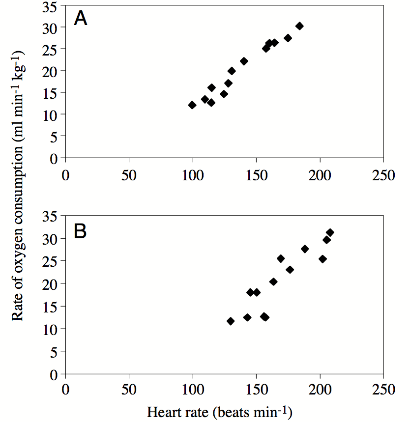

# Linear regression

> The place in which I'll fit will not exist until I make it.  
> James Baldwin


In the last two chapters we learned to use data sets which fall into a few categories. We now turn to data which can be measured as a range of numerical values. We can ask a similar question of numerical data that we asked of categorical: how can we tell whether two variables are related? And if they are, what kind of relationship is it? This takes us into the realm of *data fitting*, raising two related questions: what is the best mathematical relationship to describe a data set? and what is the quality of the fit? You will learn to do the following in this chapter:


* define the quality of the fit between a line and a two-variable data set
* calculate the parameters for the best-fit line based on statistics of the data set
* use R to calculate and plot best-fit line for a data set
* understand the meaning of correlation and covariance
* understand the phenomenon of regression to the mean


## Linear relationship between two variables
\label{sec:model8}

Although there is always error in any real data, there may be a relationship between the two variables that is not random: for example, when one goes up, the other one tends to go up as well. These relationships may be complicated, but in this chapter we will focus on the the simplest and most common type of relationship: linear, where a change in one variable is associated with a proportional change in the other, plus an added constant. This is expressed mathematically using the familiar equation for a linear function, with parameters slope ($m$) and intercept ($b$):

$$ y = mx + b$$

Let us say you have measured some data for two variables, which we will call, unimaginatively, $x$ and $y$. This data set consists of pairs of numbers: one for $x$, one for $y$, for example, the heart rate and body temperature of a person go together. They cannot be mixed up between different people, as the data will lose all meaning. We can denote this a list of $n$ pairs of numbers: $(x_i, y_i)$ (where $i$ is an integer between 1 and $n$). Since this is a list of pairs of numbers, we can plot them as separate points in the plane using each $x_i$ as the x-coordinate and each $y_i$ as the y-coordinate. This is called a \index{plot!scatter} *scatterplot* of a two-variable data set. For example, two scatterplots of a data set of heart rate and body temperature are shown in figure \ref{fig:HRTemp_scatterplot}. In the first one, the body temperature is on the x-axis, which makes it the \index{variable!explanatory} *explanatory* variable; in the second one, the body temperature is on the y-axis, which makes it the  \index{variable!response} *response* variable.

```{r HRTemp-scatter, tidy=TRUE, tidy.opts=list(width.cutoff=50), fig.show='hold', out.width='50%', fig.asp=.75, fig.align='center', fig.cap ='Scatterplot of heart rates and body temperatures: a) with heart rate as the explanatory variable; b) with body temperature as the explanatory variable.'}

data<-read.table('data/HR_temp.txt', header=TRUE)
plot(data$Temp, data$HR,main='heart rates vs. body temps', cex=1.5, cex.axis=1.5,cex.lab=1.5)
plot(data$HR, data$Temp,main='body temps vs. heart rates', cex=1.5, cex.axis=1.5,cex.lab=1.5)
```

## Linear least-squares fitting
\label{sec:math8}

### sum of squared errors

It is easy to find the best-fit line for a data set with only two points: its slope and intercept can be found by solving the two simultaneous linear equations, e.g. if the data set consists  of $(3,2.3), (6, 1.7)$, then finding the best fit values of $m$ and $b$ means solving the following two equations:
\begin{eqnarray*}
3m + b &=&  2.3 \\
6m + b &=& 1.7
\end{eqnarray*}
These equations have a unique solution for each unknown: $m=-0.2$ and $b=2.9$ (you can solve it using basic algebra).

However, a data set with two points is very small and cannot serve as a reasonable guide for finding a relationship between two variables. Let us add one more data point, to increase our sample size to three: $(3,2.3), (6, 1.7), (9, 1.3)$. How do you find the best fit slope and intercept? \textbf{Bad idea:} take two points and find a line, that is the slope and the intercept, that passes through the two. It should be clear why this is a bad idea: we are arbitrarily ignoring some of the data, while perfectly fitting two points. So how do we use all the data? Let us write down the equations that a line with slope $m$ and intercept $b$ have to satisfy in order to fit our data points:
\begin{eqnarray*}
3m + b &=&  2.3 \\
6m + b &=& 1.7 \\
9m + b &=& 1.3
\end{eqnarray*}
This system has no exact solution, since there are three equations and only two unknowns. We need to find $m$ and $b$ such that they are a *best fit* to the data, not the perfect solution. To do that, we need to define what we mean by the  \index{fitting!goodness} *goodness of fit*.

One simple way to asses how close the fit is to the data is to subtract the predicted values of $y$ from the data, as follows: $e_i = y_i - (mx_i + b)$.  The values $e_i$ are called the *errors* or \index{linear regression!residual} *residuals* of the linear fit. If the values predicted by the linear model ($mx_i+b$) are close to the actual data $y_i$, then the error will be small. However, if we add it all up, the errors with opposite signs will cancel each other, giving the impression of a good fit simply if the deviations are symmetric. 

A more reasonable approach is to take absolute values of the deviations before adding them up. This is called the total deviation, for $n$ data points with a line fit:
$$ TD = \sum_{i=1}^n |  y_i - mx_i - b | $$

Mathematically, a better measure of total error is a sum of squared errors, which also has the advantage of adding up non-negative values, but is known as a better measure of the distance between the fit and the data (think of Euclidean distance, which is also a sum of squares) \index{fitting!least squares}:
$$ SSE = \sum_{i=1}^n ( y_i - mx_i - b )^2 $$


Thus we have formulated the goal of fitting the best line to a two-variable data set, also known as linear regression: **find the values of slope and intercept that result in the lowest possible sum of squared errors**. There is a mathematical recipe which produces these values, which will be described in the next section. Any model begins with \index{linear regression!assumptions} assumptions and in order for linear regression to be a faithful representation of a data set, the following must be true:

* the variables have a linear relationship

* all of the measurements are independent of each other

* there is no noise in the measurements of the explanatory variable

* the noise in the measurements of the response variable is normally distributed with mean 0 and identical standard deviation


The reasons why these assumptions are necessary for linear regression to work are beyond the scope of the text, and they are elucidated very well in the book *Numerical Recipes* \citep{press_numerical_2007}. However, it is important to be aware of them because if they are violated, the resulting linear fit may be meaningless. It's fairly clear that if the first assumption is violated, you are trying to impose a linear relationship on something that is actually curvy. The second assumption of independence is very important and often overlooked. The mathematical reasons for it have to do with properly measuring the goodness of fit, but intuitively it is because measurements that are linked can introduce a new relationship that has to do with the measurements, rather than the relationship between the variables. Violation of this assumption can seriously damage the reliability of the linear regression. The third assumption is often ignored, since usually the explanatory variable is also measured and thus has some noise. The reason for it is that the measure of goodness of fit is based only on the response variable, and there is no consideration of the noise in the explanatory variable. However, a reasonable amount of noise in the explanatory variable is not catastrophic for linear regression. Finally, the last assumption is due to the statistics of maximum-likelihood estimation of the slope and intercept, but again some deviation from perfect normality (bell-shaped distribution) of the noise, or slightly different variation in the noise is to be expected. 

### best-fit slope and intercept

```{definition, def-cov}
The \index{covariance} covariance of a data set of pairs of values $(X,Y)$ is the sum of the products of the corresponding deviations from their respective means:
```

$$ Cov(X,Y) = \frac{1}{n-1} \sum_{i=1}^n (x_i - \bar X) (y_i - \bar Y) 
$$

Intuitively, this means that if two variable tend to deviate in the same direction from their respective means, they have a positive covariance, and if they tend to deviate in opposite directions from their means, they have a negative covariance. In the intermediate case, if sometimes they deviate together and other times they deviate in opposition, the covariance is small or zero. For instance, the covariance between two independent random variables is zero, as we saw in section \ref{sec:math4_2}.

It should come as no surprise that the slope of the linear regression depends on the covariance, that is, the degree to which the two variables deviate together from their means. If the covariance is positive, then for larger values of $x$  the corresponding $y$ values tend to be larger, which means the slope of the line is positive. Conversely, if the covariance is negative, so is the slope of the line. And if the two variables are independent, the slope has to be close to zero. The actual formula for the \index{linear regression!slope}\index{slope!linear regression}slope of the linear regression is \citep{whitlock_analysis_2008}:

\begin{equation}
m = \frac{Cov(X,Y)}{Var(X)}
\end{equation}

I will not provide a proof that this slope generates the minimal sum of squared errors, but that is indeed the case. To find the intercept of the linear regression, we make use of one other property of the best fit line: in order for it to minimize the SSE, it must pass through the point $(\bar X, \bar Y)$. Again, I will not prove this, but note that the point of the two mean values is the central point of the ``cloud'' of points in the scatterplot, and if the line missed that central point, the deviations will be larger. Assuming that is the case, we have the following equation for the line: $\bar Y = m\bar X + b$, which we can solve for the  \index{linear regression!$y$-intercept} \index{y-intercept!linear regression} intercept $b$:
\begin{equation}
b = \bar Y - \frac{Cov(X,Y) \bar X}{Var(X)}
\end{equation}

### Execises

B($m^2/kg$)   H($^\circ C /min)$ 
-----------   ------------
    7.0           0.103 
    5.0           0.091 
    3.6           0.014
    3.3           0.024
    2.4           0.031
    2.1           0.006

Table: Body leanness (B) and heat loss rate (H)  in boys; partial data set from \citep{sloan_cooling_1973}

\label{tab:ch8_bh}


Use the data set in table \ref{tab:ch8_bh} to answer the following questions:


1. Compute the means and standard deviations of each variable.

2. Compute the covariance between the two variables.

3. Calculate the slope and intercept of the linear regression for the data with $B$ as the explanatory variable.

4. Make a scatterplot of the data set with $B$ as the explanatory variable and sketch the linear regression line with the parameters you computed.

5. Calculate the slope and intercept of the linear regression the data with $H$ as the explanatory variable.

6. Make a scatterplot of the data set, with $H$ as the explanatory variable and sketch the linear regression line with the parameters you computed.


### correlation and goodness of fit}
The correlation between two random variables is a measure of how much variation in one corresponds to variation in the other. If this sounds very similar to the description of covariance, it's because they are closely related. Essentially, correlation is a normalized covariance, restricted to lie between -1 and 1. Here is the definition:

```{definition, def-corr}
The \index{correlation} (linear) correlation of a dataset of pairs of data values (X,Y) is:
```
$$ r = \frac{Cov(X,Y)}{\sqrt{{Var(X)}{Var(Y)}}} =  \frac{Cov(X,Y)}{\sigma_X \sigma_Y}
$$

If the two variables are identical, $X=Y$, then the covariance becomes its variance $Cov(X,Y) = Var(X)$ and the denominator also becomes the variance, and the correlation is 1. This is also true if $X$ and $Y$ are scalar multiples of each other, as you can see by plugging in $X= cY$ into the covariance formula. The opposite case if $X$ and $Y$ are diametrically opposite, $X = -cY$, which has the correlation coefficient of -1. All other cases fall in the middle, neither perfect correlation nor perfect anti-correlation. The special case if the two variables are independent, and thus their covariance is zero, has the correlation coefficient of 0.


\label{fig:ch8_corr_examples}


This gives a connection between correlation and slope of linear regression:
\begin{equation}
m = r \frac{\sigma_Y}{\sigma_X}
\label{eq:slope_corr}
\end{equation}

Whenever linear regression is reported, one always sees the values of correlation $r$ and squared correlation $r^2$ displayed. The reason for this is that $r^2$ has a very clear meaning of the **the fraction of the variance of the dependent variable $Y$ explained by the linear regression** $Y=mX+b$.  Let us unpack what this means.

According to the stated assumptions of linear regression, the response variable $Y$ is assumed to be linear relationship with the explanatory variable $X$, but with independent additive noise (also normally distributed, but it doesn't play a role for this argument). Linear regression captures the linear relationship, and the remaining error (residuals) represent the noise. Thus, each value of $Y$ can be written as $Y = R + \hat Y$ where $R$ is the residual (noise) and  the value predicted by the linear regression is $\hat Y =mX+b$. The assumption that $R$ is independent of $Y$ means that $Var(Y) = Var (\hat Y) + Var (R)$ because variance is additive for independent random variables, as we discussed in section \ref{sec:math4}. By the same reasoning $Cov(X,\hat Y + R) = Cov(X,\hat Y) + Cov(X,R)$. These two covariances can be simplified further: $Cov(X,R) = 0$ because $R$ is independent random noise. $X$ and the predicted $\hat Y$ are perfectly correlated, so $Cov(X,\hat Y)  = Cov(X,mX+b)  = Var(X) = Var(\hat Y)$. This leads to the derivation of the meaning of $r^2$:

\begin{equation}
\begin{aligned}
  r^2 = \frac{Cov(X,Y)^2}{Var(X) Var(Y)} &=   \frac{(Cov(X,\hat Y) + Cov(X,R) )^2}{Var(X) Var(Y)}   = \\
  =\frac{Var(X)Var(\hat Y)}{Var(X) Var(Y)} &=  \frac{Var(\hat Y)}{Var(Y)}
  \end{aligned}
\label{eq:ch8_frac_var}
\end{equation}

One should be cautious when interpreting results of a linear regression. First, just because there is no linear relationship does not mean that there is no other relationship. Figure \ref{fig:ch8_corr_examples} shows some examples of scatterplots and their corresponding correlation coefficients. What it shows is that while a formless blob of a scatterplot will certainly have zero correlation, so will other scatterplots in which there is a definite relationship (e.g. a circle, or a X-shape). The point is that **correlation is always a measure of the linear relationship between variables.**

The second caution is well known, as that is the danger of equating correlation with a causal relationship. There are numerous examples of scientists misinterpreting a coincidental correlation as meaningful, or deeming two variables that have a common source as causing one another. For example, one can look at the increase in automobile ownership in the last century and the concurrent improvement in longevity and conclude that automobiles are good for human health. It is well-documented, however, that a sedentary lifestyle and automobile exhaust do not make a person healthy. Instead, increased prosperity has increased both the purchasing power of individuals and enabled advances in medicine that have increase our lifespans. To summarize, one must be careful when interpreting correlation: a weak one does not mean there is no relationship, and a strong one does not mean that one variable causes the changes in the other.

There is another important measure of the quality of linear regression: the \index{plot!residual}\index{linear regression!residual} residual plot. The residuals are the differences between the predicted values of the response variable and the actual value from the data. As stated above, linear regression assumes that there is a linear relationship between the two variables, plus some uncorrelated noise added to the values of the response variable. If that were true, then the plot of the residuals would look like a vaguely spherical blob, with a mean value of 0 and no discernible trend (e.g. no increase of residual for larger $x$ values). Visually assessing residual plots is an essential check on whether linear regression is a reasonable fit to the data in addition to the $r^2$ value.

### Exercises

Figure \ref{fig:ch8_penguins} shows scatterplots of the rate of oxygen consumption (VO)  and heart rate (HR) measured in two macaroni penguins running on a treadmill (really). The authors performed linear regression on the data and found the following parameters: $VO =0.23HR - 11.62$ (penguin A) and $VO =0.25HR - 20.93$ (penguin B). The datasets have the standard deviations: $\sigma_{VO} = 6.77$ and $\sigma_{HR} = 28.8$ (penguin A) and $\sigma_{VO} = 8.49$ and $\sigma_{HR} = 30.6$ (penguin B).


\label{fig:ch8_penguins}


1. Find the dimensions and units of the slope and the intercept of the linear regression for this data (the units of HR and VO are on the plot).

2. Data set B has a larger slope than data set A. Does this mean the correlation is higher in data set B  than in A? Explain.

3. Calculate the correlation coefficients for the linear regressions of the two penguins; explain how much variance is explained in each case.

4. Re-calculate the slopes of the two linear regressions if the explanatory and response variables were reversed. Does changing the order of variable affect the correlation?


## Linear regression using R
\label{sec:comp6}

We now have the tools to compute the parameters of the best-fit line, provided we can calculate the means, variances, and covariance of the two variable data set. Of course, the best way to do all this is to let a computer handle it.  The function for calculating linear regression in R is `lm()`, which outputs a bunch of information to a variable called myfit in the script below.  The slope, intercept, and other \index{parameter!linear regression}parameters can be printed out using the `summary()` function. In the script below you see a bunch of information, but we are concerned with the ones in the first column correspond to the best fit intercept (-166.2847) and the slope (2.4432). You can check that they correspond to our formulas by computing the covariance, the variances, and the means of the two variables:

```{r, tidy=TRUE,tidy.opts=list(width.cutoff=50)}
my_data<-read.table('data/HR_temp.txt', header=TRUE)
myfit <- lm(HR ~Temp, my_data)
summary(myfit)
m<-cov(my_data$HR,my_data$Temp)/var(my_data$Temp)
print(m)
b<-mean(my_data$HR)-m*mean(my_data$Temp)
print(b)
```

Here `Temp` and `HR` are the explanatory and response variables, respectively, and `my_data` is the name of the data frame they are stored in. The best fit parameters are stored in `myfit`, and the line can be plotted using `abline(myfit)`. The script below shows how to calculate a linear regression line and then plot it over a scatterplot in R, and the result is shown in figure \ref{fig:linreg_HRTemp}a.


```{r linreg-HRTemp, tidy=TRUE, tidy.opts=list(width.cutoff=50), fig.show='hold', out.width='50%', fig.asp=.75, fig.align='center', fig.cap = 'Linear regression for a data set of heart rates and body temperatures (a); and the residuals (b).'}
plot(my_data$Temp, my_data$HR,main=
'scatterplot and linear regression line',
cex=1.5, cex.axis=1.5,cex.lab=1.5)
abline(myfit)
HRresiduals <- resid(myfit)
plot(data$Temp, HRresiduals,main='residuals plot',cex=1.5, cex.axis=1.5,cex.lab=1.5)
abline(0,0)
```

However, what does this mean about the quality of the fit? Just because we found a line to draw through a scatterplot does not mean that this line is meaningful. In fact, looking at the plot, there does not seem to be much of a relationship between the two variables. There are various statistical measures for the significance of linear regression, the most important one relies on the correlation between the two data sets. Look again at the summary statistics for the data set of heart rates and temperatures. There are several different statistics here, and the one that we care about is the $r^2$, which is reported here as 'Multiple R-squared'. This number tells us that the linear regression accounts for only about 6% of the total variance of the heart rate. In other words, there is no significant linear relationship in this data set.

As mentioned in section \ref{sec:math8}, the other important check is plotting the residuals of the data set, after the linear fit is subtracted. You see the result in figure \ref{fig:linreg_HRTemp}b, showing that the residuals do not have any pronounced pattern. So it is reasonable to conclude that linear regression was a reasonable model to which to fit the data. The low correlation is because data seem to have little to no relationship, not because there is some complicated nonlinear relationship.


Here is an example of a linear regression performed and the line plotted over the basic R plot. Note that lm() uses the following syntax to indicate which variable is which: lm(Y ~ X) (where Y is the response variable and X is the explanatory variable.)

```{r}
myfit <- lm(child ~ parent, Galton) 
summary(myfit)
print(paste("The best-fit slope is: ", myfit$coefficients[2]))
print(paste("The best-fit intercept is: ", myfit$coefficients[1]))      
```

The summary outputs a whole bunch of information that is returned by the `lm()` function, as the object `myfit`. The most important are the intercept and slope, which may be printed out as shown above, and the R-squared parameter, also called the coefficient of determination. The value of R-squared is not accessible directly in `myfit`, but it is printed out in the summary (use multiple R-squared for our assignments.)


The actual best-fit line can be plotted as follows over a scatterplot of the data; notice that abline can take myfit as an input and use the slope and intercept: 
```{r}
#Overlay the best-fit line on the base R plot
plot(Galton$parent, Galton$child, xlab='mid-parent height (inches)', ylab='child height (inches)')
abline(myfit)
```


After performing linear regression it is essential to check that the residuals obey the assumptions of linear regression. The residuals are the difference between the predicted response variable values and the actual values of the response variable, in this case the child height. The residuals are contained in the object myfit as variable residuals:

```{r}
plot(Galton$parent, myfit$residuals, xlab='mid-parent height (inches)', ylab='residuals (inches)')
abline(0,0)
```

It appears that the residuals meet the assumptions of being independent of measurement (shapeless scatterplot), are centered at zero, and look roughly normally distributed, although that can be checked more carefully using other tools.


### Exercises:


1. Calculate descriptive statistics (mean and standard deviation) of the residuals from the linear regression above. What do you expect them to be, and how do they differ from the expectation? Using this calculation, check that the coefficient of determination really captures the fraction of total variance explained by linear regression

```{r}

```

2.  Perform linear regression on the Galton data set with the response and explanatory variables switched, and report which parameters changed and how.

```{r}

```

3. Plot the residuals from your new linear regression and calculate and report their descriptive statistics. What do you expect them to be, and how do they differ from the expectation? Using this calculation, check that the coefficient of determination really captures the fraction of total variance explained by linear regression.

```{r}

```


## Regression to the mean
\label{sec:bio8}
The phenomenon called \index{regression to the mean} regression to the mean is initially surprising. Francis Galton first discovered this by comparing the heights of parents and their offspring. Galton took a subset of parents who are taller than average and observed that their children were, on average, shorter than their parents. He also compared the heights of parents who are shorter than average, and found that their children were on average taller than their parents. This suggests the conclusion that in long run everyone will converge closer to the average height - hence "regression to mediocrity", as Galton called it \citep{senn_francis_2011}.


```{r linreg-Galton, tidy=TRUE, tidy.opts=list(width.cutoff=50), fig.show='hold', out.width='50%', fig.asp=.75, fig.align='center', fig.cap = 'Galton data on heights of parents and of children as scatterplots (two versions with explanatory and response variables switched). The dotted red lines show the identity line y=x and the solid black line is the linear regression.'}
library("HistData")
myfit <- lm(child ~ parent, Galton) 
plot(Galton$parent, Galton$child, xlab='mid-parent height (inches)', ylab='child height (inches)',cex=1.5, cex.axis=1.5,cex.lab=1.5)
abline(myfit,lwd=3,lty=1)
abline(0,1,lwd=3,lty=2,col='red')
myfit <- lm(parent ~child, Galton) 
plot(Galton$child, Galton$parent, xlab='child height (inches)', ylab='mid-parent height (inches)',cex=1.5, cex.axis=1.5,cex.lab=1.5)
abline(myfit,lwd=3)
abline(0,1,lwd=3,lty=2,col='red')
```


But that is not the case! The parents and children in Galton's experiment had a very similar mean and standard deviation.  This appears to be a paradox, but it is easily explained using linear regression. Consider two identically distributed random variables $(X,Y)$ with a positive correlation $r$. The slope of the linear regression is $m = r \sigma_Y/\sigma_X$ and since $\sigma_Y=\sigma_X$, the slope is simply $r$. Select a subset with values of $X$ higher than $\bar X$, and consider the mean value of $Y$ for that subset. If the slope $m<1$ (the correlation is not perfect), then the mean value of $Y$ for that subset is less than the mean value of $X$. Similarly, for a subset with values of $X$ lower than $\bar X$,  the mean value of $Y$ for that subset is greater than the mean value of $X$, again as long as the slope is less than 1. 

Figure \ref{fig:regression2mean} shows Galton's data set (available in R by installing the package 'HistData') along with the linear regression line and the identity like ($y=x$). If each child had exactly the same height as the parents, the scatterplot would lie on the identity line. Instead, the linear regression lines have slope less than 1 for both the plot with the parental heights as the explanatory variable and for the plot with the variables reversed. The correlation coefficient $r$ does not depend on the order of the variables; so using the equation \ref{eq:slope_corr} we can see the difference in slopes is explained by the two data sets having different standard deviations, and reversing the explanatory and response variables results in reciprocation of the ratio of standard deviations. The children's heights have a higher standard deviation, which is likely an artifact of the experiment. In the data set the   heights of the two parents were averaged to take them both into account, which substantially reduces the spread between male and female heights. To summarize, although the children of taller parents are shorter on average than their parents, and the children of shorter parents are taller than their parents, the overall standard deviation does not decrease from generation to generation. 


### Discussion questions

Please read the paper on measuring the rate of \index{sequencing!whole genome} de novo mutations in humans and its relationship to paternal age \citep{kong_rate_2012}.

1. What types of mutations were observed in the data set? What were the most and the least common?

2. The paper shows that both maternal and paternal age are positively correlated with offspring inheriting new mutations. What biological mechanism explains why paternal age is the dominant factor? What could explain the substantial correlation with maternal age?

3. Is linear regression the best representation of the relationship between paternal age and number of mutations? What other model did the authors use to fit the data, and how did it perform?

4. What do you make of the historical data of paternal ages the authors present at the end of the paper? Can you postulate a testable hypothesis based on this observation?

