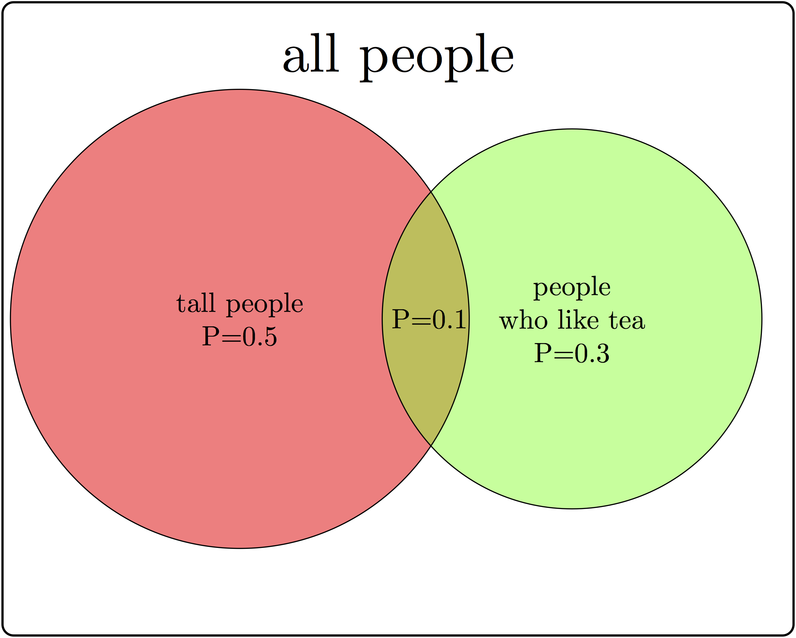
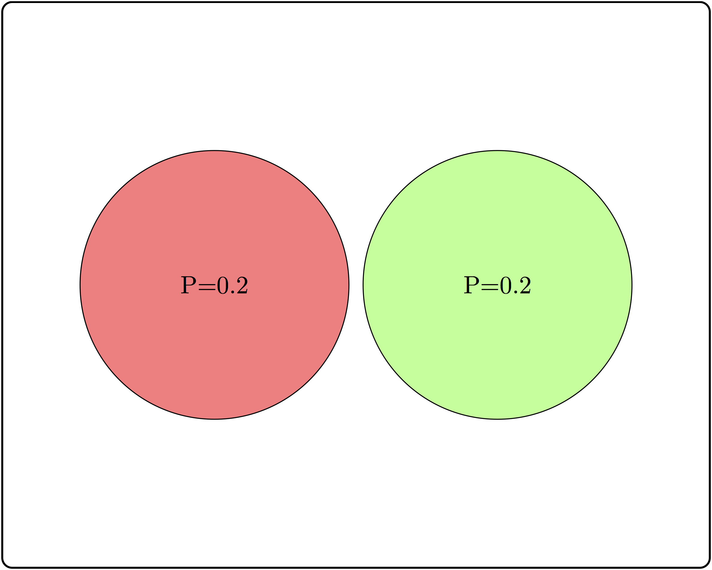
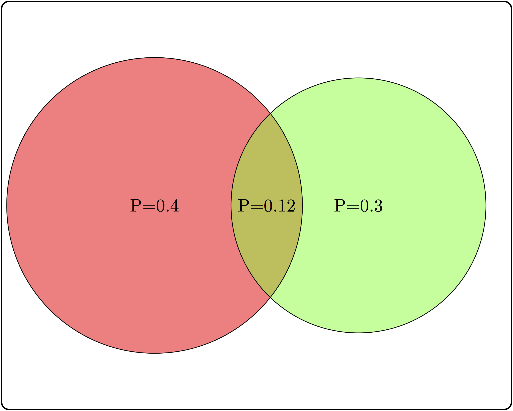
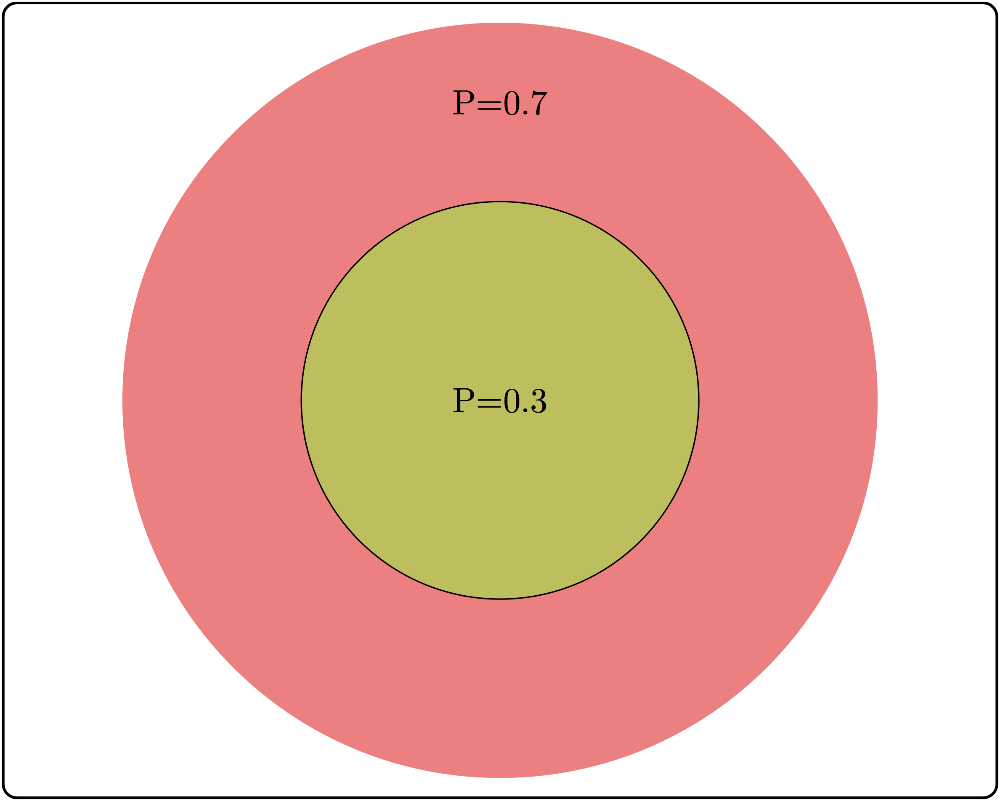

# Independence

> Unconnected and free   
No relationship to anything.  
-- They Might Be Giants, *Unrelated Thing*

In the first part of the book we learned how to describe data sets and probability distributions of random variables. So far we have not discussed how two or more variables may influence each other, and the next four chapters will be devoted to relationships between two variables. Many experiments in biology result in observations that naturally fall into a few categories, for example: sick or healthy patients, presence or absence of a mutation, etc. The resulting data sets are called *categorical*.  Unlike numerical data sets that we will investigate later in chapters 8 and 9, they are not usually represented by numbers. Although it is possible, for instance, to denote mutants with the number 1 and wild type with 0, such designation does not add any value. Categorical variables require different tools for analysis than numerical ones; one cannot compute a linear regression between two categorical variables, because there is no meaningful way to place categories on axes. In this chapter you will learn the following:

* notion of conditional probability

* definition of independence for events and random variables

* produce a categorical data table

* compute a table of expected values based on independence

## Contingency tables to summarize data

What kind of relationship can there be between categorical variables? It cannot be expressed in algebraic form, because without numeric values we cannot talk about a variable increasing or decreasing. Instead, the question is, does one variable being in a particular category have an effect on which category the second variable falls into?  Let us say you want to know whether the age of the mother has an effect on the child having trisomy 21 (a.k.a. Down's syndrome), a genetic condition in which an embryo receives three chromosomes 21 instead of the normal two. The age of the mother is a numerical variable, but it can be classified into two categories: less than 35 and 35 or more years of age. The trisomy status of a fetus is clearly a binary, categorical variable: the fetus either has two chromosomes 21 or three. 

The data are presented in a two-way or *contingency table*, which is a common way of presenting a data set with two categorical variables. The rows in such tables represent different categories of one variable and the columns represent the categories of the other, and the cells contain the data measurements of their overlaps. Table \ref{tab:data_table_DS_age} shows a contingency table for the data set on Down's syndrome and maternal age, in which the rows represent the two categories of maternal age and the columns represent the presence or absence of the syndrome. Each internal cell (as opposed to the total counts on the margins) corresponds to the number of measurement where both variables fall into the specified category, for instance the number of fetuses with the syndrome and a mother under 35 is 28.

Maternal age  |  No DS | DS | Total  
--------------|------- |----|------
    < 35      | 29,806 | 28 |29,834 
   \>= 35     |  8,135 | 64 | 8,199 
   Total      | 37,941 | 92 | 38,033

Contingency table for maternal age and incidence of Down's syndrome. Numbers represent counts of patients belonging to both categories in the row and the column. DS = Down's syndrome. From \citep{malone_first-trimester_2005}.


Once the data are organized into a contingency table, we can address the main question stated above: does the age of the mother have an effect on whether a fetus inherits three chromosomes 21? Perhaps the first approach that suggests itself is to compare the fraction of mothers carrying a fetus with DS for the two age categories. In this case, the fraction for the under-35 category is $28/29834 \approx 0.00094$, while for the 35-and-over category the fraction is $64/8199 \approx 0.0078$. The two fractions are different by almost a factor of 10, which suggests a real difference between the two categories. However, all data contain an element of randomness and a pinch of error, thus there needs to be quantifiable way of deciding what constitutes a real effect. But to determine if there is a relationship, we first have to define what it means to not have one.


## Conditional probability
\label{sec:math6_1}

Let us return to the abstract description of probability introduced in section 8.1. There we used the notion of sample space and its subsets, called events, to describe collections of experimental outcomes. Suppose that you have some information about a random experiment that restricts the possible outcomes to a particular subset (event). In other words, you have ruled out some outcomes, so the only possible outcomes are those in the complementary set. This will affect the probability of other events in the sample space, because your information may have ruled out some of the outcomes in that event as well. 

```{definition, def-cond-prob}
For two events $A$ and $B$ in a sample space $\Omega$ with a probability measure $P$, the probability of $A$ given $B$, called the *conditional probability* is defined as:
$$P(A|B) = \frac{P(A\& B)}{P(B)}$$
```

$A \& B$ represents the intersection of events $A$ and $B$, also known as $A$ and $B$, the event that consists of all outcomes that are in both $A$ and $B$. In words, given the knowledge that an event $B$ occurs, the sample space is restricted to the subset $B$, which is why the denominator in the definition is $P(B)$. The num`erator is all the outcomes we are interested in, which is $A$, but since we are now restricted to $B$, the numerator consists of all the elements of $A$ which are also in $B$, or $A \& B$. The definition makes sense in two extreme cases: if $A = B$ and if $A$ and $B$ are mutually exclusive:

 * $P(B|B) = P(B \& B) /P(B) = P(B)/P(B) = 1$ (probability of $B$ given $B$ is 1)
 * if $P(A\& B) =0$, then $P(A|B) = 0/P(B) = 0$ (if $A$ and $B$ are mutually exclusive, then probability of $A$ given $B$  is 0)




There are some common misunderstandings about conditional probability, which are usually the result of discrepancies between everyday word usage and precise mathematical terminology.  First, the probability of $A$ given $B$ is not the same as probability of $A$ and $B$. These concepts seem interchangeable because the statement "what are the odds of finding a tall person who likes tea?" is hard to distinguish from ''what are the odds that a person who is tall likes tea?'' The difference in these concepts can be illustrated using a Venn diagram, shown in figure \ref{fig:ch6_cond_prob}. Based on the probabilities indicated there, the probability of randomly selecting a person who is both tall and likes tea is $P(A \& B) = 0.1$, while the probability that a tea drinker is tall is $P(A | B) = 0.1/0.3 = 1/3$, which are different values.

A similar misconception is to be cavalier about the order of conditionality. In general, $P(A | B) \neq P(B |A)$, except in special cases. Going back to the illustration in figure \ref{fig:ch6_cond_prob}, the probability that a tea drinker is tall $P(A | B) = 1/3$ is the different than the probability that a tall person is a tea drinker $P(B|A) = 0.1/0.5 = 0.2$. One must take care when interpreting written statements to carefully distinguish what is known \emph{a priori} and what remains under investigation. In the statement $P(A | B)$, $B$ represents what is known, and $A$ represents what is still to be investigated. 

**Example.** Let us return to the data set in the previous section. Data table \ref{tab:data_table_DS_age} describes a sample space with four outcomes and several different events. One can calculate the probability of a fetus having Down's syndrome (event) based on the entire data set of 38,033 mothers, and 92 total cases of DS, so the probability is $92/38,033 \approx 0.0024$. Similarly, we can calculate the probability of a mother being above 35 as $8,199/ 38,033 \approx 0.256$. 

Now we can calculate the conditional probability of a mother over 35 having a DS fetus, but first we have to be clear about what information is known and what is not. If the age of the mother is known to be over 35 (mature age or MA), then we calculate $P(DS | MA) = 64/8,199 \approx 0.008$. Notice that the denominator is restricted by the information that the mother is over 35, and thus only women in that category need to be considered for the calculation. 

On the other hand, if we have the information that the fetus has DS, we can calculate the reversed conditional probability, what is the probability that a fetus with DS has a mother above age 35? $P(MA | DS) = 64/92 \approx 0.7$. Notice that is both calculations the numerators are the same, since they both are the intersection between the two events, but the denominators are different, because they depend on which event is given.


### Exercises

In figure \ref{fig:mendel_flowers} there is a table of genotypes from the classic Mendelian experiment with genetics and color of pea flowers. The parents are both heterozygous, meaning each has a copy of the dominant (purple) allele B and the recessive (white) allele b. The possible genotypes of offspring are shown inside the square, and all four outcomes have equal probabilities. Based on this information, answer the following questions.

1. What is the probability of an offspring having purple flowers? white flowers?

2. What is the probability of an offspring having genotype $BB$? genotype $Bb$? genotype $bb$?

3. What is the probability of an offspring having genotype $BB$, given that its flowers are purple?

4. What is the probability of an offspring having genotype $Bb$, given that its flowers are purple?

5. What is the probability of an offspring having genotype $BB$, given that its flowers are white?

6. What is the probability of an offspring having genotype $Bb$, given that its flowers are white?}

7. What is the probability of an offspring having purple flowers, given that its genotype is $BB$?


## Independence of events

We first encountered the notion of independence in chapter 3, where two events were said to be independent if they did not affect each other. The mathematical definition uses the language of conditional probability to make this notion precise. It says that $A$ and $B$ are independent if given the knowledge of $A$, the probability of $B$ remains the same, and vice versa.

```{definition, def-indep-events}
Two events $A$ and $B$ are *independent* if $P(A|B) = P(A)$, or equivalently if $P(B|A) = P(B)$.
```

Independence is not a straightforward concept. It may be confused with mutual exclusivity, as one might surmise that if $A$ and $B$ have no overlap, then they are independent. That however, is false by definition, since $P(A|B)$ is 0 for two mutually exclusive events. The confusion stems from thinking that if $A$ and $B$ are non-overlapping, then they do not influence each other. But the notion of influence in this definition is about information; so of course if $A$ and $B$ are mutually exclusive, the knowledge that one of them occurs has an influence of the probability of the other one occurring.

A useful way to think about independence is in terms of fractions of outcomes. The probability of $A$ is the fraction of outcomes out of the entire sample space which is in $A$, while the probability of $A$ given $B$ is the fraction of outcomes in $B$ which are also in $A$. The definition of independence equates the two fractions, therefore, if $A$ occupies 1/2 of sample space, in order for $A$ and $B$ to be independent, events in $A$ must constitute 1/2 of the event $B$. In the illustration in figure \ref{fig:ch6_cond_prob}, the fraction of tall people is 0.5 of the sample space, but the fraction of tea-drinkers who are tall is $0.1/0.3=1/3$. Since the two fractions are different, $A$ and $B$ are not independent.

 




### Exercises

Consider three examples of events and their intersections in figure \ref{fig:ch6_indep_ex}.

1. Based on the two non-overlapping (mutually exclusive) events, calculate the conditional probability $P(A|B)$ and compare it with $P(A)$. Are $A$ and $B$ independent?

2. Based on the two partially overlapping events, calculate the conditional probability $P(A|B)$ and compare it with $P(A)$. Are $A$ and $B$ independent?

3. Based on the two completely overlapping events, calculate the conditional probability $P(A|B)$ and compare it with $P(A)$. Are $A$ and $B$ independent?


### product rule

The definition of independence is abstract, but it has a direct consequence of great computational value. From the definition of conditional probability, $P(A|B) = P(A\cap B)/P(B)$, and if $A$ and $B$ are independent then $P(A|B)$ can be replaced with $P(A)$, leading to the expression $P(A) = P(A\& B)/P(B)$. Multiplying both sides by $P(B$) gives us the formula called the *product rule*, which states that for two independent events the probability of both of them occuring is the product of their separate probabilities:

$$
P(A \& B) = P(B)P(A)
$$

The product rule is extremely useful for computing probability distributions of complicated random variables. Recall that the binomial distribution, which we saw in section \ref{sec:math4_2} is based on a string of $n$ Bernoulli trials which are independent of each other, which allows the calculation of the probability of a string of successes and failures, or heads/tails, etc. In practice, independence between processes is rarely true in the idealized mathematical sense. However, computing the probability of two random variables without independence is extremely difficult, so it is useful to make the independence assumption and then test it against the data. If it stands up, you have a good predictive model, and if it does not, you have learned that two processes are somehow linked, which is very useful.

## Independence of variables 

The product rule enables us to extend the notion of independence from events to variables. The concepts of independence is the same in both contexts, since the probability of a value $x$ of a random variable $X$ corresponds to the probability of the event that gets mapped to $x$ by the variable. In order to make independence applicable to variables, the condition must hold true for all possible values of both random variables. That way, knowing the value of one variable has no effect on the probability of the other. In order to make it simpler to calculate, we will use the product rule as the equivalent condition for independence:

```{definition, def-indep-var}
Two random variables $X$ and $Y$ are *independent* if for all possible values of $X$ and $Y$ it is true that
$$ P(X=a  \& Y=b) = P(X=a)P(Y=b)$$
```

This allows us to address the question posed at the beginning of the chapter: how can one determine whether a data set has independent variables? The definition allows us to calculate what we would expect if the variables were independent. Given a data set in the form of a contingency table, such as table \ref{tab:data_table_DS_age}, we can first calculate the probabilities of the two variables separately, and then from that predict the probabilities of the two variables together. 

**Example.** Let us calculate the expected probabilities and frequencies of Down's syndrome in pregnant women in the two age categories. First, compute the probabilities of having Down's syndrome (and not having it), based on all the pregnancies in the data set: $P(DS) = 92/38033 \approx 0.002419$; the complementary probability is $P(no \ DS) = 1 - P(DS)$. Similarly, we can calculate the probability that a pregnant woman is 35 or over, based on the entire data set (let's denote this event $MA$ for mature age). $P(MA) = 8199/38033 \approx 0.21558$; the complementary probability is $P(YA) = 1  - P(MA)$ ($YA$ stands for young age). 

These separate probabilities were calculated from the data, and now we can use them to calculate the predicted probabilities of different outcome, based on the assumption of independence. The probability of a mature-age woman having a pregnancy with Down's syndrome, based on the product rule is $P(MA \& DS) \approx 0.0024 \times 0.216 = 0.000518$. Similarly, we can calculate the probabilities of the other three outcomes: $P(YA \& DS) \approx 0.0019 $; $P(MA \& no \ DS)  \approx 0.2156$; $P(YA \& no \ DS) \approx 0.782$.

These probabilities are the predictions based on the assumption that the two variables are independent. To compare the predictions with the data, we need to take one more step: convert the probabilities into counts, or frequencies of each occurrence. Since the probability is a fraction out of all outcomes, to generate the predicted frequency we need to multiply the probability by the total number of data points, in this case pregnant patients. The results of this calculation are seen in table \ref{tab:exp_table_DS_age} with expected frequencies shown instead of experimental observations.


Maternal age  | No DS    | DS  | Total  
--------------|----------|-----|------
    < 35      | 29,761.8 |72.2 |29,834 
   \>= 35     | 8,179.2  |19.8 |8,199 
   Total      | 37,941   | 92  |38,033

Expected frequencies of Down's syndrome for two different age groups of mothers, assuming that age and Down's syndrome are independent.


Notice that expected frequencies do not need to be integers, because they are the result of prediction and not a data measurement. Now that we have a prediction, we can compare it with the measurements in the data table \ref{tab:data_table_DS_age}. The numbers are substantially different, and we can see that the predicted frequency of Down's syndrome for women under 35 is larger than the frequencies for women at or above 35, due to the larger fraction of patients in the younger age group. We can calculate the differences between the *observed* and *expected* contingency tables to measure how much reality differs from the assumption of independence:


Maternal age  | No DS    | DS  | Total  
--------------|----------|-----|------
    < 35      | 44.2     |-44.2|29,834 
   \>= 35     | -44.2    |44.2 |8,199 
   Total      | 37,941   | 92  |38,033

Differences between the observed frequencies of Down's syndrome for different maternal ages and the expected frequencies based on the assumption of independence.

The table of differences shows that the observed frequency of DS in the data set are higher than expected by 44.2 for women above 35 years of age and is lower than expected by the same number for women below age 35. This demonstrates that mathematically speaking, the two variables of age and DS are not independent.

However, real data is messy and subject to randomness of various provenance. First, there is sampling error that we explored in chapter 9, which means that samples from two perfectly independent variables can and will differ from expected frequencies. Second,  measurement errors or environmental noise can contribute more randomness to the data. Thus, simply checking that observed frequencies are different from expected is not enough to conclude that the variables are not independent. We need a method to decide what scale of differences is enough to declare that there is an effect e.g. of maternal age on the likelihood of DS. To do this, we leave the cozy theoretical confines of probability and venture into the wild and treacherous world of statistics. 
