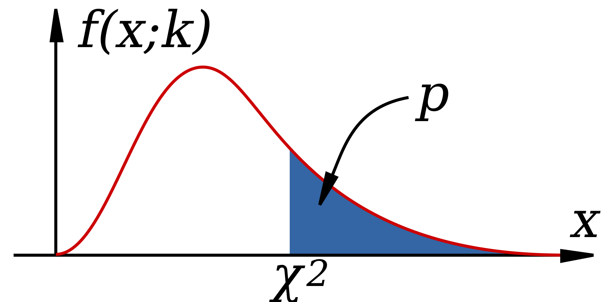

# Hypothesis testing

> Sometimes I'm right and I can be wrong  
My own beliefs are in my song.  
-- Sly and the Family Stone, *Everyday People*

This chapter introduces hypothesis testing and explains how to evaluate the results. This fundamentally involves two steps: stating the hypothesis and then making the binary decision whether to reject it or not. Although such a dualistic approach is necessarily reductive, there are many situations that make it necessary: deciding whether to approve a drug or start a treatment, for example. Much of the scientific method is based on hypothesis testing: scientists formulate an idea (hypothesis), then accumulate data that can challenge it, and if the data contradict the hypothesis, they discard it (the hypothesis, not the data!) No hypothesis in science is ever proven in an absolute sense, which is why it is fundamentally different from mathematics. A hypothesis that has survived many tests and was found to be consistent with all available observations becomes a theory, like the theory of gravity or of evolution. But unlike a theorem, a scientific theory is not certain, and if solid evidence were to surface that contradicts Newton's gravitational theory, it would be falsified and thrown out (again, the theory, not the evidence.)

In this chapter we will describe the framework of hypothesis testing and apply it to the specific task of deciding whether two variables are independent. After reading it you will know how to:

* Explain the difference between the truth of the hypothesis and a test result
* Describe four different outcomes of hypothesis testing
* Compute different hypothesis testing error rates
* Explain the meaning of p-value
* Use R to perform the chi-squared test

## Terminology and quality measures

### positives and negatives

In the classic statistical framework, the hypothesis to be tested is usually called the *null hypothesis*, which helpfully rhymes with dull, because it represents the lack of anything interesting, essentially the default state of the system. In order to reject the null hypothesis, the data has to be substantially different from what is expected as default. For instance, medical tests have the null hypothesis that the patient is normal/healthy, and only if the results are substantially different from normal the patient is considered ill. Another common example is the criminal justice system: a defendant on trial undergoes a binary test where the null hypothesis is innocence. Only if the prosecutor's evidence is strong, that is, shows guilt beyond a reasonable doubt, that the null hypothesis is rejected and the defendant found guilty.

Tests are binary, in that there are only two possible decisions: to reject the hypothesis or to not reject it. We can never truly accept a hypothesis as true, due to the impossibility of perfect knowledge of the world. The decision to reject a hypothesis is called a *positive* test result, which seems backwards, but remember that the default or null hypothesis is a lack of anything unusual or interesting, so if the data are different from default, it is called a positive result. The decision to not reject the null hypothesis is called a *negative* test result. You are probably familiar with this in a medical context: if you've ever been tested for a disease, you know that a negative result is good news!

### types of errors

Hypothesis testing gives us a positive or negative result, but that does not mean that it is correct. Ideally, we want the test to reject a false null hypothesis, and not reject a true null hypothesis. These results are called, respectively, a *true positive* and a *true negative*. We can think of the hypothesis as a variable that can be either true or false, and of the test result as another variable than can be positive or negative. In the language of probability, the correct test results can be defined as follows:

```{definition, def-correct-test}
For a hypothesis that can be either false (F) or true (T) and a test result that can be either positive (P) or negative (N), the probabilities of a *true positive* and *true negative* are:
$$ 
P(TP) = P(P \& F); \; P(TN) = P(N \& T)
$$
```

However, hypothesis tests are not infallible, and they can make mistakes of two different types. A test that rejects a true null hypothesis makes a *type I error* or a *false positive* error, while a test that fails to reject a false null hypothesis makes a *type II error* or a false negative error. We can again define the probabilities of the two error types as the overlap of the events:

```{definition, def-test-errors}
For a hypothesis that can be either false (F) or true (T) and a test result that can be either positive (P) or negative (N), the two types of errors are:
$$ 
P(FP) = P(P \& T); \; P(FN) = P(N \& F)
$$
```


Test result | $H_O = F$ | $H_O=T$
------------|-----------|--------
Positive    |  TP       |  FP
Negative    |  FN       |  TN 

Table summarizing the four possible results of hypothesis testing, depending on the truth of null hypothesis $H_0$ and on the testing result. 

### test quality measures

Now that we have classified the four outcomes of hypothesis testing, we can define the measures of quality of a given hypothesis test. This aims to address a practical concern: how much can you trust a test result? One may answer this question by testing on data where the hypothesis is known to be either true or false. For example, if there is a "gold standard" method for determining the presence or absence of disease, one can use that information to measure the quality of a new test. By performing enough tests, we can measure the frequencies of the four testing outcomes and then measure the following two quality metrics:

```{definition, def-sens}

The *sensitivity* (or power) of a test is the probability of obtaining a positive result, given a false hypothesis.
$$ Sens = P(P | F) = \frac{P(TP)}{P(TP) + P(FN)} $$

The *specificity* of a test is the probability of obtaining the negative result, given a true hypothesis. 

$$ Spec = P(N | T) = \frac{P(TN)}{P(TN) + P(FP)} $$
```

Note that these are conditional probabilities, premised on knowing whether the hypothesis is actually true. On the other hand, there are two kinds of *error rates*: 

```{definition, def-error-rates}
The *type I error rate* or *false positive rate* is the probability of obtaining the positive result, given a true hypothesis (complementary to specificity):
$$FPR = \frac{FP}{TN+FP}$$
   
The *type II error rate* or *false negative rate* is the probability of obtaining the negative result, given a false hypothesis (complementary to sensitivity). 
$$FNR = \frac{FN}{TP+FN}$$
```


Notice that knowledge of sensitivity and specificity determine the type I and type II error rates of a test since they are complementary events.  Of course, it is desirable for a test to be both very sensitive (reject false null hypotheses, detect disease, convict guilty defendants) and very specific (not reject true null hypotheses, correctly identify healthy patients, acquit innocent defendants), but that is impossible in practice. In fact, making a test highly sensitive (e.g. diagnose every patient with a disease) will make it useless because of it lack of specificity, and vice versa. In statistics, as in life, tradeoffs are required.

### Exercises

Test for TB |TB absent | TB present
------------|----------|-----------
Negative    | 1739     | 8    
Positive    | 51       | 22 

Data for TB testing using X-ray imaging

Table \ref{tab:TB_test} shows the results of using X-ray imaging as a diagnostic test for tuberculosis in patients with known TB status. Use it to answer the questions below.

1. Calculate the marginal probabilities of the individual random variables, i.e. the probability of positive and negative X-ray test results, and of TB being present and absent.

2. Find the probability of positive result given that TB is absent (false positive rate) and the probability of a negative result given that TB is absent (specificity).

3. Find the probability of negative result given that TB is present (false negative rate) and the probability of a positive result given that TB is present (sensitivity).

4. Find the probability that a person who tests positive actually has TB (probability of TB present given a positive result).

5. Find the probability that a person who tests negative does not have TB (probability of no TB given a negative result).

6. Assuming the test result and the TB status are independent, calculate the expected probability of both TB being present and a positive X-ray test.}

7. Under the same assumption, calculate the expected probability of both TB being absent and a positive X-ray test.

### rejecting the null hypothesis

Hypothesis testing is one of the most important applications of statistics. People often think of statistics as a collection of tests to be used for different hypotheses, which is too simplistic, but different tests do occupy a large fraction of statistics books. In this book we will only dip a toe into hypothesis testing, and will primarily approach it in a probabilistic (model-centered) way rather than from a  statistical (data-centered) viewpoint. Probability allows us to calculate the sensitivity and specificity of a test for a given null hypothesis, provided the hypothesis is simple enough and the data are sampled correctly.

**Example: testing whether a coin is fair.** Suppose we want to know whether a coin is fair (has equal probabilities of heads and tails) based on a data set of several coin tosses. How much evidence do we need in order to reject the hypothesis of a fair coin with a small chance of making a type I error? What is the corresponding chance of making a type II error, not detecting an unfair coin? 

Let us first consider a data set of two coin tosses. If one is heads and one is tails, it's obvious we have no evidence to reject the null hypothesis. But what if both times the coin landed heads? The probability of this happening for a fair coin is 1/4, which means that if you reject the null hypothesis based on the evidence, your probability of committing a type I error is 1/4. However, it is very difficult to answer the second question about making a type II error, because in order to do the calculation we need to know something about the probability of heads or tails. The hypothesis being false only means that the probability is not 1/2, but it could be anything between 0 and 1. 

Let us see how this test fares for a larger sample size. Suppose we toss a coin $n$ times, and if all $n$ come up heads, then we reject the hypothesis that the coin is fair. A fair coin will come up all heads with probability $1/2^n$, so that is the rate of false positives for this test. For example, if a coin came up heads ten times in a row, there is only a 1/1024 probability that this is the result of a fair coin, so the probability of making a type I error is less than 0.1%. Is this careful enough? This question cannot be answered mathematically - it depends on your sense of acceptable risk of making a mistake. Notice that if you decide to use a very stringent criteria for rejecting a null hypothesis, you will necessarily end up not rejecting more false hypotheses. Such is the face of us mortals, dealing with imperfect information in an uncertain world.

This leads us to an important new idea: the probability that a given data set is produced from the model of the null hypothesis is called the *p-value* of a test. In the example of coin tosses we just studied, the p-value was $p=1/2^n$. However, what if the data had 9 heads out of 10 tosses? The p-value then would be the probability of obtaining 9 or 10 heads out of 10. This is because to compute the probability of making a false positive error, we consider all cases that could have produced the result that is as different from expectation, or even further from expectation (in this case, 5 heads out of 10) than the data. \citep{whitlock_analysis_2008}.

```{definition, def-p-val}
For a data set $D$ and a null hypothesis $H_0$, the *p-value* is defined as the probability of obtaining a result as far from expectation or farther than the data, given the null hypothesis.
```

The p-value is the most used, misused, and even abused quantity is statistics, so please think carefully about its definition. One reason this notion is frequently misused is because it is very tempting to conclude that the p-value is the probability of the null hypothesis being true, based on the data. That is not true! The definition has the opposite direction of conditionality - we assume that the null hypothesis is true, and based on that calculate the probability of obtaining the data. There is no way (according to classical frequentist statistics) of assigning a probability to the truth of a hypothesis, because it is not the result of an experiment. 
The simplest way to describe the p-value is that it is the likelihood of the hypothesis, based on the data set. This means that the smaller the p-value, the less likely the hypothesis, and one can be more certain about rejecting the hypothesis. Alternatively, the p-value represents the probability of making a type 1 error, or rejecting the correct null hypothesis for a particular data set. These two notions may seem to be in conflict, but they tell the same story: if the hypothesis is likely, the probability of making a type 1 error is high.

## Chi-squared test

Now we are ready to address the question raised in the previous chapter of testing the independence hypothesis based on the table of observations and the calculated table of expected counts. In order to measure the difference between what is expected for a data table with two independent variables and the actual observations, we need to gather these differences into a single number. One can devise several ways of doing this, but the accepted measure is called the chi-squared statistic and it is defined as follows:

```{definition, def-chi-sq}
The chi-squared value for the independence test is calculated on the basis of a two-way table with $m$ rows and $n$ columns as the sum of the differences between the observed counts and the computed expected counts as follows:
$$\chi^2= \sum_i \frac{(Observed(i)-Expected(i))^2}{Expected(i)}$$
The number of degrees of freedom of chi-squared is $df = (m-1)(n-1)$.
```

This number describes how far away the data is from what is expected for an independent data set. Therefore, the larger the chi squared statistic, the larger the differences between observed and expected frequency, and thus the null hypothesis  of independence is less likely. However, simply obtaining the $\chi^2$ is not enough to say whether the two variables are independent. We need to translate the chi-squared value into the language of probability, that is to ask, what is the probability of obtaining a data set with a particular $\chi^2$ value, if those two variables were independent.

This question is answered using the *chi-squared probability distribution*, which describes the probability of the random variable $\chi^2$. Like the normal distribution we saw in section \ref{sec:math5} it is a continuous distribution, because $\chi^2$ can take any (positive) real value. In another similarity, the  $\chi^2$ distribution has an even more complicated functional form than the normal distribution, so I do not present it here, because it is not enlightening. I will also not share the derivation of the mathematical form of the distribution, as it is far outside the goals of this text. In practice, nobody computes either the chi-squared statistic or its probability distribution function by hand, instead computers handle these chores. The chi-squared distribution has one key parameter, called the number of degrees of freedom, which was defined above. Depending on d.f. the distribution changes, specifically for more degrees of freedom the distribution moves to the right, that is, the chi-squared values tend to be larger.



The chi-squared distribution is used to determine the probability of obtaining a chi-squared statistic as at least as large as observed, based on the null hypothesis of independence. Figure \ref{fig:ch6_chisq_dist} shows a plot of the chi-squared distribution, as well as the total probability to the right of an observed $\chi^2$. This allows one to use it for the *chi-squared test* for independence between random variables, by comparing the p-value obtained from the distribution (by a computer) against a number called the *significance* level, which is decided by humans. The significance value $\alpha$ is a threshold that the test has to clear in order to reject the null hypothesis: if the p-value is less than $\alpha$, the independence hypothesis is rejected, otherwise it stands, although one can never say that the independence hypothesis is accepted.

There is no mathematical or statistical method for determining the appropriate significance level, it is entirely up to the users to decide how much risk of rejecting a true null hypothesis they are willing to tolerate. If you choose 0.01, that means you want the likelihood of the hypothesis to be less than 1% percent in order to reject it. This is entirely arbitrary, and using a rigid significance level to decide whether a hypothesis is true can lead to major problems which we will discuss in the next chapter.

Like all mathematical models, the chi-squared distribution relies on a set of assumptions. If the assumptions are violated, then the probability distribution does not apply and the p-value does not reflect the actual likelihood of the hypothesis. Here are the assumptions:

* the data is from a simple random sample of the population 
* the sample size is sufficiently large
* expected cell counts cannot be too small
* the observations are independent of each other


## Hypothesis testing in R
\label{sec:comp6}

R has many functions for different tests, including the chi-squared test. To use it, one first has to input a data set in the form of a two-way table, where each row represents the values of one random variable, and each column represents the values of the second random variable. The following script shows how to manually input a 2 by 2 contingency table into a matrix. In the matrix function, `ncol` stands for number of columns, and `nrow` for number of rows. Notice the order in which the numbers are put into the matrix: down the first column, then the second, etc. Type `help(matrix)` for more details. In order to access a specific element of the matrix, just like in vectors, R uses square brackets and two indices, first one for row, and second for column. Below are examples of accessing two elements of the matrix data defined above, and how to reference a particular element of the matrix.

```{r}
data <- matrix(c(442,514,38,6),ncol=2,nrow=2)
print(data)
print(data[1,2])
print(data[2,1])
```

Based on a given data set, how likely is the hypothesis that the two random variables are independent?  It is hard to do by hand (in the old days, you looked it up in a table of chi-squared values) but R will do it all for us: 1) calculate the expected counts, 2) compute the chi-squared value for the table, and 3) use the number of degrees of freedom and the chi-squared value to calculate the p-value of the independence hypothesis based on it. Use the `chisq.test()` function, and you will see output like this:

```{r}
test.output <- chisq.test(data)
print(test.output)
```

The results are the chi-squared values, the number of degrees of freedom (which depends on the number of rows and columns in the two-way table) and the p-value. The p-value is used to decide whether to reject the hypothesis, because it represents the likelihood of the hypothesis, given the data. In this case, the p-value is pretty small, so it seems relatively safe to reject the hypothesis of independence.  To see the results of the hypothesis test, type `print(test.output)` and to access the p-value individually, use `test.output$p.value`.

Finally, we need to specify the significance level $\alpha$ for the hypothesis test. This refers to the probability of rejecting a true null hypothesis, by random chance. For instance, if you reject the hypothesis at $\alpha=0.05$ significance, you're accepting a 5% chance that you falsely rejected a correct hypothesis. Note that it says nothing about failing to reject an incorrect hypothesis (also called the rate of false negatives.) 

### example with data

Let us return to the data presented in section \ref{sec:model6}. We noted that the fraction of women in different age categories carrying fetuses with DS are different, but how certain are we that is not a fluke? To test the hypothesis of independence, we input the data into R and then run the chi-squared test:

```{r}
data <- matrix(c(29806, 8135, 28, 64),ncol=2,nrow=2)
test.output <- chisq.test(data)
print(test.output)
```

This tests of independence between the two variables of maternal age and DS status. The chi-squared parameter is about 122, reflecting the differences between expected and observed frequencies. This number us to calculate the p-value, which is very small (the number is actually caused by machine error). Therefore, the hypothesis can be 
rejected with a very small risk of making an error.


### stop-and-frisk and race

The practice of New York Police Department dubbed "stop-and-frisk" gave police officers to power to stop, question, and search people on the street without a warrant. Since the practice commenced in the early 2000s, it has generated controversy for several reasons. First, the 4th amendment to the U.S. Constitution limits the power of the state to detain and search citizens, by mandating that officials first obtain a warrant based on "probable cause," while based on the Supreme Court interpretation, police are allowed to stop someone without a warrant provided "the officer has a reasonable suspicion supported by articulable facts" that the person may be engaged in criminal activity. Exactly what these conditions mean and whether officers in NYPD always had reasonable suspicions before stopping is a legal matter, rather than a statistical one, and you can read what federal judge Scheindlin ruled on this matter here \citep{_stop-and-frisk_????}.

The second issue raised by stop-and-frisk is whether it violates the principle of equal protection under the law enshrined in the 14th amendment of the Constitution. The idea that the law and its agents should treat people of different backgrounds the same, that people can be punished for their actions, but not for who they are, is deeply rooted in American law and culture. Critics of stop-and-frisk charge that officers disproportionately stop and search people of African-American and Hispanic background and therefore violate their constitutional rights to equal protection. As part of the trial, statistical evidence was introduced about the number of stops of New Yorkers of different racial backgrounds, how many of those stops resulted in the use of force, and how many uncovered evidence of criminal activity leading to an arrest. Let us analyze the data using our tools to address whether race and somebody being "stopped-and-frisked" are related.

The data in the summary of judge Scheindlin's decision is as follows: between 2004 to 2012, out of 4.4 million stops, 52% of the people stopped were black, 31% of the people stopped were Hispanic, and 10% of the people were white. The population of New York according to the 2010 census is approximately 23% black, 29% Hispanic, and 33% white. You may notice that the fractions are suggestive of a higher probability of stops of African-Americans, and lower probability of stops of white individuals, but we cannot use fractions to perform a chi-squared test, because actual counts are necessary to quantify the uncertainty in the testing. 

Below I present data in the form of counts for only the calendar year 2011 \citep{_nypds_????}, in the form of a contingency table with two variables: race/ethnicity and being stopped by police without a warrant. I have used the census population of New York (http://factfinder2.census.gov) and its breakdown by race (white only, black only, Hispanic, other). The data are presented in table \ref{tab:stop_frisk_race}, and then are input in R and run through a chi-squared independence test.

```{r}
data_mat <- matrix(c(61805, 2665172, 350743, 1527029, 223740, 
2119718, 49436, 1201578),ncol=4,nrow=2)
rownames(data_mat) <- c('stopped', 'not stopped')
colnames(data_mat) <- c('White','Black', 'Hispanic', 'Other')
print(data_mat)
test.output <- chisq.test(data_mat)
print(test.output)
```

The results confirm what comparing the percentages suggested: the race of a person in NYC is not independent of whether or not they get stopped and frisked, with only a tiny probability that this disparity could have happened by chance. However, this is only the beginning of the analysis that experts performed for the court trial. Drawing conclusions about motives from the data is tricky, since two variables may be related without a causal connection. Defenders of the practice have argued that the racial disparities reflect differences in criminal activity. The data, however, show that only 6% of the stops result in arrests, and 6% more in court summons, so the vast majority of those stopped and frisked were not engaged in criminal activity. 