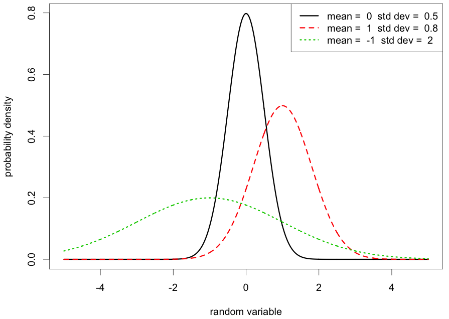
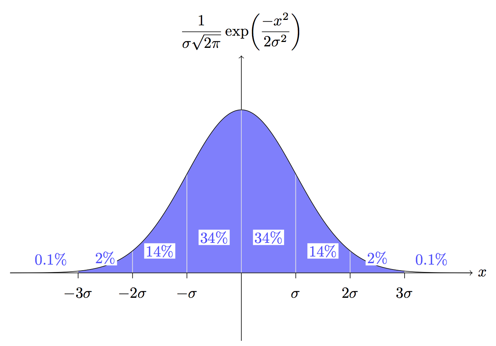

# Sampling distribution and estimation

> Pragmatism!? Is that all you have to offer?  
-- Tom Stoppard, *Rosencrantz and Guildenstern Are Dead*


One of the most common tasks in any experimental science is to measure the value of a quantity by performing repeated experiments. A single experiment is not sufficient because there are always random factors making any single observation imperfect: natural variation of the random variable, experimental error, etc. For example, the number of new mutations (those not present in either parent) in an offspring is a random variable, so each individual may have a different number. A set of experimental measurements is called the *sample*. In this chapter you will learn to do the following:

* understand the sample mean as a random variable

* calculate the standard error for a sample mean

* calculate the confidence interval for the mean

* understand the meaning of the parameters of the normal distribution

* simulate sampling of a random variable using R


## Law of large numbers
\label{sec:math5_1}

### sample mean

The goal in this chapter is to calculate the best estimate of the true mean value of a random variable. To do this, we need to repeat the experiment several times and take the mean of the data set: if one measurement is too high while another one is too low, their average is much closer to the true value.  One important consideration here is that the errors cannot be systematically *biased*. If your experiment always overestimates or underestimates the true value, then averaging the measurements will result in a biased estimate. Second consideration is that the errors cannot depend on each other. This means that if one measurement is above average, it should have no effect on the probability of other measurements being above average. 

In statistical parlance, a perfectly representative, unbiased sample is called a *simple random sample*. Speaking precisely, for a sample with $n$ observations (size $n$) this requires that all subsets of the population of the same size have equal probability of being selected. In practice, this is not easy to verify. Sampling bias occurs if the way a sample is selected results in some participants being systematically overrepresented, and other underrepresented. With a biased sample, any conclusions from a study are suspect, and the mathematics is no longer applicable.

In statistics, it is customary to distinguish between the *population* and the *sample*. The term population doesn't always refer to a collection of people or other living creatures; instead it may refer to all possible outcomes of an experiment - essentially, the entire sample space that we introduced in the previous chapter. Out of this ocean of possibilities, an experimenter fishes out a subset called the sample, and uses it to describe the whole population. It should be clear that the sample needs to be representative of the whole population, if this endeavor is to have any hope of success.

As mentioned in the last section, the most common estimation involves the mean. Here we need to distinguish two concepts: the *true mean* and the *sample mean*. The true mean refers to the quantity we are trying to measure (estimate) and it is considered the mean of a probability distribution of a random variable across the entire population. Thus the true mean is a *parameter* which we are trying to estimate.

The sample mean $\bar X$ is the average of a sample of experimental measurements, an it is a random variable with its own probability distribution. Suppose you've collected a sample of size $n$ and measured its mean $\bar X_1$. If you collect another sample of the same size, its mean $\bar X_2$ will be (most likely) a different number. Repeating this process many times will result in different values of the sample mean, all dancing around the true mean. Provided that each time the data collection was unbiased, producing simple random samples, the variation is due to a combination of variance of the random variable in the population and the *sampling error*. The different sample means result from selecting samples which may randomly contain more numbers higher than the true mean, than those lower (or the opposite).

In this and the following sections we will describe the variation in the sample mean. It is a remarkable fact that we can describe this distribution, called the *sampling distribution of the mean*, in general, and connect it to the true distribution of the variable in the population. The first result describes the mean of the sampling distribution:

```{theorem, LLN1}
(Law of Large Numbers, part 1) For a sample of $n$ independent\index{independence!sampling} measurements with the same distribution with mean $\mu$, the sample mean approaches $\mu$ as $n$ becomes large. More formally, if $X_1, X_2, ... , X_n$ are independent, identically distributed random variables with mean $\mu$, then:
$$ \lim_{n \rightarrow \infty}  \frac{X_1 + X_2 + ... + X_n} {n} =  \lim_{n \rightarrow \infty}  \bar X = \mu $$
```

This result is called the Law of Large Numbers and it is intuitive: as the size of an unbiased random sample increases, its sample mean approaches the true mean. If we are dealing with a finite population, then of course if the sample includes the entire population, its mean will be the true mean.

One consequence of this is that the best estimator for the true mean is the sample mean; in fact it is what is called an *unbiased estimator*, provided the sampling process is unbiased. However, this is of only of limited use to someone trying to estimate a quantity, because the theorem doesn't say how large the sample size needs to be in order for its mean to be reasonably close to the true mean. To address this practical question, let us consider the variance of the sampling distribution. 


### sample size and standard error
As mentioned above, repeated samples from the same populations have varying sample means, and we would like to describe the variance. This variation depends on the sample size, as suggested by the law of large numbers, for large sample sizes the sample mean approaches the true mean. The intuitive fact is that the larger the sample size, the less variation is in the sampling distribution. 

```{theorem, LLN2}
**(Law of Large Numbers, part 2)** For a sample of $n$ independent measurements with the same distribution with variance $\sigma^2$, the variance of the sampling distribution for a sufficiently large $n$ approaches the variance divided by the sample size:
$$ Var(\bar X) = \frac{\sigma^2}{n}$$
```

In other words, for a sample of $n$ independent measurements the variance of the sample mean is inversely proportional to the sample size. Below I will sketch a calculation to justify (if not prove) the theorem. Suppose that the distribution of experimental measurements has the expected value of $\mu$ and the variance $\sigma^2$. Then for a sample of $n$ independent measurements $\{X_i\}$, the variance of the sample mean is the following:

$$ Var(\bar X) = Var\left(\frac{1}{n} \sum_{i=1}^{n} X_i\right)  = 
 \frac{1}{n^2} \sum_{i=1}^{n}Var(X_i) =  \frac{1}{n^2} n \sigma^2 = \frac{\sigma^2}{n}$$
The critical step in that calculation is the second equal sign, where the variance passes inside the sum. This is true because, as we saw in section \ref{sec:math4_2}, the variance of a sum of independent random variables is equal to the sum of the variances. 

It is often useful to deal with standard deviations to describe the spread of a distribution. Since the standard deviation is the square root of variance, we have the following definition:

```{definition, std-err}
The standard deviation of the mean of a sample of $n$ independent, identically distributed random variables with standard deviation $\sigma$ is called the *standard* error of the sample mean. 
```


For large sample size $n$, according to the law of large numbers it approaches $s= \sigma/\sqrt{n}$. The standard error represents the spread in estimation of the true mean based on the data set of size $n$. This means that increasing the sample size by a factor of 100 will lead to a reduction in the spread of the sample mean by a factor of 10. For example, if we obtain a sample of size 1000 instead of 10, the sample mean will have much less volatility.


## Central limit theorem

### normal distribution
In the last section we calculated the mean and the standard deviation of sampling distributions for a large sample size. There is an even more remarkable fact about sampling distributions: they all look the same! 
Regardless of the distribution of the random variable being sampled, the plot of the distribution of sample means approaches the famous bell-shaped curve called the *normal distribution*. This is one of the most fundamental and useful results in all of mathematics, and is called the Central Limit Theorem.

The theorem is much more subtle in both its statement and implications than the law of large numbers, so I need to spell out a few preliminaries. First, the sample mean for a large sample size can take on a whole range of values, so we will think of it as a continuous random variable. Say you're sampling from the uniform distribution of integers between 1 and 10. If your sample size is 2, the mean may be either an integer (e.g. 5 if your sample is 6 and 4) or a fraction with denominator 2 (e.g. 11/2 if your sample is 1 and 10). As the sample size grows larger, the denominator of the sample mean increases, and the possible means are smeared out more densely between the values of the discrete distribution, e.g. for sample size 100, you may observe a sample mean of 3.62. As the sample sizes become larger, it is convenient to stipulate that the range of values of the sample mean is continuous, that is contains all real numbers between the maximum and the minimum values of the original distribution.

This brings us to the magnificent, famous, and indispensable normal, or Gaussian distribution. More correctly, it is the *probability density function* of the normal random variable, which has the range from negative infinity to infinity, that is, any real number. Below is the mathematical form of its density function $\rho(x)$, with parameters $\mu$ and $\sigma$ representing the mean and the standard deviation, respectively \citep{whitlock_analysis_2008}. 

$$\rho(x) = \sqrt{\frac{1}{2\pi \sigma^2}} e^{-\frac{(x-\mu)^2}{2 \sigma^2}}$$




The function of the random variable $x$ is plotted in figure \ref{fig:ch5_normal_dist}, for different values of the mean and the standard deviation. The shape of the distribution is the famous bell-shaped curve, and the mean indicates the position of the peak on the $x$-axis. The standard deviation parameter is responsible for the width of the distribution: the larger $\sigma$, the broader and more spread out the distribution. Those are the only parameters in the normal distribution, everything else about it remains the same.

This probability density function differs from the discrete distribution functions we saw in the last chapter in one key way: although you can plug in a particular value of the normal random variable, the number it returns is not the probability of that particular value. Properly speaking, the probability of any particular value of the normal random variable, like 3.2, is indistinguishable from zero, because there are infinitely many such values and if they all had nonzero probabilities, the total probability of the distribution would be infinite. In fact, the total probability of the normal random variable must be 1, as dictated by the axioms of probability seen in section \ref{sec:math4_1}. 

Instead, in order to extract probability from a density function, it must be integrated. The integral is the equivalent of a sum when you need to add up numbers from a continuous range. So instead of calculating the probability of one value, for continuous random variables we can calculate the probability of a range of values by taking the integral of the density function $\rho(x)$ on that range. For example, the probability of the normal random variable with $\mu=1$ and standard deviation $\sigma=0.8$ being in the range between 0 and 1 is:
$$ P(0 < x < 1) = \sqrt{\frac{1}{2\pi 0.8^2}} \int_{0} ^1 e^{-\frac{(x-1)^2}{2 \times 0.8^2}}dx$$
These integrals may look intimidating, and rightly so: there is no method for solving them the way you may have done in a calculus course. But although we cannot write down an algebraic formula, we can still find the answer \emph{numerically}, that is as a number. In the old days, one consulted a table in the back of the probability or statistics textbook that contained the values of these integrals. We can do this much more efficiently using R, as will be demonstrated in the computational section below.

Now that we have a nodding acquaintance with the normal distribution, here is its most wonderful property: the means of samples, for large sample sizes, are distributed normally. 

```{theorem, CLT}
**(Central Limit Theorem)** The distribution of the mean of a sample of $n$ independent\index{independence!sampling}, identically distributed random variables with mean $\mu$ and standard deviation $\sigma$ approaches for large $n$ the \emph{normal distribution} with mean $\mu$ and standard deviation $\sigma/\sqrt{n}$. If the above conditions are met, the probability that a sample mean will fall between values $a$ and $b$ is given by the integral of the probability density function:

$$ P(a < \bar X < b) = \sqrt{\frac{n}{2\pi \sigma^2}} \int_{a} ^b e^{-\frac{(x-\mu)^2}{2 \sigma^2/n}}dx$$
```

This theorem gifts us the ability to predict how widely the means of a sample can vary around the true mean. If you know the true mean $\mu$, the true standard deviation $\sigma$, and the sample size  $n$ is large enough (ignoring for a second what that means exactly) then the probability of the sample mean being off by 0.1 from the true mean in either direction is:
$$ P(\mu-0.1< \bar X < \mu+0.1) = \sqrt{\frac{n}{2\pi \sigma^2}} \int_{\mu-0.1} ^{\mu+0.1} e^{-\frac{(x-\mu)^2}{2 \sigma^2/n}}dx$$

To evaluate this integral (numerically) we need to know the values of the three parameters: $\mu$, $\sigma$, and $n$. In practice, only the sample size $n$ is known, while $\mu$ and $\sigma$ are parameters of the true distribution, and can be only estimated. The next section is devoted to sorting out the statistical details. 


### confidence intervals
The central limit theorem is a purely mathematical result, but it is used in a wide range of practical applications, from public opinion polling to medical risk assessments. In this section we journey from the abstract land of probability to the data-driven domain of statistics on a quest for correct estimation of means. When reporting any experimental measurement, it is mandatory to include *error bars* around the mean of a data set to indicate a range of plausible values of the estimated quantity, usually in the form of $\bar X \pm \epsilon$. The meaning of these error bars varies: sometimes the standard deviation of the measurements ($\sigma_X$) is used, other times the standard error, but the correct way to report uncertainty in estimation is to calculate the confidence interval \citep{whitlock_analysis_2008}. 

```{definition, conf-int}
A *confidence interval*  is a range of values calculated from a data set to estimate the true value of a quantity (e.g. mean). The associated *confidence level* $\alpha$ (between 0 and 1) is the likelihood that the confidence interval contains the true value.
```

The meaning of confidence intervals is pretty subtle. This is in large part because of the word likelihood in the definition, which in everyday language is interchangeable with probability, but as mathematical terms they are not. Here is the wrong way to think about them: a confidence interval for a mean at $\alpha$ level does not mean that the true mean has probability $\alpha$ of being in that interval. The true mean is not a random variable, it is a parameter of the probability distribution that we assume exists. Instead, it means that if sampling were repeated many times, out of the resulting confidence intervals fraction $\alpha$ would contain the true mean. 

You can see from this definition that there is more than one confidence interval one can report from a single data set, because its size depends on the confidence level. At first glance, you might be tempted to make $\alpha$ as large as possible - after all, you'd like to have maximum confidence in your estimate. Unfortunately, it is impossible to provide a confidence interval in which the true mean is guaranteed to reside, short of making the interval infinitely wide. However, one generally wants the estimate to be precise, which means making the confidence internal as narrow as possible. This brings us to the cruel fact of the estimation business: the goal of making a useful (precise) estimate is in opposition to the goal of making a confidence interval with a large confidence level. One can always make a very precise estimate, but it will have a lower confidence level, or one may increase the confidence by making the interval larger. 




So, given a data set, how do we construct a confidence interval? First, we need to choose the desired confidence level, for example $\alpha=0.95$, which is commonly used. The data set has a sample mean $\bar X$, sample standard deviation $\sigma_X$, and sample size $n$, which are at our disposal. The central limit theorem tells us that the distribution of sample means is normal (provided $n$ is large enough) with mean $\mu$ and standard deviation $s=\sigma/\sqrt n$. One can calculate the deviation around the $\mu$ that define a confidence interval using fancy integrals or computers. Figure \ref{fig:ch5_sigma_levels} shows the probability of falling within a a certain deviation from the mean for integer multiples of standard deviation $\sigma$; for example, the probability of falling within one standard deviation of the mean for a normal random variable is approximately 68%. Luckily, these probability levels are the same for all normal distributions, so they can be used to calculate the confidence interval for any mean. For instance, the range of the normal random variable that contains 95% probability is approximately $(\mu - 1.96 s, \mu + 1.96 s)$, that is between 1.96 times the standard deviation to the left of the mean to 1.96 the standard deviation to the right of the mean. So to construct the confidence interval one needs the mean $\mu$, the standard error $s$, and the 95% confidence level.

If you were not too bedazzled by different symbols, you might have noticed that there was a bait-and-switch in the argument above. The data set provides the sample mean $\bar X$, but the confidence interval requires the true mean $\mu$. The law of large numbers says that the former approaches the latter for large $n$, but they are not the same. However, there is no choice but to use the imperfect sample mean $\bar X$ as the central point for the confidence interval - because $\mu$ is what we are trying to estimate! Further, the standard error $s$ actually depends on the true standard deviation $\sigma$, but we have to make do with the sample standard deviation $\sigma_X$, for the exact same reason: the true value is not available. (The topic of proper estimation of standard deviation is another kettle of fish, which I leave aside.) These approximations are not always sufficiently appreciated, but they can lead to notable discrepancies between the theoretical confidence level and the actual confidence level, which will be illustrated in the computational assignments in section \ref{sec:proj5}.

To summarize, here is the recipe for calculating a confidence interval for the true mean at a given confidence $\alpha$ based on a data set $X$ of size $n$:

1. Compute the sample mean $\bar X$, which is the best estimate we have of the true mean $\mu$.

2. Compute the sample standard deviation $\sigma_{X}$, which is the best estimate we have of the actual standard deviation $\sigma$

3.Compute the standard error $s = \sigma_X/\sqrt{n}$

4. Use a table or R to calculate the multiple called $z_\alpha$ for the desired confidence level $\alpha$. For example, $z_{0.9}  \approx 1.65$, $z_{0.95} \approx 1.96$, $z_{0.99} \approx 2.58$.

5. Build the confidence interval by adding and subtracting $z_\alpha s$ from the sample mean $\bar X$. For example, the 95% confidence interval is $\bar X \pm z_{0.95} s= \bar X \pm 1.96\sigma_{X}/\sqrt{n}$.
\end{enumerate}

There are a couple of important points about error bars that make them different in practice from their theoretical setup. The definition states that if you take a bunch of sample and compute their 95% confidence intervals, about 95% of them will contain the true mean. If you actually perform this experiment using R, you will find out that this is not the case, especially for small sample sizes. The reason for this is that the theoretical definition assumes that we use the true mean and true standard deviation to calculate the confidence interval. But the best we can do is to use the sample mean and sample stander deviation, so of course the confidence interval will be off. This is an important caution about being overly confident about confidence intervals. Another caution comes from the fact that they are based on the assumption of perfect independence between different measurements. Bear this is mind when you see a 95% confidence interval reported in a paper, especially one with a small sample size.


### estimating relative risk

Clinical trials to evaluate medical treatments or drugs usually proceed by dividing a group of people into two subgroups: one which receives the treatment and one which does not (control group). If this is done in an unbiased random manner, it is called a randomized controlled trial (RCT), which is typically considered the best study design (for most purposes). The two groups are then compared for the outcomes, such as mortality or morbidity (illness). The comparison is usually done in the form of *relative risk*, or the ratio between the fractions of those with an undesirable outcome in one group and the other. In an idealized case, if the relative risk is 1, there is no difference between the groups, and thus the treatment has no effect. If relative risk is not 1, then it makes a difference (either good or bad).

The astute reader has likely noted that this idealization has no practical value. Relative risk is almost never exactly 1 even if the treatment does nothing, due to chance alone. The actual relative risk from a study may be 1.12 or 0.96. Is this sufficiently different from 1 to say that the treatment has an effect? If only we had a way of computing a range of values to estimate the true value of a quantity... But wait, we do! It's called a confidence interval.

The statistics necessary to compute confidence intervals for relative risk are different than what we have seen, because relative risk is not distributed normally. It turns out that its distribution is log-normal (under some assumptions). We will not delve into the details here, but the basic ideas are the same: choose the confidence level, calculate the confidence interval based on the distribution (in this case log-normal) and the statistics of the data. The main question for a clinical trial is, does this confidence interval include 1 or not? If not, then the treatment has an effect (whether positive or negative) at that confidence level.

The following discussion questions are based on the paper ["Autism occurrence by MMR vaccine status among children with older siblings with and without autism"](https://jamanetwork.com/journals/jama/fullarticle/2275444). Read the paper and discuss with your peers or colleagues using the following questions as a starting point:

1. How are confidence intervals used in the study to conclude that there is no effect of MMR vaccination on development of autism spectrum disorders (ASD)?

2. What are some limitations of the study? How does its design differ from a classic RCT?

3. Does dividing children by whether or not they have a sibling with ASD make the study stronger?


## Sampling and confidence intervals in R

As we saw in section \ref{sec:comp4}, R can be used to generate random numbers from a particular distribution, for example the uniform distribution of real numbers between 0 and 1. This distribution differs from the discrete uniform distribution discussed in section \ref{sec:math4_2}, because the values of the random variable can be any real number between 0 and 1, so it is a continuous variable. The true mean of this distribution is 0.5, but what is the mean of a sample of numbers drawn from a uniform distribution? We can perform this numerical experiment using the R function `runif()`, which generates a specified number of random numbers from the uniform distribution. If you repeat the same command, you will get a different set of values, since they are generated randomly every time.  The following script produces two random samples of size 10 and prints out the means of the samples:

```{r}
sample <- runif(10)
print(sample)
mean(sample)
sample <- runif(10)
print(sample)
mean(sample)
```

If you copy this script and run it yourself, you will obtain different numbers and if you run it several times you will notice that the mean of sample of 10 values is prone to considerable volatility. This leads to two related questions: 1) how large does the sample need to be in order to obtain a good estimate of the true mean? 2) given a random sample and its sample mean, what is the reasonable range of values for the estimate of the true mean? We addressed these questions theoretically in section \ref{sec:math5_1}, and here we investigate them by generating multiple random samples using R. 

The script used to produce figure \ref{fig:data_samplemeans} generates 100 random samples of size 10 (using the uniform random number generator), saves the means of the ten samples into a vector variable, and plots its histogram; then it does the same thing for 100 random samples of size 100. The histograms of sample means in figure \ref{fig:data_samplemeans} demonstrate the effect of sample size that we previously discussed theoretically. As a smaller sample size, the sample means vary more widely, in other words, the distribution of sample means has a larger variance for smaller sample sizes. Although the sampling process is random, and every time the script is run it produces a new set of sample means, in the figure you can see clearly that sample means for samples of size 10 are much more spread out than those for sample size 100.  

```{r sample-dist, fig.show='hold', out.width='50%', fig.asp=.75, fig.align='center',fig.cap = 'Distribution of means of samples drawn from the uniform distribution for different sample sizes: 10 (left) and 100 (right).'}
numsamples <- 100
samplemeans<-rep(NA, numsamples)
samplesize<-10
for (i in 1:numsamples) {
 	sample <- runif(samplesize)
	samplemeans[i] <- mean(sample)
}
title_text <- paste(numsamples, "means of samples of size", samplesize)
hist(samplemeans, main=title_text,cex.axis=1.5,cex.lab=1.5)

samplemeans<-rep(NA, numsamples)
samplesize<-100
for (i in 1:numsamples) {
 	sample <- runif(samplesize)
	samplemeans[i] <- mean(sample)
}
title_text <- paste(numsamples, "means of samples of size", samplesize)
hist(samplemeans, main=title_text,cex.axis=1.5,cex.lab=1.5)
```


The central limit theorem predicts that for large sample size $n$ the distribution of sample means is close to the normal distribution. To demonstrate this, the scripts below generate 1000 samples of size 200 and 500 from the uniform random variable and plot the histograms of sample means shown in figure @\ref(fig:sample-dist). In addition to the histograms, we also overlay plots of the normal distribution with mean $\mu=0.5$ and standard deviation $s = \sigma/\sqrt{n}$, where $\sigma$ is the standard deviation of the continuous uniform distribution between 0 and 1, which happens to be $1/\sqrt{12}$. Notice that for sufficiently many samples (1000), the histograms are clearly bell-shaped, as predicted, despite the random samples being generated from the uniform distribution. The normal distribution curve matches the distribution of samples of size 1000 somewhat better than those of size 100, but the difference is not dramatic. The most important difference is in the spread of the sampling distribution, which is noticeably smaller for the larger sample size. This illustrates how much more accurate an estimate of the mean from sample of size 1000 is compared to sample of size 100.

```{r clt-demo, fig.show='hold', echo=FALSE, out.width='50%', fig.asp=.75, fig.align='center',fig.cap = 'Central limit theorem in action: comparison of histograms of sample means and the normal distribution: on the left is a histogram of means of samples of size 100, on the right means of samples of size 1000'}
numsamples <- 1000
samplemeans<-rep(NA, numsamples)
samplesize<-100
for (i in 1:numsamples) {
 	sample <- runif(samplesize)
	samplemeans[i] <- mean(sample)
}
break_points <- seq(min(samplemeans),max(samplemeans), 
(max(samplemeans)-min(samplemeans))/20)
hist(samplemeans, breaks=break_points, freq=FALSE, cex.axis=1.5,cex.lab=1.5,
main='1000 means of samples of size 100')
sigma<-1/sqrt(12)/sqrt(samplesize)
mu<-0.5
range <- seq(min(samplemeans),max(samplemeans), sigma/100)
lines(range,dnorm(range,mu,sigma),t='l',lwd=3,col=2,lty=1,cex.axis=1.5,cex.lab=1.5)
samplemeans<-rep(NA, numsamples)
samplesize<-1000
for (i in 1:numsamples) {
 	sample <- runif(samplesize)
	samplemeans[i] <- mean(sample)
}
sigma<-1/sqrt(12)/sqrt(samplesize)
break_points <- seq(min(samplemeans),max(samplemeans), 
(max(samplemeans)-min(samplemeans))/20)
hist(samplemeans, breaks=break_points, freq=FALSE, cex.axis=1.5,cex.lab=1.5,
main='1000 means of samples of size 1000')
range <- seq(min(samplemeans),max(samplemeans), sigma/100)
lines(range,dnorm(range,mu,sigma),t='l',lwd=3,col=2,lty=1)
```


### computing confidence intervals
Now let us compute a confidence interval for the mean based on a sample, following the recipe at the end of section \ref{sec:math5_2}. To do this we will use the function `qnorm()`, which is the inverse normal density function. This means that for a given probability level $p$, the function returns the value $x$ of the standard normal random variable with mean $\mu=0$ and standard deviation $\sigma=1$, such that the total probability of the distribution being less than $x$ is equal to $p$. For instance, since the standard normal is a symmetric distribution with mean 0, the probability of the random variable being below 0 is 0.5, as shown by the command in the script below. The second command in the script calculates the value of the standard normal so that 95% of the probability is to its left.

```{r}
qnorm(0.5) # the value that divides the density function in two
qnorm(0.95) # the value such that 95% of density is to its left 
```

The function `qnorm()` is necessary for computing the $z_\alpha$ values for a given confidence value $\alpha$. The $z_\alpha$ is the value of the standard normal such that the random variable $z$ had probability $\alpha$ of being within $z_\alpha$ of the mean $\mu=0$; in other words, it requires that the probability of being outside of the interval $(-z_\alpha, z_\alpha)$ is $1-\alpha$. The function `qnorm(p)` returns the value $x$ so that the standard normal has probability $p$ of being less than $x$; in other words, that probability being greater than $x$ is $1-p$. There are two ways of being outside the interval $(-z_\alpha, z_\alpha)$: less than $-z_\alpha$ (called the left tail of the distribution) and greater than $z_\alpha$ (called the right tail of the distribution). The values $z_\alpha$, by definition, represent tails of $(1-\alpha)/2$, because there are two tails, and the normal distribution is symmetric.

The script below generates a sample from the uniform distribution, computes its mean and standard deviation, and the standard error. Then it calculates the value $z_\alpha$ based on the defined $\alpha$ value, and calculates the variables right and left, the respective boundaries  of the confidence interval for the true mean. The script shows confidence intervals calculated from a sample of size 10 and a sample of size 100.

```{r}
size <- 10 # sample size
alpha <- 0.95 # significance level
sample<-runif(size)
s <- sd(sample)/sqrt(size) # standard error
z <- qnorm((1-alpha)/2) # z-value
left <- mean(sample)+s*z
right <- mean(sample)-s*z
print(right)
print(left)
size <- 100 # sample size
sample<-runif(size)
s <- sd(sample)/sqrt(size) # standard error
z <- qnorm((1-alpha)/2) # z-value
right <- mean(sample)+s*z
left <- mean(sample)-s*z
print(right)
print(left)
```
Every time you run this script, it will produce new samples and therefore different confidence intervals, but most of the time (theoretically, 95\% of the time, although that is not practically true) the confidence interval will contain the true mean of 0.5. As you would expect, the confidence interval for sample size 10 is much wider than the one for sample size 100. To obtain a reliable estimate of the true mean, you must obtain a sufficient number of measurements.
