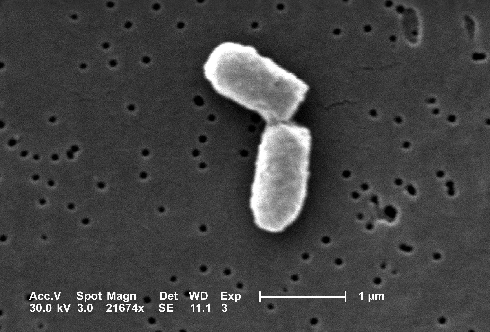

# (PART) Things that change over time {-} 


# Linear difference equations
\chaptermark{linear difference equations}


> We're captive on the carousel of time  
> We can't return we can only look behind  
> From where we came  
> And go round and round and round  
> In the circle game  
> -- Joni Mitchell, *The Circle Game*
 

All living things change over time, and this evolution can be quantitatively measured and analyzed. Mathematics makes use of equations to define models that change with time, known as \index{model!dynamical system} *dynamical systems*. In this unit we will learn how to construct models that describe the time-dependent behavior of some measurable quantity in life sciences. Numerous fields of biology use such models, and in particular we will consider changes in population size, the progress of biochemical reactions, the spread of infectious disease, and the spikes of membrane potentials in neurons, as some of the main examples of biological dynamical systems.

Many processes in living things happen regularly, repeating with a fairly constant time period. One common example is the reproductive cycle in species that reproduce periodically, whether once a year, or once an hour, like certain bacteria that divide at a relatively constant rate under favorable conditions. Other periodic phenomena include circadian (daily) cycles in physiology, contractions of the heart muscle, and waves of neural activity. For these processes, theoretical biologists use models with \index{model!discrete time} *discrete time*, in which the time variable is restricted to the integers. For instance, it is natural to count the generations in whole numbers when modeling population growth. 

This chapter will be devoted to analyzing dynamical systems in which time is measured in discrete steps. In this chapter you will learn to do the following:


* write down discrete-time (difference) equations based on stated assumptions

* find analytic solutions of linear difference equations

* use for loops in R

* compute numeric solutions of difference equations


## Discrete time population models
\label{sec:model14}

Let us construct our first models of biological systems. We will start by considering a population of some species, with the goal of tracking its growth or decay over time. The variable of interest is the number of individuals in the population, which we will call $N$. This is called the \index{variable!dependent} dependent variable, since its value changes depending on time; it would make no sense to say that time changes depending on the population size. Throughout the study of dynamical systems, we will denote the \index{variable!independent} independent variable of time by $t$. To denote the population size at time $t$, we can write $N(t)$ but sometimes  use $N_t$. 

### static population
In order to describe the dynamics, we need to write down a rule for how the population changes. Consider the simplest case, in which the population stays the same for all time. (Maybe it is a pile of rocks?) Then the following equation describes this situation:
$$N(t+1) = N(t) $$
This equation mandates that the population at the next time step be the same as at the present time $t$. This type of equation is generally called a \index{difference equation!definition} *difference equation*, because it can be written as a difference between the values at the two different times:
$$N(t+1) - N(t) = 0$$ 
This version of the model illustrates that a difference equation at its core describes the increments of $N$ from one time step to the next. In this case, the increments are always 0, which makes it plain that the population does not change from one time step to the next. 

### exponential population growth

Let us consider a more interesting situation: as a colony of dividing bacteria, such as *E. coli*, shown in figure \ref{fig:ch14_cell_div}. We will assume that each bacterial cell divides and produces two daughter cells at fixed intervals of time, and let us further suppose that bacteria never die. Essentially, we are assuming a population of immortal bacteria with clocks. \index{bacteria!division}This means that after each cell division the population size doubles. As before, we denote the number of cells in each generation by $N(t)$, and obtain the equation describing each successive generation:
$$ N(t+1) = 2N(t)$$
It can also be written in the difference form, as above:
$$ N(t+1) - N(t) = N(t) $$
The increment in population size is determined by the current population size, so the population in this model is forever growing. This type of behavior is termed \index{function!exponential} \index{exponential!growth} *exponential growth*, which we will investigate further in section \ref{sec:math14}.




### population with births and deaths

Suppose that a type of fish lives to reproduce only once after a period of maturation, after which the adults die. In this simple scenario, half of the population is female, a female always lays 1000 eggs, and of those, 1% survive to maturity and reproduce. Let us set up the model for the population growth of this idealized fish population. The general idea, as before, is to relate the population size at the next time step $N(t+1)$ to the population at the present time $N(t)$.

Let us tabulate both the increases and the decreases in the \index{population!linear model}\index{model!population}population size. We have $N(t)$ fish at the present time, but we know they all die after reproducing, so there is a decrease of $N(t)$ in the population. Since half of the population is female, the number of new offspring produced by $N(t)$ fish is $500N(t)$. Of those, only 1% survive to maturity (the next time step), and the other 99%  ($495N(t)$) die. We can add all the terms together to obtain the following difference equation:
$$ 
N(t+1) = N(t) - N(t) + 500N(t) - 495 N(t)  = 5N(t)
$$

The number 500 in the expression is the \index{population!birth rate} *birth rate* of the population per individual, and the negative terms add up to the \index{population!death rate} *death rate* of 496 per individual. We can re-write the equation in difference form:
$$ 
N(t+1) - N(t) = 4N(t)
$$

This expression again generates growth in the population, because the birth rate outweighs the death rate. \citep{allman_mathematical_2003}

### dimensions of birth and death rates

As we discussed in section \ref{sec:model2} the dimensions of quantities in a model have to satisfy the rules of \index{dimensional analysis} dimensional analysis we discussed in chapter 2. In the case of population models, the birth and death rates measure the number of individuals that are born (or die) within a reproductive cycle for every individual at the present time. Their dimensions must be such that the terms in the equation all match:
$$ [N(t+1) - N(t)] = [population] = [r] [N(t)] = [r]  \times [population] $$
This implies that $r$ is algebraically dimensionless. However, the meaning of $r$ is the rate of change of population over one (generation) time step. $r$ is the birth or death rate of the population *per generation*, and therefore, when such rates are measured, they are reported with units of inverse time (e.g. number of offspring per year). 

### linear demographic models

We will now write a general difference equation for any population with constant birth and death rates. This will allow us to substitute arbitrary values of the birth and death rates to model different biological situations. Suppose that a population has the birth rate of $b$ per individual, and the death rate $d$ per individual. Then the general model of the population size is:
\begin{equation}
 N(t+1) = (1 + b - d)N(t)
 \label{linear_pop}
\end{equation}

The general equation also allows us to check the dimensions of birth and death rates, especially as written in the incremental form: $ N(t+1) - N(t) = (b - d)N(t)$. The change in population rate over one reproductive cycle is given by the current population size multiplied by the difference of birth and death rates, which as we saw are algebraically dimensionless. The right hand side of the equation has the dimensions of population size, matching the difference on the left hand side. \citep{edelstein-keshet_mathematical_2005}

## Solutions of linear difference models

\label{sec:math14}

### simple linear models

Having set up the difference equation models, we would naturally like to solve them to find out how the dependent variable, such as  population size, varies over time. A solution may be \index{difference equation!analytic solution} *analytic*, meaning that it can be written as a formula, or \index{difference equation!numeric solution} *numerical*, in which case it is generated by a computer in the form of a sequence of values of the dependent variable over a period of time. In this section, we will find some simple analytic solutions and learn to analyze the behavior of difference equations which we cannot solve exactly.\index{linear!difference equation}

```{definition, diff_eqn}
A function $N(t)$ is a \index{difference equation!solution}\emph{solution} (over some time period $a < t < b$) of a difference equation $N(t+1) = f(N(t))$ if it satisfies that equation (over some time period $a < t < b$).
```


\label{def:math14_sol}

For instance, let us take our first model of the static population, $N(t+1) = N(t)$. Any constant function is a solution, for example, $N(t) = 0$, or $N(t) = 10$. There are actually as many solutions as there are numbers, that is, infinitely many! In order to specify exactly what happens in the model, we need to specify the size of the population at some point, usually, at the "beginning of time", $t = 0$. This is called the \index{initial condition} *initial condition* for the model, and for a well-behaved difference equation it is enough to determine a unique solution. For the static model, specifying the initial condition is the same as specifying the population size for all time.

Now let us look at the general model of population growth with constant birth and death rates. We saw in equation \ref{linear_pop} above that these can be written in the form $N(t+1) = (1 + b - d) N(t)$. To simplify, let us combine the numbers into one growth parameter $r = 1 + b - d$, and write down the general equation for population growth with constant growth rate:
$$N(t+1) =  rN(t)$$

To find the solution, consider a specific example, where we start with the initial population size $N_0 = 1$, and the growth rate $r=2$. The sequence of population sizes is: 1, 2, 4, 8, 16, etc. This is described by the formula $N(t) = 2^t$. 

In the general case, each time step the solution is multiplied by $r$, so the solution has the same exponential form. The initial condition $N_0$ is a multiplicative constant in the solution, and one can verify that when $t=0$, the solution matches the initial value:
\begin{equation}
N(t)  = r^t N_0
\label{eq:lin_discrete_sol}
\end{equation}

I would like the reader to pause and consider this remarkable formula. No matter what the birth and death parameters are selected, this solution predicts the population size at any point in time $t$. 

In order to verify that the formula for $N(t)$ is actually a solution in the meaning of definition \ref{def:math14_sol}, we need to check that it actually satisfies the difference equation for all $t$, not just a few time steps. This can be done algebraically by plugging in $N(t+1)$ into the left side of the dynamic model and $N(t)$ into the right side and checking whether they match. For $N(t)$ given by equation \ref{eq:lin_discrete_sol}, $N(t+1) = r^{t+1} N_0$, and thus the dynamic model becomes:
$$r^{t+1} N_0 = r \times r^t N_0$$
Since the two sides match, \index{function!exponential}this means the solution is correct. 

### models with a constant term
Now let us consider a dynamic model that combines two different rates: a proportional rate ($rN$) and a constant rate which does not depend on the value of the variable $N$. We can write such a generic model as follows:
$$ N(t+1) =  rN(t) + a $$
The right-hand-side of this equation is a linear function of $N$, so this is a linear difference equation with a constant term. What function $N(t)$ satisfies it? One can quickly check that that the same solution $N(t) = r^t N_0$ does not work because of the pesky constant term $a$:
$$ r^{t+1} N_0 \neq r \times r^t N_0 + a$$

To solve it, we need to try a different form: specifically, an exponential with an added constant. The exponential can be reasonably surmised to have base $r$ as before, and then leave the two constants as unknown: $N(t) = c_1 r^t + c_2$. To figure out whether this is a solution, plug it into the linear difference equation above and check whether a choice of constants can make the two sides agree:
$$  N(t+1) =  c_1 r^{t +1} + c_2 = rN(t) + a  = rc_1 r^t + rc_2+ a$$
This equation has the same term $c_1 r^{t +1}$ on both sides, so they can be subtracted out. The remaining equation involves only $c_2$, and its solution is $c_2 = a/(1-r)$. Therefore, the general solution of this linear difference equation is the following expression, which is determined from the initial value by plugging $t=0$ and solving for $c$.
\begin{equation}
 N(t) = c r^t  + \frac{a}{1-r}
\label{eq:ch14_sol_wconst}
\end{equation}
 
**Example.** Take the difference equation $N(t+1) = 0.5 N(t) + 40$ with initial value $N(0)= 100$. The solution, according to our formula is $N(t) = c 0.5^t + 80$. At $N(0) = 100 = c+80$, so $c=20$. Then the compete solution is $N(t) = 20 \times 0.5^t + 80$. To check that this actually works, plug this solution back into the difference equation:
$$ N(t+1) = 20 \times 0.5^{t+1} + 80 = 0.5 \times (20 \times 0.5^t + 80) + 40 =  20 \times 0.5^{t+1} + 80$$
The equation is satisfied and therefore the solution is correct.

### population growth and decline
\label{sec:bio14}

The parameter $r$ can assume different values, depending on the birth and death rates. If the birth rate is greater than the death rate, $r > 1$, and if it is the other way around, $r < 1$. Note that for a realistic biological population, the death rate is limited by the number of individuals present in the population. The maximum number of individuals at any time is $N(t)+bN(t)$, so this means that $d \leq b +1$. Therefore, for a biological population, $r \geq 0$.

```{r ch14-sol, tidy=TRUE, tidy.opts=list(width.cutoff=50), fig.show='hold', out.width='50%', fig.asp=.7, fig.align='center', fig.cap = 'Plots of solutions of linear difference equations: a) $N(t+1) = 2N(t)$ with different initial values; b) $N(t+1) = 0.5N(t)$ with different initial values'}
x <- 0:6
y0 <- 5
plot(x,y0*2^x,t='b',lwd=3, cex.axis=1.5,cex.lab=1.5, xlab='time', ylab='population')
y0<- 1
lines(x,y0*2^x ,t='b',lwd=3, col=2)
leg.txt <- c("N(0)=5","N(0)=1")
legend("topleft", leg.txt, cex=1.5, col=c(1,2), pch=1, lty=1, lwd=3)
y0 <- 1000
plot(x,y0*0.5^x,t='b',lwd=3, cex.axis=1.5,cex.lab=1.5, xlab='time', ylab='population')
y0<- 500
lines(x,y0*0.5^x,t='b',lwd=3,col=2)
leg.txt <- c("N(0)=1000","N(0)=500")
legend("topright", leg.txt, cex=1.5, col=c(1,2), pch=1, lty=1, lwd=3)
```

The solutions in formula \ref{eq:lin_discrete_sol} and \ref{eq:ch14_sol_wconst} are exponential  functions, which as we saw in section \ref{sec:math2} have a limited menu of behaviors, depending on the value of $r$. If $r > 1$, multiplication by $r$ increases the size of the population, so the solution $N(t)$ will grow. If $r < 1$, multiplication by $r$ decreases the size of the population, so the solution $N(t)$ will decay (see figure \ref{fig:ch14_solutions}). Finally, if $r=1$, multiplication by $r$ leaves the population size unchanged, like in the pile of rocks model. Here is the complete classification of the behavior of population models with constant birth and death rates (assuming $r>0$):

* $r > 1$: $N(t)$ grows without bound
* $r < 1$: $N(t)$ decays to the constant $a/(1-r)$
* $r = 1$: $N(t)$ remains constant

As we see, there are only two options for  solution of linear difference equations: ever-faster growth or decay to zero or another constant value. The exponential growth of populations is also known as \index{model!Malthusian growth} \emph{Malthusian} after the early population modeler Thomas Malthus. He used a simple population model with constant growth rate to predict demographic disaster due to the exponentially increasing population outstripping the growth in food production. In fact, human population has not been growing with a constant birth rate, and food production has (so far) kept up pace with population size, illustrating yet again that mathematical models are only as good as the assumptions that underlie them.

### Exercises

For the following scenarios for a population: 1) Construct a dynamic model by writing down a difference equation both in the updating function form ($N(t+1) = f(N(t))$) and the increment form ($N(t+1) - N(t) = g(N(t))$) and specify the time step; 2) find the solution of the linear difference equation with a generic initial value and check that it satisfies the difference equation by plugging the solution into your equation (in either form); 3) plug in the given initial value and predict the future. 

1. Zombies have appeared in Chicago. Every day, each zombie produces 3 new zombies. Suppose that initially there is only one zombie, how many zombies will there be in 7 days? 

2. Suppose hunters kill 50 deer in a national forest every hunting season, while the deer by themselves have equal birth and death rates. If there are initially 500 deer in the forest, predict how many there will be in 5 years.

3.  The number of infected people in a population grows by 8% per day and those who become infected remain infected. If initially there are 8 infected, how many individuals will be infected in 45 days? 

4. Suppose bacteria in a population divide in 2 every hour and 90% of the current population dies after reproduction, not including the new offspring. If the population initially has 10 million bacteria, predict how many there will be in 12 hours. 

5. In a rabbit population, each pair produces 2.2 offspring every year (i.e. 1.1 per capita) and the adults have a 0.9 annual death rate after reproduction (and assume the whole population is paired up into mating pairs.) If initially there are 55 rabbits, predict  how many there will be in 5 years.

6. Consider the same rabbit population, but now a python that lives nearby eats exactly 1 rabbit a month. If initially there are 55 rabbits, how many do you predict will be in 10 years?

7. 10 fish are added to an aquarium every month, while 80% of those present survive every month and there is no reproduction. If initially there are 10 fish in the aquarium, predict how many there will be in 2 years. 

8. A Mardi Gras parade marches down the street, and every block 50 new revelers join the parade, while 20% of parade leaves for various reasons. Suppose the parade starts with 12 people, predict how many there will be after 30 blocks.

9. Twenty flies fly into a house every day, and half of the flies in the house at beginning of each day find their way out (no births or deaths happen in the house.) If there are 10 files in the house initially, how many will there be in 12 days?

10. Every day someone eats 10 pieces of candy from a bowl, while someone else adds half as many pieces as are currently in the bowl (before 10 pieces are removed.) If there are currently 20 pieces of candy in the bowl, how many will there be in 7 days?

## Numerical solutions in R
\label{sec:comp14}

### for loops

Often times one has to write a script to perform the same (or similar) task many times. Like all programming languages, R has commands that call for repetition of the same commands multiple times. These structures are called \emph{loops}. In this section you will learn about the \index{R programming!for loop} *for loop*, which looks like this: 
```{r, eval = FALSE}
for (i in 1:10) {
	body of the loop
}
```


For example, the following script will print out "Hello!" ten times like this:

```{r, tidy = TRUE}
for (i in 1:10) {
  print("Hello!")
}
```

The for loop starts with the keyword `for`, then has the expression in parentheses (i in 1:10). `i` is called the *loop variable*, `in` is another keyword, and `1:10` is a *loop vector*. After the first line there is a curly bracket { and everything that follows until the closing bracket } is the *loop body*. The loop body is executed as many times as there are elements in the loop vector (in this example, 10 times) and the only thing that changes is the values of the loop variable i, which starts with the first element of the vector (1) and goes until it reaches the last element (10) and then stops:

```{r}
for (i in 1:10) {
  print(paste("Iteration number", i))
}
```


It can be used to do repetitive calculations, for example, adding up all the integers in an array (of course the built-in function `sum()` will do it too):
```{r}
# add up the integers from 1 to 10 and print out the total
total<-0
for (i in 1:10) {
  total<-total+i
}
print(total)
```


### using vectors with loops

It is especially useful to use loops to assign vector variables one element at a time. The loop variable (e.g. `i`) is usually used for *indexing* the vector variable. There are several necessary features of using vectors in for loops, so let us take an example script and break them down in this example of calculating a vector of the sum of integers from 1 up to the current number:

1. *Pre-allocate* the vector variable: create a vector of the correct length prior to the loop by filling it with a placeholder value, e.g. 0 or NA (not a value).
```{r, tidy = TRUE}
max <- 10 
total_vec <- rep(0, max+1) # pre-allocate the vector
```

2. Only put in the loop what has to be repeated (e.g. don't put the pre-allocation inside the loop);
```{r}
for (i in 1:max) { # iterate for i from 1 to max
  total_vec[i+1] <- total_vec[i] + i # assign to the next value of total_vec the sum of i and the current value of total_vec
}
```


3. Be careful with indexing inside for loops - this means paying careful attention to the lowest and the highest index that you're using inside the loop. For example, if your loop vector goes from 1 to max (as above), the total number of elements in your vector will be max+1, because we assigned the element with index i+1 in the loop:

```{r}
print(length(total_vec)) # print the number of elements of total_vec
print(total_vec)
```

Here is an example of a loop calculating the famous Fibonacci sequence, where the next value is defined to be the sum of two previous values in the sequence, and the plotting the resulting sequence, together with an exponential function that approximates it.
```{r}
num_steps <- 20 # number of steps
fib <- rep(1, num_steps + 2) # pre-allocate vector with correct number of elements with all 1s
for (i in 1:num_steps) {
  fib[i+2] <- fib[i+1] + fib[i] # add elements i and i+1 and assign it to element i+2
}
time <- 0:(num_steps+1) # define a "time" vector as the independent variable
plot (time, fib, lwd = 3, xlab = 'time steps', ylab = "Fibonacci")
# an exponential function wiht the Golden ratio base
phi <- (1+sqrt(5))/2 # golden ratio
sol <- 0.75*phi^time # calculate the exponential function vector (no loop required)
lines(time, sol, col='red', lwd = 3) # overlay the exponential function plot
legend("topleft", # legend placement
       c("Fibonacci", "exponential"), # vector containing labels for the legend
       col=1:2, # vector containing color codes (1 is black, 2 is red)
       lty=c(0,1), # vector specifying line types (0 is none, 1 is regular line)
       pch=c(1,NA), # vector specifying types of point markers (1 is cicle, NA is none)
       lwd=3) 
```


### Exercises:

1. Assign the value 5 to a variable and multiply it by 1.03, replacing the old value of the variable. The new value should be 5.15.


2. Write a script to take a number and multiply it by 1.03 one hundred times using a for loop (see section 4.4.2) Starting with the initial value 5, the script should return the value 96.093.


3. Preallocate a vector of values to be all zeros, assign the first element to 5, and then use a for loop to calculate 100 values by multiplying the previous one by 1.03 and assigning them to sequential elements of the vector, then plot that vector. You should see an exponentially growing curve, with the last element (101st) equal to 96.093.


4. Fix the indexing error in the script below for calculating a vector of factorials. Each element of the vector `factorial_vec[i]` should be equal to $i!= 1*2*3...*i$, so for example `factorial_vec[2]` should be 2 and `factorial_vec[3]` should be 6.
```{r, eval=FALSE}
# multiply integers from 1 to 10 and assign the factorials to the vector 
max.num <- 10
factorial_vec <- rep(1,max.num)
for (i in 1:max.num) {
  factorial_vec[i+1]<-factorial_vec[i]*i
}
print(factorial_vec)
```


