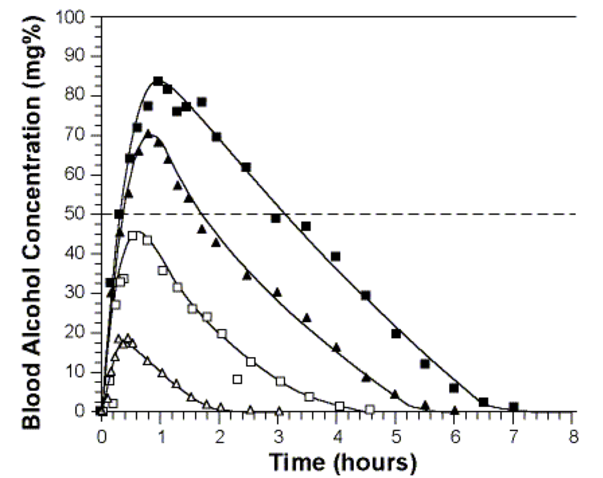
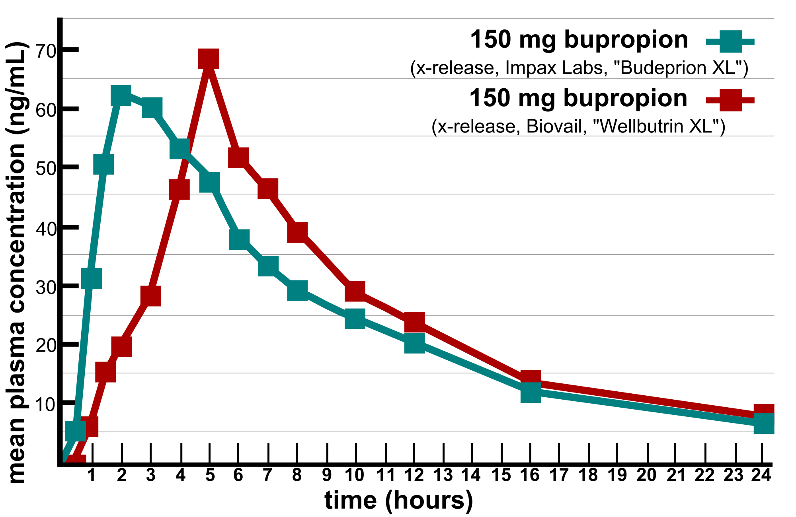

# Solutions of ordinary differential equations

> He felt a restless, vague ambition  
A craving for a change of air  
(A most unfortunate condition,  
A cross not many choose to bear.)  
-- Alexander Pushkin, *Eugene Onegin*


In the last chapter we learned about differential equations and how to use graphical analysis to find equilibria and predict the long-term behavior of the solutions. In this chapter we will examine two methods for generating the detailed solutions of ODEs: analytic and numeric.

There are at least two good reasons to use differential equations for many applications. First, they are often more realistic than discrete time models, because some events happen very frequently and non-periodically. The second reason is mathematical: it turns out that dynamical systems with continuous time, described by differential equations, are better behaved than difference equations. This has to do with the essential "jumpiness" of difference equations. Even for simple nonlinear equations, the value of the variable after one time step can be far removed from its last value. This can lead to highly complicated solutions, as we saw in some of the numerical solutions in the last chapter. 

That kind of erratic behavior is impossible in (reasonable) differential equations. Solutions of ODEs are generally smooth and predictable, as long they are defined by continuous defining function, the flow produces smooth solutions. Sometimes, they can be written down exactly, as a mathematical function, called an analytic solution. For most ODEs, particularly nonlinear ones, that is not possible, but then computational methods can be used to produce an approximate numeric solution that can visualize the behavior of the solutions.


* find and verify analytic solutions of linear differential equations

* compute numerical solutions of differential equations using the Forward Euler method

* explore the relationship between numeric error and step size


## Solutions of ordinary differential equations
\label{sec:math15}

In this section we will investigate how to write down analytic solutions for ordinary differential equations (ODEs). Let us first define the mathematical terms that will be used in this discussion.

```{definition, def-ode}
An ordinary differential equation is an equation that contains derivatives of the \index{variable!dependent} dependent variable (e.g. $x$) with respect to an independent variable (e.g. $t$). For example:
  $$ \frac{dx^2}{dt^2}+ 0.2 \frac{dx}{dt} - 25 = 0 $$
```

For the time being, we will restrict ourselves to ODEs with the highest derivative being of first order, called *first-order* ODEs. Second-order ODEs are common in models derived from physics, but can actually be converted to first-order ODEs, though it requires an additional dependent variable. Third and higher order ODEs are very uncommon. To be precise:
```{definition, def-firstode}
A *first-order* ODE is one where the derivative $dx/dt$ is  equal to a *defining function* $f(x,t)$, like this: 
$$\frac{dx} {dt} = \dot x = f(x,t)$$
```

The defining function may potentially depend on both the dependent variable $x$ and the \index{variable!independent} independent variable $t$. If it only depends on $x$, it is called an *autonomous* ODE, for example:

$$ \frac{dx}{dt} = \dot x = rx $$
or

$$\frac{dx}{dt} = \dot x = 5x -4$$

On the other hand, if the defining function depends only on the independent variable $t$, it may be called a *pure-time* ODE, for example:

$$ 
\frac{dx}{dt} = \dot x = 5t
$$
or

$$
\frac{dx}{dt} = \dot x = 20 - 0.3 \sin(4 \pi t)
$$

An ODE is \index{differential equation!homogeneous}\emph{homogeneous} if every term involves either the dependent variable $x$ or its derivative. 
\end{mosdef}
For instance, $\dot x = x^2 + \sin(x)$ is homogeneous, while $\dot x = -x + 5t$ is not. 

Most simple biological models that we will encounter in the next two chapters are autonomous, homogeneous ODEs. However, nonhomogeneous equations are important in many applications, and we will encounter them at the end of the present section.

### separate and integrate method

```{definition, def-ode-sol}
The *analytic (or exact) solution* of an ordinary differential equation is a function of the independent variable that satisfies the equation. If no initial value is given, then the *general solution* function will contain an uknown *integration constant*. If an initial value is specified, the integration constant can be found to obtain a *specific solution*. 
```


This means that the solution function obeys the relationship between the derivative and the defining function that is specified by the ODE. To verify that a function is a solution of a given ODE, take its derivative and check whether it matches the other side of the equation.


**Example**. The function $x(t) = 3t^2 +C$ is a general solution of the ODE $\dot x = 6t$, which can be verified by taking the derivative: $\dot x (t) = 6t$. Since this matches the right-hand side of the ODE, the solution is valid.

**Example**. The function $x(t) = Ce^{5t}$ is a general solution of the ODE $\dot x = 5x$. This can be verified by the taking the derivative: $\dot x = 5C e^{5t}$ and comparing it with the right-hand side of the ODE: $5x = 5 Ce^{5t}$. Since the two sides of the equation agree, the solution is valid.


In contrast with algebraic equations, we cannot simply isolate $x$ on one side of the equal sign and find the solutions as one, or a few numbers. Instead, solving ordinary differential equations is very tricky, and no general strategy for solving an arbitrary ODE exists. Moreover, a solution for an ODE is not guaranteed to exist at all, or not for all values of $t$. We will discuss some of the difficulties later, but let us start with equations that we can solve.

The most obvious strategy for solving an ODE is integration. Since a differential equation contains derivatives, integrating it can remove the derivative. In the case of the general first order equation, we can integrate both sides to obtain the following:
$$ \int \frac{dx}{dt} dt = \int f(x,t) dt \Rightarrow x(t) + C = \int f(x,t) dt$$
The constant of integration $C$ appears as in the standard antiderivative definition. It can be specified by an initial condition for the solution $x(t)$. Unless the function $f(x,t)$ depends only on $t$, it is not possible to evaluate the integral above. Instead, various tricks are used to find the analytic solution. The simplest method of analytic solution of a first-order ODEs, which I call \index{differential equation!separate-and-integrate} *separate-and-integrate* consists of the following steps:

1. use algebra to place the dependent and independent variables on different sides of the equations, including the differentials (e.g. $dx$ and $dt$)
2. integrate both sides with respect to the different variables, don't forget the integration constant 
3. solve for the dependent variable (e.g. $x$) to find the *general solution*
4. plug in $t=0$ and use the initial value $x(0)$ to solve for the integration constant  and find the the *specific solution*

**Example.** Consider a very simple differential equation: $\dot x  = a$, where $\dot x$ stands for the time derivative of the dependent variable $x$, and $a$ is a constant. It can be solved by integration:
$$ \int \frac{dx}{dt} dt  = \int a dt  \Rightarrow x(t) + C = at $$

This solution contains an undetermined integration constant; if an initial condition is specified, we can determine the complete solution. Generally speaking, if the initial condition is $x(0) = x_0$, we need to solve an algebraic equation to determine $C$:  $x_0 = a*0 - C$, which results in $C = -x_0$. The complete solution is then $x(t) = at + x_0$. To make the example more specific, if $a = 5$ and the initial condition is $x(0) = -3$, the solution is 

$$x(t) = 5t -3$$
 
**Example.** Let us solve the linear population growth model in equation \ref{eq:linear_ode}: $\dot x = rx$. The equation can be solved by  first dividing  both sides by $x$ and then integrating: \index{linear!differential equation}
$$ \int \frac{1}{x} \frac{d x}{dt}  dt = \int \frac{dx}{x} = \int r dt \Longrightarrow \log |x| = rt + C  \Longrightarrow  x =  e^{rt+C} = Ae^{rt}$$

We used basic algebra to solve for $x$, exponentiating both sides to get rid of the logarithm on the left side. As a result, the additive constant $C$ gave rise to the multiplicative constant $A=e^C$. Once again, the solution contains a constant which can be determined by specifying an initial condition $x(0) = x_0$. In this case, the relationship is quite straightforward: $x(0) = A e^0 = A$. Thus, the complete solution for equation \ref{eq:linear_ode} is:
$$ x(t) = x_0e^{rt}$$

### behavior of solutions of linear ODEs
As in the case of the discrete-time models, population growth with a constant birth rate has \index{exponential!function} exponential form. Once again, please pause and consider this fact, because the exponential solution of linear equations is one of the most basic and powerful tools in applied mathematics. Immediately, it allows us to classify the behavior of linear ODE into three categories:

* $r > 0$: $x(t)$ grows without bound
* $r < 0$: $x(t)$ decays to 0
* $r = 0$: $x(t)$ remains constant at the initial value

The rate $r$ being positive reflects the dominance of birth rate over death rate in the population, leading to unlimited population growth. If the death rate is greater, the population will decline and die out. If the two are exactly matched, the population size will remain unchanged.

**Example.**  The solution for the biochemical kinetic model in equation \ref{eq:lin_chem_kin} is identical except for the sign: $A(t) = A_0 e^{-kt}$. When the reaction rate $k$ is positive, as it is in chemistry, the concentration of $A$ decays to 0 over time. This should be obvious from our model, since there is no back reaction, and the only chemical process is conversion of $A$ into $B$.  The concentration of $B$ can be found by using the fact that the total concentration of molecules in the model is conserved. Let us call it $C$. Then $B(t) = C - A(t) = C- A_0e^{-kt}$. The concentration of $B$ increases to the asymptotic limit of $C$, meaning that all molecules of $A$ have been converted to $B$.

### solutions of nonhomogeneous ODEs
ODEs that contain at least one term without the dependent variable are a bit more complicated. If the defining function is $f(x,t)$ is *linear* in the dependent variable $x$, they can be solved on paper using the same separate-and-integrate method, modified slightly to handle the constant term. Here are the steps to solve the generic linear ODE with a constant term $\dot x = ax +b$:

1.  separate the dependent and independent variables on different sides of the equations, by dividing both sides by the right hand side $ax+b$, and multiplying both sides by the differential $dt$
2. integrate both sides with respect to the different variables, don't forget the integration constant! 
3. solve for the dependent variable (e.g. $x$)
4. plug in $t=0$ and use the initial value $x(0)$ to solve for the integration constant 

**Example.** Let us solve the following ODE model using separate and integrate with the given initial value:
$$\frac{dx}{dt} = 4x -100;  \; x(0) = 30$$

1.  separate the dependent and independent variables:
$$ \frac{dx}{4x - 100} = dt$$

2. integrate both sides:
$$  \int \frac{dx}{4x -100} =  \int dt \Rightarrow \frac{1}{4} \int \frac{du}{u} = \frac{1}{4} \ln | 4x- 100 |  = t + C$$
The integration used the substitution of the new variable $u=4x -100$, with the concurrent substitution of $dx = du/4$.

3. solve for the dependent variable:
$$  \ln | 4x- 100 |  = 4t + C \Rightarrow 4x-100 = e^{4t} B  \Rightarrow x = 25  + Be^{4t}$$
Here the first step was to multiply both sides by 4, and the second to use both sides as the exponents of $e$, removing the natural log from the left hand side, and finally simple algebra to solve for $x$ as a function of $t$.

4. solve for the integration constant:
$$ x(0) = 25  + B = 30 \Rightarrow B = 5$$
Here the exponential ``disappeared'' because $e^0=1$.
\end{enumerate}
Therefore, the complete solution of the ODE with the given initial value is
$$x(t) =  25  + 5e^{4t}$$

At this point, you might have noticed something about solutions of linear ODEs: they always involve an exponential term, with time in the exponent. Knowing this, it is possible to bypass the whole process of separate-and-integrate by using the following short-cut.

**Important fact:** Any linear ODE of the form $\dot x= ax +b$ has an analytic solution of the form:
$$ x(t) = Ce^{at} + D$$

This can be tested by plugging the solution back into the ODE to see if it satisfies the equation. First, take the derivative of the solution to get the left-hand side of the ODE: $\frac{dx}{dt} = Ca e^{at}$; the plug in $x(t)$ into the right hand side of the ODE: $aCe^{at} + aD +b$. Setting the two sides equal, we get: 
$$Ca e^{at} = aCe^{at} + aD +b$$
which is satisfied if $aD + b = 0$, which means $D= -b/a$. This is consistent with the example above, the additive constant in the solution was 25, which is $-b/a= -(-100)/4 = 25$. 

In short, if you want to solve a linear ODE $\dot x= ax +b$ , you can bypass the separate-and-integrate process, because the general solution always has the form:
\begin{equation}
x(t) = Ce^{at} - \frac{b}{a}
\label{eq:ch15_ode_sol}
\end{equation}

The unknown constant $C$ can be determined from a given initial value. So the upshot is that all linear ODEs have solutions which are exponential in time with exponential constant coming from the slope constant $a$ in the ODE. The dynamics of the solution are determined by the sign of the constant $a$: if $a>0$, the solution grows (or declines) without bound; and if $a<0$, the solution approaches an asymptote at $-b/a$ (from above or below, depending on the initial value). Go back and read section \ref{sec:math2} for a review of exponential functions if this is not clear. 

### Exercises

Solve the following linear ODEs and use the specified initial values to determine the integration constant. Describe how the solution behaves over a long time (e.g. grows without bound, goes to zero, etc.). Plug the solution back into the ODE to check that it satisfies the equation.


1. 
$$ \frac{dx}{dt} = 0.1; \; x(0)= 100 $$

2. 
$$ \frac{dx}{dt} =  2\sin(4t) -0.4t; \; x(0)= 5 $$

3. 
$$ \frac{dx}{dt} = 3x; \; x(0) = 0.4 $$

4. 
$$ \frac{dx}{dt} = -5x; \;  x(0) = -300 $$

5. 
$$ \frac{dx}{dt} = -0.5x + 100 ; \; x(0) = 20 $$

6. 
$$ \frac{dx}{dt} =  1 + x; \; x(0) = 4 $$

7. 
$$ \frac{dx}{dt} =  -10 - 0.2x; \; x(0) = 10 $$

8. 
$$ \frac{dx}{dt} =  -4 + 0.5x; \; x(0) = 6 $$


## Numeric solutions and the Forward Euler method

Analytic solutions are very useful for a modeler because they allow prediction of the variable of interest at any time in the future. However, for many differential equations they are not easy to find, and for many others they simply cannot be written down in a symbolic form. Instead, one can use a numerical approach, which does not require an exact formula for the solution. The idea is to start at a given initial value (e.g. $x(0)$) and use the derivative from the ODE (e.g. $dx/dt$) as the rate of change of the solution (e.g. $x(t)$) to calculate the change or increment for the solution over a time step. Essentially, this means replacing the continuous change of the derivative with a discrete time step, thus converting the differential equation into a difference equation and then solving it. The solution of the difference equation is not the same as the solution of the ODE, so  \index{differential equation!numerical solution} *numeric solutions* of ODEs are always approximate. I will use the letter $y(t)$ to denote the numerical solution to distinguish it from the exact solution $x(t)$. The fundamental difference between them is that $y(t)$ is not a formula that can be evaluated at any point in time, but instead is a sequence of numbers calculated every time step, which hopefully are close to the exact solution $x(t)$.

Let us introduce all the players: first, we need to pick the time step $\Delta t$, which is the length of time between successive values of $y$. In the difference equation notation one can use  $y_i$ to mean $y(i\Delta t)$, the value of the numerical solution after $i$ time steps. Then we need to calculate the derivative, or the rate of change at a particular point in time. For any first-order ODE of the form
$$ \frac{d x} {dt} = \dot x = f(x,t)$$

the rate of change depends (potentially) on the values of $x$ and $t$. This rate of change based on the numerical solution after $i$ time steps is $f(y(i\Delta t), i\Delta t) = f(y_i, t_i)$. Finally, to calculate the change of the dependent variable we need to multiply the rate of change by the time step. This should make sense in a practical context: if you drive for two hours (time step) at 60 miles per hour (rate of change), the total distance (increment) is $2*60=120$ miles. By the same token, we can write down how to calculate the next value of the numerical solution $y_{i+1}$ based on the previous one:
\begin{equation}
 y_{i+1} = y_i + \Delta t f(y_i, t_i) 
 \label{eq:ch15_FE}
\end{equation}

This method of computing a numerical solution of an ODE is called the \index{differential equation!Forward Euler method} *Forward Euler method*, after the famous mathematician who first came up with it. It is called a forward method because it uses the value of the dependent variable and its derivative at time step $i$ to predict the value at the next time step $i+1$. The method is iterative, so it needs to be repeated in order to calculate a set of values of the approximate solution $y(t)$. Here are a couple of simple examples of computing numerical solution using FE:

\textbf{Example.} Let us numerically solve the ODE $\dot x = -0.1$ using the Forward Euler method. This means the defining function in the formulation of FE above is $f(x,t)=-0.1$. We can calculate the numeric solution for a couple of steps and compare the values with the exact solution, since we now know that it is $x(t) = x_0 -0.1t$. Let us pick the time step $\Delta t = 0.2$ and begin with the initial value $x(0)=1$. Here are the first three steps using the FE method:
$$ y(0.2) = y(0) + \Delta t f(y(0)) = 1 + 0.2*(-0.1) = 0.98$$
$$ y(0.4) = y(0.2) + \Delta t f(y(0.2)) = 0.98+ 0.2*(-0.1) = 0.96$$
$$ y(0.6) = y(0.4) + \Delta t f(y(0.4)) = 0.96+ 0.2*(-0.1) = 0.94$$
Since the rate of change in this ODE is constant, the solution declines by the same amount every time step. In this case, the numerical solution is actually exact, and perfectly matches the analytic solution. Table \ref{tab:ch15_FE} (right) shows the numerical solution for 3 time steps along with the exact solution.

\textbf{Example.}  Let us numerically solve the ODE $\dot x = -0.1x$ using the Forward Euler method. This means the defining function in the formulation of FE above is $f(x,t)=-0.1x$. We can calculate the numeric solution for a couple of steps and compare the values with the exact solution, since we now know that it is $x(t) = x_0 e^{-0.1t}$. Let us pick the time step $\Delta t = 0.2$ and begin with the initial value $x(0)=100$. Here are the first three steps using the FE method:
$$ y(0.2) = y(0) + \Delta t f(y(0)) = 100 + 0.2*(-0.1*100) = 98$$
$$ y(0.4) = y(0.2) + \Delta t f(y(0.2)) = 98+ 0.2*(-0.1*98) $$
$$ = 96.04$$
$$ y(0.6) = y(0.4) + \Delta t f(y(0.4)) = 96.04+ 0.2*(-0.1*96.04) \approx  $$
$$ \approx 94.12$$
In this case, the derivative is not constant and the numerical solution is not exact, which is demonstrated in table \ref{tab:ch15_FE} (left). The error in the numerical solution grows with time, which may be problematic. We will further investigate how to implement the computation of numerical solutions using R in the next section.


 t     x    y     error
---- ----- ----  ------
 0    1     1      0 
 0.2 0.98  0.98    0 
 0.4 0.96  0.96    0
 0.6 0.94  0.94    0 

Table: Numerical solutions of the ODE $\dot x = -0.1$ using Forward Euler $y$ calculated for 3 steps of size $\Delta t = 0.2$ as well as the exact solution $x$, both rounded to two digits after the decimal, and the error of the numerical solution.

 t     x     y    error 
---- ----- -----  ------
 0    100   100    0 
 0.2 98.02  98    0.02
 0.4 96.08  96.04 0.04
 0.6 94.18  94.12 0.06 

Table: Numerical solution of the ODEs $\dot x = -0.1x$ (right) using Forward Euler $y$ calculated for 3 steps of size $\Delta t = 0.2$ as well as the exact solution $x$, both rounded to two digits after the decimal, and the error of the numerical solution.

\label{tab:ch15_FE}


### Exercises

Use the Forward Euler method to solve the following differential equations with time step $\Delta t=0.5$ for 2 steps to compute $y(1)$ (the value of the numerical solution at $t=1$.)

1. 
$$ \frac{dx}{dt} = 0.1; \; x(0)= 100 $$

2. 
$$ \frac{dx}{dt} =  2\sin(4t) -0.4t; \; x(0)= 5 $$

3. 
$$ \frac{dx}{dt} = 3x; \; x(0) = 0.4 $$

4. 
$$ \frac{dx}{dt} = -5x; \;  x(0) = -300 $$

5. 
$$ \frac{dx}{dt} = -0.5x + 100 ; \; x(0) = 20 $$

6. 
$$ \frac{dx}{dt} =  1 + x; \; x(0) = 4 $$

7. 
$$ \frac{dx}{dt} =  -10 - 0.2x; \; x(0) = 10 $$

8. 
$$ \frac{dx}{dt} =  -4 + 0.5x; \; x(0) = 6 $$


## Forward Euler method in R
\label{sec:comp16}

### implementation

In practice, the most common approach to finding solutions for differential equations is using a computer to calculate a numerical solution, for example using the Forward Euler method. This means using a computer program to construct a sequence of values of the dependent variable that approximate the true solution. Below is an outline of the algorithm that can be translated into a programming language, like R, to solve ODEs.

* assign the time step `dt`, length of time `Tmax`, number of time steps `numstep`

* pre-allocate the vector of numeric solution values `y` of length `numstep+1`

* assign the initial value for the ODE to the first element of the solution

* assign the vector of time values `t` from 0 to `Tmax` of length `numstep+1`

* for loop starting at 1 to `numstep`

    + assign the next solution value to be the current solution value plus the time step multiplied by the defining function at the current solution value

* plot numeric solution `y` as a function of time `t`


To implement the algorithm, one need to know the defining function $f(x,t)$, the initial value, the time step, and the total time. The output is the solution vector $y$, which contains a sequence of values that approximate the solution of the ODE, along with the vector of time values spaced by the time step. Below is an example implementation of the Forward Euler method for the following linear ODE with initial value 1000:

$$ 
\frac{dx}{dt} =  -0.5 x 
$$

```{r fig-FE-sol}
x0 <- 1000
dt <- 0.01 # set time step
Tmax <- 10 # set length of time
numstep <- Tmax/dt # assign number of time steps
pop <- rep(x0, numstep+1) # initialize solution with y0
for (i in 1:numstep) { # do the Euler!
	pop[i+1] <- pop[i]+dt*(-0.5*pop[i])
}
time <- seq(0,Tmax, dt)
plot(time, pop, type='l')
```

Notice that it is very similar to the script for numerical solution of a difference equation we saw in \ref{sec:comp14} with the major difference being the presence of a time step, whereas in difference equations the time step is always 1. There is one more important point for the implementation: usually one needs to solve the ODE for a particular length of time $T$ with a specified time step $\Delta t$ . This dictates that the required number of iterations be $T/\Delta t$; in other words, for a given time period the number of time steps is inversely proportional to the time step.


### Exercises

Consider a slightly different linear ODE:

$$
\frac{dx}{dt} =  0.2 x 
$$


1. Calculate the numeric solution of the ODE for **one time step** using Forward Euler, for time step dt=0.1, starting with initial value x(0) = 5. Answer: 5.1

```{r}
# YOUR CODE HERE
```


2. Write a script to solve the ODE using the Forward Euler method based on the outline above. Set the time step dt=0.1 and report the solution **after 100 time steps**. Answer: 36.22323

```{r}
# YOUR CODE HERE
```

3. Change the time step to be dt=0.01 and report the solution **after 1000 time steps**. Answer: 36.87156. 

```{r}
# YOUR CODE HERE
```


### error analysis

Numeric solutions of ODE are always approximate, because they use discrete time steps to approximate continuous change (derivatives). Thus numeric solutions always have *error*, which is the difference between the *exact* or *analytic* solution and the numeric solution. If we know the exact solution of an ODE, we can calculate the error using vector subtraction in R. For the same linear ODE we solved above:
$$ 
\frac{dx}{dt} =  -0.5 x 
$$
The analytic solution is $x(t) = x_0 e^{-0.5t}$, where $x_0$ is the initial value. Here is an example of computing the numeric solution (as we did above) and then calculating the analytic solution and plotting it:

```{r}
x0 <- 1000
dt <- 0.5 # set time step
Tmax <- 10 # set length of time
numstep <- Tmax/dt # assign number of time steps
pop <- rep(x0, numstep+1) # initialize solution with y0
for (i in 1:numstep) { # do the Euler!
	pop[i+1] <- pop[i]+dt*(-0.5*pop[i])
}
time <- seq(0,Tmax, dt)
plot(time, pop, type='l', main = "Numeric and analytic solutions of an ODE") # plot the numeric solution
exact <- x0*exp(-0.5*time) # calculate the exact solution
lines(time, exact, col = 'red') # plot the exact solution
legend('topright', col=c('black', 'red'), lty=1, legend = c('numeric', 'analytic'))
```

Now we can calculate the error of the numeric solution and plot it:

```{r}
error <- abs(exact - pop)
plot(time, error, type = 'l', main='Error of the numeric solution')
```

What is the sources of this error? There are at least two distinct sources of error in numerical solutions: a) \index{error!roundoff}\emph{roundoff error} and b) \index{error!truncation}\emph{truncation error}. Roundoff error is caused by computers representing real numbers by a finite string of bits on a computer using what is known as a \index{R programming!floating point}\emph{floating point} representation. In many programming languages variables storing real numbers can be single or double precision, which typically support 24 and 53 significant binary digits, respectively. Any arithmetic operation involving floating point numbers is only approximate, with an error that depends on the way the numbers are stored in the memory. Truncation error is caused by approximations inherent in numerical algorithms, such as Forward Euler, which represent instantaneous rate of change in an ODE with discrete steps and thus are always a bit off from the true analytic solution.

In practice, roundoff error is not a big concern in contemporary computation for most modelers. Truncation error, on the other hand, can cause big problems, but luckily it is within your control. One can decrease the error in the case of finite difference methods by choosing smaller time steps, or by choosing an algorithm with a higher *order of accuracy*, which we'll leave for a more advanced discussion. 

Returning specifically to the Forward Euler method, it is called a \index{differential equation!first-order method} *first-order method* because the total error of the solution (after some number of time steps) depends linearly on the time step $\Delta t$. One can show this by using the Taylor expansion of the solution $y(t)$ to derive the forward Euler method, with $\tau(\Delta t)$ representing the truncation error after one time step:
$$y(t+\Delta t) = y(t) +  \Delta t \frac {dy(t) }{dt} + \tau(\Delta t)$$
As you might have learned in calculus, the error remaining after the linear term in the Taylor series is proportional to the the square of the small deviation $\Delta t$. This only describes the error after 1 time step, but  since the errors accumulate every time step, the total error after $N$ time steps accumulates $N \tau(\Delta t)$. As we saw in the implementation above, for a given length of time, $N$ is inversely proportional to $\Delta t$. Therefore, the total error is proportional to the $\Delta t$ and so FE is a first-order method.

The exercise above shows that new errors in FE method accumulate in proportion with the time step. The next question is, what happens to these errors over time? Do they grow or dissipate with more iterations? This is known as the stability of a numerical method, and unlike the above question about the order of accuracy, the answer depends on the particular ODE that one needs to solve. Below I show an example of error analysis for a linear ODE:\index{stability!Forward Euler}

**Example.** To numerically solve the equation $\dot x = ax$, we substitute the function $ax$ for the function $f(x,t)$, and obtain the FE approximation for this particular ODE:
$$y_{i+1} = y_i + \Delta t a y_i = (1+a\Delta t) y_i$$
The big question is what happens to the truncation error: does it grow or decay? To investigate this question, let us denote the error at time $t_i$ , that is the difference between the true solution $x(t_i)$ and the approximate solution $y(t_i)$, by $\epsilon_i$. It follows that $y_i = x_i + \epsilon_i$. Then we can wrote the following difference equations involving the error:

$$y_{i+1} = x_{i+1} + \epsilon_{i+1} = (x_i + \epsilon_i) (1+a\Delta t)  = x_i (1+a\Delta t) + \epsilon_i(1+a\Delta t)$$
Let us set aside the terns in the equation that involve $x$ (since it is just the equation for forward Euler). The remaining difference equation for $\epsilon$ describes the change in the error:
$$\epsilon_{i+1} = \epsilon_i(1+a\Delta t) $$

This states that the error in this  numerical solution is repeatedly multiplied by the constant $(1+a\Delta t)$. As we saw in section \ref{sec:math14}, this linear difference equation has an exponential solution $\epsilon_n = (1+a\Delta t)^n \epsilon_0$, which decays to 0 if $|1+a\Delta t| < 1$ or grows without bound if  $|1+a\Delta t| > 1$. The first inequality is called the stability condition for the FE scheme, since it guarantees that the old errors decay over time. Since $\Delta t >0$, the only way that the left hand side can be less than 1 is if $a<0$. Therefore, the condition for stability of the FE method for a linear ODE: 
$$|1 + a\Delta t| < 1 \Rightarrow \Delta t < -2/a$$

Thus, if $a>0$, the errors will eventually overwhelm the solution. If $a<0$, if the time step is small enough (less than $-2/a$) then FE is stable. Generally speaking, however, Forward Euler is about the worst method to use for practical numerical solutions of ODEs, due to its low accuracy and to its lack of stability under certain conditions.


### Exercises

$$
\frac{dx}{dt} =  0.2 x 
$$

1. Calculate the error of the numeric solution of this ODE after one time step with dt=0.1 and initial value x(0) = 5 by subtracting it from the exact (analytic) solution $x(t) = e^{0.2t}x(0)$, with the same initial value. Answer: about 0.001.

```{r}
# YOUR CODE HERE
```


2. Compute the error of the two numeric solution over Tmax = 10 by subtracting the numeric solution vector from the analytic solution calculating over the same time vector and report the mean of that error vector. Answers: for dt=0.1 the mean error is 0.722, for dt=0.01 the mean error is 0.0737. 

```{r}
# YOUR CODE HERE
```


## Applications of linear ODE models
\label{sec:bio15}

### model of pharmacokinetics

Describing and predicting the dynamics of drug concentration in the body is the goal of  \index{kinetics!pharmacology} *pharmacokinetics*. Any drug that humans take goes through several stages: first it is administered (put into the body), then absorbed, metabolized (transformed), and excreted (removed from the body) \citep{rosenbaum_basic_2011}. Almost any drug has a dose at which it has a toxic effect, and most can kill a human if the dose is high enough. Drugs which are used for medical purposes have a *therapeutic range*, which lies between the lowest possible concentration (usually measured in the blood plasma) that achieves the therapeutic effect and the concentration which is toxic. One of the basic questions that medical practitioners need to know is how much and how frequently to administer a drug to maintain drug concentration in the therapeutic range.

The concentration of a drug is a dynamic variable which depends on the rates of several processes, most directly on the rate of administration and the rate of metabolism. Drugs can be \index{kinetics!drug administration} administered through various means (e.g. orally or intravenously) which influences their rate of absorption and thus how the concentration increases. Once in the blood plasma, drugs are metabolized primarily by enzymes in the liver, converting drug molecules into compounds that can be excreted through the kidneys or the large intestine. The process of \index{kinetics!drug metabolism} *metabolism proceeds at a rate that depends on both the concentration of the drug and on the enzyme that catalyzes the reaction. For some drugs the metabolic rate may be constant, or independent of the drug concentration, since the enzymes are already working at full capacity and can't turn over any more reactions, for example alcohol is metabolized at a constant rate of about 1 drink per hours for most humans. Figure \ref{fig:ch15_drug_conc}a shows the time plots of the blood alcohol concentration for 4 males who ingested different amounts of alcohol, and the curves are essentially linear with the same slope after the peak.  For other drugs, if the plasma concentration is low enough, the enzymes are not occupied all the time and increasing the drug concentration leads to an increase in the rate of metabolism. One can see this behavior in the metabolism of the anti-depressant drug bupropion in figure \ref{fig:ch15_drug_conc}b, where the concentration curve shows a faster decay rate for higher concentration of the drug than for lower concentration. In the simplest case, the rate of metabolism is linear, or proportional to the concentration of the drug, with proportionality constant called the first-order metabolic rate. 






Let us build an ODE model for a simplified pharmacokinetics situation. Suppose that a drug is administered at a constant rate of $M$ (concentration units per time unit) and that it is metabolized at a rate proportional to its plasma concentration $C$ with metabolic rate constant $k$. Then the ODE model of the concentration of the drug over time $C(t)$ is:
$$ \frac{dC}{dt} = M - kC$$
The two rate constants $M$ and $k$ have different dimensions, which you should be able to determine yourself. The ODE can be solved using the separate-and-integrate method:

1. Divide both sides by the right hand side $M-kC$, and multiply both sides by the differential $dt$
$$ \frac{dC}{M-kC} = dt$$
2. integrate both sides with respect to the different variables, don't forget the integration constant! 
$$ \int \frac{dC}{M-kC} = \int dt \Rightarrow$$
$$ -\frac{1}{k} \log |M-kC| = t + A$$
3. solve for the dependent variable $C(t)$
$$ \exp(\log |M-kC| ) = -\exp(kt +A) \Rightarrow $$
$$  M - kC = B e^{-kt} \Rightarrow $$
$$ C(t) = \frac{M}{k}- Be^{-kt}$$
Notice that I changed the values of integration constants $A$ and $B$ during the derivation, which shouldn't matter because they have not been determined yet.
4. plug in $t=0$ and use the initial value $x(0)$ to solve for the integration constant 
If we know the initial value $C(0) = C_0$, then we can plug it in and get the following algebraic expression:
$$ C_0 =  \frac{M}{k} - B \Rightarrow $$
$$ B = C_0 -  \frac{M}{k}$$
Then the complete solution is:
$$ C(t) =  \frac{M}{k} - (C_0- \frac{M}{k})e^{-kt}$$

The solution predicts that after a long time the plasma concentration will approach the value $M/k$, since the exponential term decays to zero. Notice that mathematically this is the same type of solution we obtained in equation \ref{eq:ch15_ode_sol} for a generic linear ODE with a constant term.

### Discussion questions

The following questions encourage you to think critically about the pharmacokinetic model above.

1. Describe in words the dependence of the long-term plasma concentration of the drug on the }parameters. Does this prediction make intuitive sense?

2. Explain in practical terms the assumption that the administration of the drug results in a constant rate of growth of the concentration. Under what circumstances does this match reality?

3. Explain in practical terms the assumption that the drug metabolism rate is proportional to the plasma concentration. Under what circumstances does this match reality?

4. Discuss how you could modify the ODE model to describe other circumstances, or to add other effects to it.


