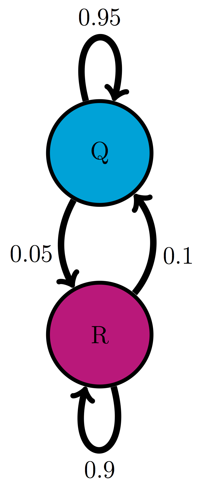
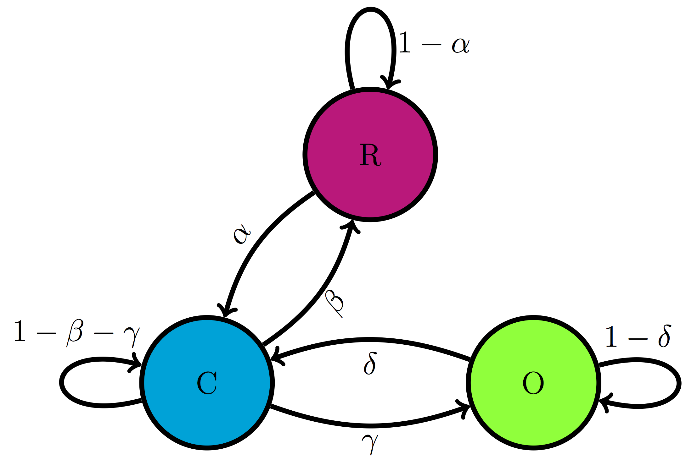
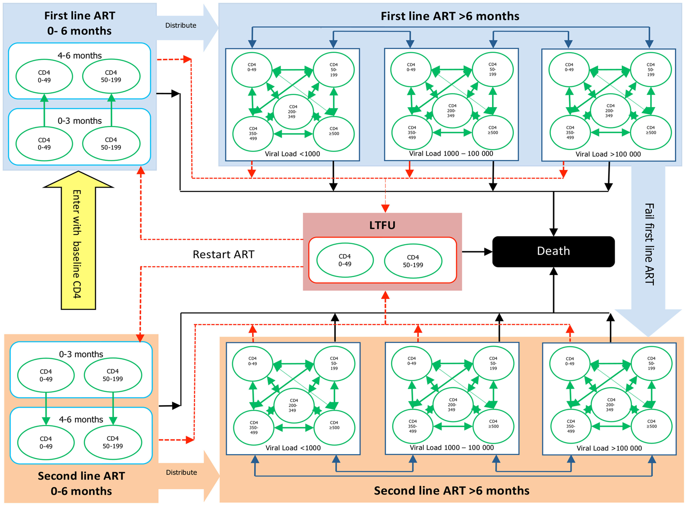

# (PART) Random models that change with time {-}

# Markov models with discrete states

> True, man is mortal, but that's not the half of it. What's worse is that he's sometimes suddenly mortal, that's the trick!  
-- Mikhail Bulgakov, *The Master and Margarita*


Life is complex and often unpredictable.  Molecules bump into each randomly due to thermal motion; entire organisms either find food or become food themselves due to chance. Mathematical probability supplies tools to model, analyze, and even predict the behavior of these random processes. In this part of the book we will focus on living systems that can be described as being in different categories called discrete states. Similar to the categorical random variables that were described in chapters 8 and 10, these systems are not measured on a numerical scale, but can be described by words. For example, ion channels are trans-membrane proteins which can change their shape to allow or not allow the passage of ions. Thus, an ion channel can be described as being in an open or a closed state, with transitions taking places between those states with certain probabilities. These models with a few discrete states and random transitions with specified probabilities are called *Markov models*. They are easy to build and they provide a powerful framework for mathematical analysis. In this chapter you will learn to do the following:


* write down the transition diagram and transition matrix of a discrete-state Markov models
* understand the Markov property and its implications
* calculate the probability of a string of states based on transition probabilities
* simulate a Markov model by generating multiple state strings based on the transition probabilities


## Building Markov models
\label{sec:model10}

Consider the life cycle of a cell, which is illustrated in figure \ref{fig:ch10_cell_cycle}a. Cells are known to go through phases in the cell cycle, which correspond to different molecules being synthesized and different actions performed. The $M$ phase stands for mitosis, or cell division, which itself can be divided into stages, and in between cell divisions, cells go through gap phases ($G_1$ and $G_2$) and the $S$ phase, during which DNA replication occurs. Some cells, depending on their environmental conditions, or type in multicellular organisms, can also get off the treadmill of the cell cycle, and go into what is called ``quiescence'', or $G_0$ phase, during which the cell leads a quiet life. It can also come out of quiescence and replicate again. This suggests a simplified description of the cell that exists either in state $R$ (actively replicating) or state $Q$ (quiescent), with transitions between the two states occurring randomly with some probabilities. These kinds of models can be summarized graphically using *transition diagrams*. For example, the QR model of the cell cycle with probability of transition from Q to R of 0.05 (per hour), and the transition probability from R to Q of 0.1 (per hour) is described by the diagram shown in figure \ref{fig:ch10_cell_cycle}b.




A very different example of a biological systems that can be naturally divided into states are ion channels, mentioned above. For some of them the opening or closing is activated by the binding of other molecules, like in the case of the nicotinic acetylcholine receptor (nAChR). When not bound to acetylcholine (a small molecule that serves as a neurotransmitter) it remains closed, but binding of acetylcholine enables it to change conformation and open, though it can also be closed when bound to Ach. Figure \ref{fig:ch10_ion_channel} illustrates the three states of nAChR, along with a transition diagram that depicts possible transitions. Notice the absence of any arrows between states R and O, which reflects the fact that the ion channel cannot transition directly from the resting (unbound) state to the open state, it must go through the bound-but-closed state C.





## Markov property
\label{sec:math10}

In *finite-state* Markov models like those introduced above, the independent variable (e.g. time) advances in discrete steps, the length of which is defined by the problem. For example, in the cell cycle model, an appropriate time step may be an hour, while for the ion channel mode, a reasonable time step is a fraction of a second. In some bioinformatics models describing a string of letters, the independence variable is position in the sequence and the step is one letter. Changes from one state to another are called *transitions*, and they may only happen over a step of the independent variable. The transitions occur randomly, so they cannot be predicted, but we can describe the probability of transitions. 

For example, we may state that the probability of transition from state Q to R in the cell cycle model is 0.05 for each time step, and the probability of transition from R to Q is 0.1. This means that 5 times of 100 (out of many trials) a quiescent cell will switch to replicating over one time step, and 1 time out of 10 (out of many trials) a replicating cell will switch to the quiescent state. Let us define these parameters properly:

```{definition, def-mark-trans}
Let $X(t)$ be the random variable in a discrete-time Markov model with finitely many states at an arbitrary time $t$. The *transition probability* from state $i$ to state $j$ is  denoted $p_{ji}$ and is defined as the conditional probability:
$$ p_{ji} = P \{X(t+1) = j | X(t) = i \}$$
```

Let us unpack this definition. The transition probability is conditional on knowing the state of the model ($i$) is at the present time ($t$) and gives us the probability of the model switching to another state ($j$, which can be the same as $i$) one time step later ($t+1$). The transition probability in this definition has no explicit dependence on time $t$, which is not necessarily the case for all Markov models; I just chose to make this additional assumption, called *time-homogeneity*, for simplicity. There are Markov models which are not time-homogeneous, but we will not see them in this course.

Note that the transition from state $i$ to state $j$ is written as $p_{ji}$. This is the convention that I will use to conform to the conditional probability notation, and for another reason that will be apparent in the next chapter. Unfortunately, there is no agreement in the field as to which convention to use, and some textbooks and papers denote the same transition probability $p_{ij}$. I will strive to avoid confusion and remind you what $p_{ji}$ stands for.

One funny thing that you might have noticed in that definition is that the transition probability makes no mention of times before the present. We just brazenly assumed that the history of the random variable before the present time $t$ does not matter! This is called the *Markov property* and was first postulated by A.A. Markov in 1905.  Here is the proper definition \citep{feller_introduction_????}:

```{definition, def-mark-prop}
A time-dependent random variable $X(t)$ has the *Markov property* if for all times $t$ and for all $n<t$, the following is true:

$$P\{ X(t+1)| X(t) ; X(n) \} = P\{ X(t+1)| X(t) \}$$
```

I did not specify the state of the random variable in the definition because it must be true for all states in the model. Stated in words, this says that the probability distribution of the random variable at the next time step, given its distribution at the current time is the same whether any of its past states are known or not. Another way of stating it is that the state of the random variable at the next time, given the state at the present time, is *independent* of the past states.

If this seems like a really big assumption, you are right! The reason we assume this property is because it makes calculations with these models much easier. As with any assumption, it must be viewed critically for any given application. Does the cell really forget what state it was in an hour ago? Does it matter whether an ion channel was open a microsecond ago for its probability to open again? The answer to these questions is not always clear cut - there is almost always some residual memory of past states in a real system. If that memory is not very strong, then we can proceed with our Markov modeling. Otherwise, the models must be made more sophisticated.

### transition matrices

Let us return to our example of the cell cycle model with two transition probabilities given: transition from Q to R $p_{RQ} = 0.05$ and transition from R to Q $p_{QR}  = 0.1$. We can calculate the probability of a replicating cell remaining in the same state, and the probability of a quiescent cell remaining in the same state, because they are complementary events:

$$
p_{QQ} = 1 - p_{RQ} = 0.95; \; p_{RR} = 1 - p_{QR} = 0.9
$$

In other words, a quiescent cell either becomes replicating over one time step or remains quiescent, so the two probabilities must add up to 1. The same reasoning applies to the replicating cell. We now have all of the parameters of the model, and there is a convenient way of organizing them in one object.

```{definition, def-trans-mat}
The *transition matrix* for a discrete-time Markov model with $N$ states is an $N$ by $N$ matrix, which has the transition probabilities $p_{ij}$ as its elements in the $i$-th row and $j$-th column.
```

By convention, the rows in matrices are counted from top to bottom, while the columns are counted left to right. The transition matrix is a square matrix consisting of all of the transition probabilities of a given Markov model. It is, in essence, what defines a Markov model because the transition probabilities are its parameters. 

**Example.** For the cell cycle model in figure \ref{fig:ch10_cell_cycle} the transition matrix is:
$$ 
M = \left(\begin{array}{cc}0.95 & 0.1 \\0.05 & 0.9\end{array}\right)
$$ 

In order to write it down, we have to put the states in order; in this case I chose Q to be state number 1, and R to be state number 2. This is entirely arbitrary, but must be specified in order for the matrix to have meaning. Notice that the probabilities of staying in a state are on the diagonal of the matrix, where the row and the column number are the same. The probability of transition from state 1 (Q) to state 2 (R) is in column 1, row 2, and the probability of transition from state 2 (R) to state 1 (Q) is in column 2, row 1.

**Example.** For the three-state model of the nAChR ion channel in figure \ref{fig:ch10_ion_channel} the transition matrix is:
$$ 
M = \left(\begin{array}{ccc} 1-\alpha & \beta & 0  \\ \alpha & 1-\beta-\gamma & \delta \\ 0 & \gamma & 1-\delta \end{array}\right)
$$ 

The matrix is for states R, C, and O placed in that order. Notice that the transition probability between R and O and vice versa is zero, in accordance with the transition diagram. The probability of remaining in each state is 1 minus the sum of all the transition probabilities of exiting that state; for example for state 2 (C) the probability of remaining is $1-\beta-\gamma$.

### probability of a string of states

Knowing the parameters of the model gives us the tools to make probabilistic calculations. The simplest task is to find the probability of occurrence of a given string of states. For instance, for the cell cycle model, suppose we know that a cell is initially quiescent, what is the probability that it remains quiescent for two hours? The probability of the cell remaining quiescent for one time step is $p_{QQ} = 0.95$, and the probability of it remaining quiescent for one more time step is also $p_{QQ}$. Due to the Markov property, the two transitions are independent of each other, so the probabilities can be multiplied, due to the multiplicative property of independent events, to give the answer: $P\{QQQ\} = 0.95\times0.95 = 0.9025$.

The magic of Markov property allows us to calculate the probability of any string of states, given the initial state, as the product of transition probabilities. We can write this formally as follows: for a string of states $S = \{x_1, x_2, x_3, ... , x_{T-1}, x_T\}$, where $x_t$ represents the state at time $t$, the probability of this string, given that $P(x_1) = 1$ is
$$ 
P(S) =  p_{x_2x_1} p_{x_3x_2} ... p_{x_Tx_{T-1}} =  p_{x_Tx_{T-1}} ... p_{x_3x_2}p_{x_2x_1}
$$

The ellipsis represents all the intermediate transitions from state $x_3$ to state $x_{T-1}$. I also showed that by reversing the order of multiplication, which is allowed because of commutativity, makes the order of states proceed more clearly.

**Example.** Let us calculate the probability of another string of states based on the the cell cycle model in figure \ref{fig:ch10_cell_cycle}. The probability that a cell is initially in state R, then transitions to state Q and remains in state Q is a product of the transition probability from R to Q and the transition probability from Q to Q:
$$ 
P\{RQQ\} = 0.1 \times 0.95=0.095
$$ 

Notice that there is no transition probability for the first state, since it must be specified as an initial condition, just like in the dynamic models we saw in chapters 5 through 7.

**Example.** Let us calculate the probability of a string of states based the three-state model of the nAChR ion channel in figure \ref{fig:ch10_ion_channel}. The probability that an ion channel is initially in state R, remains in that state for 5 steps, then transitions to state C, remains there for 3 steps, then transitions to state O is:

$$ 
P\{RRRRRRCCCCO\} =  (1-\alpha)^5 \alpha (1-\beta-\gamma)^3 \gamma
$$ 

### Exercises

For the following Markov models a) draw the transition diagram, if one is not provided; b) put the states in (some) order and write down the transition matrix; c) calculate the probability of the given strings of states, taking the first state as given (e.g. for a string of 3 states, there are only 2 transitions.)


1. Use the transition diagram in figure \ref{fig:ch10_trans_diags}a (Model 1) to calculate the probability of the string of states BAB.

2. Use the transition diagram in figure \ref{fig:ch10_trans_diags}b (Model 2) to calculate the probability of the string of states CCD.

3. Use the transition diagram in figure \ref{fig:ch10_trans_diags}c (Model 3) to calculate the probability of the string of states EEF.

4. Use the transition diagram in figure \ref{fig:ch10_trans_diags}d (Model 4) to calculate the probability of the string of states GGG.

5. An ion channel can be in either open (O) or closed (C) states. If it is open, then it has probability  0.1 of closing in 1 microsecond; if closed, it has probability 0.3 of opening in 1 microsecond. Calculate the probability of the ion channel  going through the following sequence of states: COO.

6. An individual can be either susceptible (S) or infected (I), the probability of infection for a susceptible person is 0.05 per day, and the probability an infected person becoming susceptible is 0.12 per day. Calculate the probability of a person going through the following string of states: SISI.

7. The genotype of an organism can be either normal (wild type, W) or mutant (M). Each generation, a wild type individual has probability 0.03 of having a mutant offspring, and a mutant has probability 0.005 of having a wild type offspring. Calculate the probability of a string of the following genotypes in successive generations: WWWW.

8. There are three kinds of vegetation in an ecosystem: grass (G), shrubs (S), and trees (T) \citep{bodine_mathematics_2014}. Every year, 25% of grassland  plots are converted to shrubs, 20% of shrub plots are converted to trees, 8% of trees are converted to shrubs, and 1% of trees are converted to grass; the other transition probabilities are 0. Calculate the probability of a plot of land have the following succession of vegetation from year to year: GSGG.

9. The nAChR ion channel can be in one of three states: resting (R), closed with Ach bound (C), and open (O) with transition probabilities (per one microsecond): 0.04 (from R to C), 0.07 (from C to R), 0.12 (from C to O) and 0.02 (from O to C); the other transition probabilities are 0. Calculate the probability of the following string of states: OCCR.

10. (Challenging) We considered a sequence of Bernoulli trials in chapter 4, for example a string of coin tosses where each time heads and tails come up with probability 0.5. Describe this experiment as a Markov model, draw its transition diagram and write its transition matrix.

11. (Challenging) Now do the same for a sequence of Bernoulli trials where success has probability 0.9 (and failure has probability 0.1).

12. (Challenging) Can you formulate a test, based on a transition matrix of a Markov model, to tell whether it's generating a string of independent random variables as opposed to a string of random variables that depend on the previous one?


## Markov models of medical treatment
\label{sec:bio10}

Markov models are used across many biological fields. One example is the representation of disease and patient treatment using discrete states with random transitions. The states may describe the progression of the disease, the prior health and socioeconomic status of the patient, the treatment the patient is undergoing, anything that is relevant for the medical situation. Some models are very simple, for example a model of stroke patients that describes them either as well, experiencing stroke, disables, or dead \citep{sonnenberg_markov_1993}. Others use tens or hundreds of states, to better capture all the details without. One can then ask the question: what course of treatment is likely to lead to the best outcome? Notice that there can be no certainty in this answer, since the model is fundamentally random. In order to evaluate different treatments, one can run simulations of the different models and compare the statistics generated by multiple simulations of each model.  


For example, figure \ref{fig:simple_medical_markov} from \citep{sonnenberg_markov_1993} shows a four-state Markov model used to represent patients at risk for stroke. Three of the four states (well, disabled, and dead) have nonzero probability of remaining in the same state for more than one time step, and in particular the death state is permanent, so no transitions out of it are allowed. On the other hand, the stroke state does not allow for "self-transition" since it is a fast event, either resulting in full recovery, disability, or death. In order for such models to be useful, one needs to obtain data on numerous patients documenting all possible transition events, and to estimate the transition probabilities based on the observed frequencies of their respective occurrences.

A more realistic example comes from a recent study of the cost-effectiveness of different treatment protocols for HIV patients in South Africa \citep{leisegang_novel_2013}. Physicians and public health officials have to consider both the costs and the efficacy of medical procedures, and it is a difficult challenge to balance the two, with human health and lives at stake. The authors built a model that includes stages of the disease, determined by viral loads and treatment options. The authors used data from two different clinics, a public and a private one, to estimate the transition probabilities and outcomes of treatments, and the costs of clinic visits and the therapies. They then simulated the models to compare the predicted costs and outcomes, and found that while the outcomes in the two treatment protocols were similar, the costs in the private clinics were considerably lower.



### Discussion questions

You are invited to read the paper  ["A Novel Markov Model Projecting Costs and Outcomes of Providing Antiretroviral Therapy to Public Patients in Private Practices versus Public Clinics in South Africa"](https://journals.plos.org/plosone/article?id=10.1371/journal.pone.0053570) and then use the following questions for discussion with your colleagues and friends.

1. What does the Markov property mean for this model? How realistic do you think it is for actual patients?

2. What are some other assumptions the authors make? Are they reasonable from a medical standpoint?

3. The model predicts that private clinics which save costs are equally effective to private clinics with greater numbers of visits. Would you be comfortable recommending patients use only use private clinics based on this prediction?
