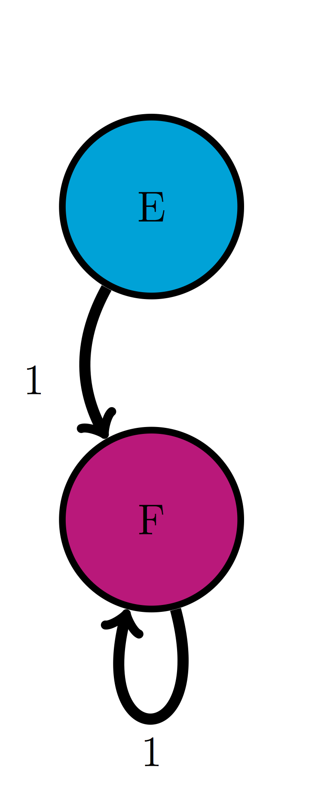

# Probability distributions of Markov chains

> I had the most rare of feelings, the sense that the world, so consistently overwhelming and incomprehensible, in fact had an order, oblique as it may seem, and I a place within it.
-- Nicole Krauss, *Great House*


In the last chapter we learned to describe randomly changing biological systems using discrete-state Markov models. These models are defined by a list of states and the transition probabilities between the states, which are organized into a transition matrix. The models are fundamentally stochastic and thus unpredictable, but they can be simulated on a computer using random number generators to produce multiple strings of states. From them one can calculate various statistical properties, such as means or variances of random variables that depend on these states. However, performing endless  simulations can be computationally expensive. It is much more efficient to predict the probability distribution of the model at any given time without performing random simulations. The mathematical framework of matrices and vectors and algebraic operations on them allow this prediction. Here is what you will learn to do in this chapter:

* write down a probability distribution  vector for a Markov model
* given a probability distribution vector at a particular time, calculate the probability distribution one (or a few) time steps into the future
* multiply matrices and vectors
* use R scripts to calculate the probability distribution any number of time steps in the future

## Probability distribution vectors

\label{sec:math11}

Consider a two-state Markov model }with a given transition matrix and a specified initial state. After one time step, the variable can be in either of two states - this can be simulated in R using a random number generator and a conditional statement. There are only two possible options: either the variable stays in the original state, or transitions from the original state to the other one. For the cell cycle model introduced in the last chapter, with initial state Q, the state space of this experiment contains two state strings: $\{QQ, QR\}$. After two time steps, there are now four possible paths. For the cell cycle model with initial state $Q$, the state space is $\{QQQ, QRQ, QRR, QQR\}$. Based on the calculation of probabilities of a given state that we learned in the last chapter, we can find the probability of each of the paths and then calculate the probability of the cell being in the replicating state after two time steps.

Let us make the problem a bit more general: take a two-state Markov model with a given transition matrix and a specified initial probability distribution, instead of a single state. In the cell cycle model, let the initial probability of $Q$ be $Q_0$ and the initial probability of $R$ be $R_0$. Then the event of the cell being in state $Q$ after 1 time step is a combination of two different state strings: $\{QQ, RQ\}$ and the probability of that event is the sum of those two probabilities:

$$ 
P(X(1) = Q)  = p_{QR}R_0 + p_{QQ}Q_0  
$$

Similarly, the event of the cell being in state $R$ is a sum of the probabilities of the state strings $\{QR, RR\}$:
$$ 
P(X(1) = R) = p_{RQ}Q_0 + p_{RR}R_0 
$$

These calculations are shown in figure \ref{fig:markov_mult_table}, starting with all the probability in state Q at t=0, then calculating the new probability distribution at time t=1, then using the same transition probabilities to calculate the new distribution at t=2.


The calculations are easy for a couple of time steps, but imagine having to do this for ten time steps, or a hundred - you would need to deal with thousands, or in the second case, about $10^{30}$ different state strings!  One may use R to run a simulations for many different state strings and plot their histograms (which we will do in section \ref{sec:proj12} in the next chapter). However, it is far more efficient to compute the probability of a cell being in a particular state at a particular time, that is, its probability distribution vector.

### Markov chains
While sometimes simulation of multiple random processes is necessary, it can get expensive. Probability offers us a theoretical way to make predictions for a Markov model, based on the notion of a *probability distribution vector*. First, let us define a few terms: a *Markov chain* is the mathematical manifestation of a Markov model. It was dubbed a chain because it consists of a string of linked random variables, the probability of each dependent on the previous one, and generating the next one. 

```{definition, def-mark-chain}
A *Markov chain* is a sequence of random variables $X(t)$, where $t$ is time, and $X(t)$ can be in one of $n$ states. Each random variable $X(t)$ has an associated probability distribution vector $\vec P(t)$, in which the $i-th$ element contains the probability of the random variable being in the $i-th$ state, and $\vec P(t)$ depends on $\vec P(t-1)$ according to the Markov property. 
```

**Example.** The model of ion channels introduced in the last chapter in figure \ref{fig:ch10_ion_channel} has three states: resting, closed, and open. A Markov chain for this model consists of a string of random variables that can take on states $R, C, O$, which can be indexed by corresponding integers 1, 2, 3. For each time step $t$, the random variable $X(t)$ has a probability vector with three elements: $\vec P(t) = (P_1(t), P_2(t), P_3(t))$. Each element represents the probability of the corresponding state at the time, e.g. $P_3(20)$ is the probability of the ion channel being in state 3 ($O$) at time 20. 

To generate a Markov chain with their associated probability distribution vectors, one needs to know the initial state or distribution. For example, if initially the ion channel model is in state $C$, the probability of the ion channel being in state $R$ after 2 time step is different than if the initial state were $R$. Given an initial probability distribution, we will calculate the probability distribution at the next time step, and then recursively generate the entire Markov chain.

The law of total probability, which we encountered in section \ref{sec:math7}, allows us to calculate the probability distribution of the Markov random variable at any time step, given its probability distribution at the previous time step. Here is the general formula for a Markov model with $N$ states:

$$
P(X(t+1) = i) = \sum_{j=1}^N P(X(t+1) = i | X(t) = j )P(X(t) = j) = \sum_{j=1}^N p_{ij}P(X(t) = j)
$$

Here $P(X(t) = j)$ is the probability of the random variable being in some state $j$ at time $t$,  $p_{ij}$ are the transition probabilities, and the sum adds up all the possible transitions into state $i$. This equation can be written down for every state $i$ at the next time step $t+1$, so we have $N$ equations, each one adding up $N$ terms. For a 2 by 2 model, this is not too daunting:
$$ 
P(X(t+1) = Q) = p_{QQ}P(X(t) = Q) + p_{QR}P(X(t) = R) $$

$$ 
P(X(t+1) = R) = p_{RQ}P(X(t) = Q) + p_{RR}P(X(t) = R) 
$$

This gives us a predictive formula for the probability distribution of a Markov random variable at the next time point, given its current probability distribution. Notice that all four of the transition probabilities are used in the system of equations, and that they are arranged in the same way that I defined them in the transition matrix. This leads to a great simplification using matrices and vectors.

## matrix multiplication
Now is a good time to properly define what matrices are and how we can operate on them. We have already seen transition matrices, but just to make sure all of the terms are clear:
```{definition, def-matrix}
A *matrix* $A$ is a rectangular array of *elements* $A_{ij}$, in which $i$ denotes the row number (index), counted from top to bottom, and $j$ denotes the column number (index), counted from left to right. 

The dimensions of a matrix are defined by the number of rows and columns, so an n by m matrix contains $n$ rows and $m$ columns. 
```

Elements of a matrix are not all created equal, they are divided into two types:

```{definition, def-mat-els}
The elements of a matrix $A$ which have the same row and column index, e.g. $A_{33}$ are called the *diagonal elements*. Those which do not lie on the diagonal are called the *off-diagonal* elements. 
```

For instance, in the 3 by 3 matrix below, the elements $a, e, i$ are the diagonal elements:
$$
A = \left(\begin{array}{ccc}a & b & c \\d & e & f \\g & h & i\end{array}\right)
$$

Matrices can be added together if they have the same dimensions. Then matrix addition is defined simply as adding up corresponding elements, for instance the element in the second row and first column of matrix $A$ is added with the element in the second row and first column of matrix $B$ to give the element in the second row and first column of matrix $C$. Recall from the previous chapter that rows in matrices are counted from top to bottom, while the columns are counted left to right. 

Matrices can also be multiplied, but this operation is trickier. For mathematical reasons, multiplication of matrices $A \times B$ does not mean multiplying corresponding elements. Instead, the definition seeks to capture the calculation of simultaneous equations, like the one in the previous section. Here is the definition of matrix multiplication, in words and in a formula \citep{strang_linear_2005}:

```{definition, def-mat-mult}
The *product of matrices $A$ and $B$* is defined to be a matrix $C$, whose element $c_{ij}$ is the dot product of the i-th row of $A$ and the j-th column of $B$:

$$ 
c_{ij} = a_{i1}b_{1j} + a_{i2}b_{2j} + ... + a_{iN}b_{Nj} = \sum_{k=1}^q a_{ik} b_{kj}
$$
```
This definition is possible only if the length of the rows of $A$ and the length of columns of $B$ are the same, since we cannot compute the dot product of two vectors of different lengths. Matrix multiplication is defined only if $A$ is $n$ by $q$ and $B$ is $q$ by $m$, for any integers $n$, $q$, and $m$ and the resulting matrix $C$ is a matrix with $n$ rows and $m$ columns, as shown in figure \ref{fig:ch11_matrix_mult}. In other words, **the inner dimensions of matrices must match** in order for matrix multiplication to be possible.

**Example.** Let us multiply two matrices to illustrate how it's done. Here both matrices are 2 by 2, so their inner dimensions match and the resulting matrix is 2 by 2 as well:
$$ 
\left(\begin{array}{cc}1 & 3 \\ 6 & 1\end{array}\right) \times \left(\begin{array}{cc}4 & 1 \\5 & -1 \end{array}\right) = \left(\begin{array}{cc}1 \times 4 + 3 \times 5 & 1 \times 1 +3 \times (-1) \\ 6 \times 4+ 1 \times 5 & 6 \times 1+1 \times (-1) \end{array}\right) = $$
$$= \left(\begin{array}{cc}19 & -2 \\ 29 & 5 \end{array}\right) 
$$

One important consequence of this definition is that matrix multiplication is not commutative. If you switch the order, e.g. $B \times A$, the resulting multiplication requires dot products of the rows of $B$ by the columns of $A$, and except in very special circumstances, they are not the same. In fact, unless $m$ and $n$ are the same integer, the product of $B \times A$ may not be defined at all.


We usually think of vectors as an ordered collection of numbers, but they can also be thought of as matrices, albeit very skinny ones. A *column vector* is a matrix that has only one column, and a *row vector* is a matrix with only one row. Even if a column vector and a row vector contain the same numbers in the same order, they are different matrices, because they function differently when multiplied. When multiplying an $n$ by $m$ matrix and a vector, one can multiply with the vector on the left, or on the right, depending on the type of vector: if it is a column vector, it must be on the right side of the matrix, while a row vector is multiplied on the left. Since the inner dimensions have to match, an $n$ by $m$ matrix can be multiplied by a $m$ by 1 column vector on the right, or by a 1 by $n$ row vector on the left.

The rules of matrix multiplication may seem annoyingly baroque, but you will see the payoff in simplification of our Markov calculations.

### Exercises
For the following pairs of matrices determine whether matrix multiplication is valid for $A \times B$ and $B \times A$, and for the valid cases indicate the dimension of the resulting matrix.

1. 
$$ 
A =  \left(\begin{array}{c}1 \\ 3 \end{array}\right);  \;  B = \left(\begin{array}{cc}4 & 1 \\5 & 1 \\6 & 1\end{array}\right)
$$

2. 
$$ 
A =   \left(\begin{array}{ccc}1 & -2 & 1 \\-2 & 1 & -2 \\1 & -2 & 1\end{array}\right);  \;  B = \left(\begin{array}{ccc}4 & 5 & 6 \\-6 & -5 & -4\end{array}\right)
$$

3. 
$$ 
A =  \left(\begin{array}{cc}2 & -1 \\-3 & 1\end{array}\right)  ;  \;  B = \left(\begin{array}{cc}-1 & -1 \\-3 & -2\end{array}\right)
$$

4. 
$$ A =   \left(\begin{array}{ccc}1 & -2 & 1 \\-2 & 1 & -2 \\1 & -2 & 1\end{array}\right)  ;  \;  B =  \left(\begin{array}{cc}-1 & -1 \\-3 & -2\end{array}\right)
$$

5. 
$$ 
A =   \left(\begin{array}{c} 1 \\ 4 \\ -2\end{array}\right) ;  \;  B =  \left(\begin{array}{ccc}-1 & -1 & 10  \\-3 & -2 & 0 \\ 0 & -1 & -7 \end{array}\right)
$$

6. 
$$ 
A =  \left(\begin{array}{ccc} -1 &  2 & -9 \end{array}\right);  \;  B = \left(\begin{array}{cc}-4 & -8 \\5 & 2 \\-6 & 10\end{array}\right)
$$


### propagation of probability vectors
To calculate the probability of states in the future, we need to start with an initial probability distribution - let us call it $P(0)$. To advance it by one time step, multiply it by the transition matrix, and obtain the probability distribution at $P(1)$. To calculate the probability distribution after two time steps, multiply the distribution vector $P(1)$ by the transition matrix and obtain the vector $P(2)$.

**Example.** Take the case of the cell cycle model where the cell is initially in the quiescent state, the vector propagation looks as follows:
$$ P(1) = M \times  P(0) = \left(\begin{array}{cc}0.95 & 0.1 \\0.05 & 0.9\end{array}\right)  \left(\begin{array}{c}1  \\ 0\end{array}\right) = \left(\begin{array}{c} 0.95 \\ 0.05\end{array}\right) $$ 
The Markov property allows us to calculate the probability distribution at the next step ($t+1$) given the distribution at the current step ($t$). This means to find the distribution of the cell cycle model after two time steps, we multiply the present distribution vector by the matrix $M$: 
$$ P(2) = M   \times  P(1) =  \left(\begin{array}{cc}0.95 & 0.1 \\0.05 & 0.9\end{array}\right)\left(\begin{array}{c} 0.95 \\ 0.05\end{array}\right) = \left(\begin{array}{c} 0.9075 \\ 0.0925\end{array}\right) $$ 

One can calculate the probability distribution vectors for as many time steps as needed by repeatedly multiplying the current probability distribution vector by the transition matrix. The general formula for the probability distribution of a Markov chain at any time $t$ is:
$$
P(t) = M \times P(t-1) = M^{t}  \times  P(0)
\label{eq:Markov_chain}
$$
which may be expressed in terms of repeated matrix multiplications (or matrix $M$ raised to the power $t$) of the initial distribution vector $P(0)$. This shows that in order to predict the distribution in the future, we need to know only two things: the initial distribution and the transition matrix of the Markov model.

### Exercises

Use the transition matrices you constructed for these models in the previous chapter to calculate the probability distribution for two time steps into the future.





1. Use the model in the transition diagram in figure \ref{fig:ch10_trans_diags}a (Model 1). If initially the model is in state A, what is the probability it is in state B after 1 time step? after 2 time steps?

2. Use the model in the transition diagram in figure \ref{fig:ch10_trans_diags}b (Model 2). If initially the model is in state C, what is the probability it is in state D after 1 time step? after 2 time steps?

3. Use the model in the transition diagram in figure \ref{fig:ch10_trans_diags}c (Model 3). If initially the model is in state E, what is the probability it is in state F after 1 time step? after 2 time steps?

4. Use the model in the transition diagram in figure \ref{fig:ch10_trans_diags}d (Model 4). If initially the model is in state H, what is the probability it is in state G after 1 time step? after 2 time steps?

5. An ion channel can be in either open or closed states. If it is open, then it has probability  0.1 of closing in 1 microsecond; if closed, it has probability 0.3 of opening in 1 microsecond. Suppose that initially 50% of ion channels are open and 50% are closed. What fraction is open after 1 microsecond? after 2 microseconds?

6. An individual can be either susceptible or infected, the probability of infection for a susceptible person is 0.05 per day, and the probability an infected person becoming susceptible is 0.12 per day. Suppose that initially the population is 90% susceptible and 10% infected. What fraction is susceptible after 1 day? after 2 days?

7. The genotype of an organism can be either normal (wild type) or mutant. Each generation, a wild type individual has probability 0.03 of having a mutant offspring, and a mutant has probability 0.005 of having a wild type offspring. Suppose that initially 0.9 of the population is wild type and 0.1 is mutant. What fraction of the population is wild type after 1 generation? After 2 generations?

8. The nAChR ion channel can be in one of three states: resting (R), closed with Ach bound (C), and open (O) with transition probabilities (per one microsecond): 0.04 (from R to C), 0.07 (from C to R), 0.12 (from C to O) and 0.02 (from O to C); the other transition probabilities are 0. Suppose that initially 3/4 of ion channels are in R and 1/4 are in C. What fraction of the ion channels is open after 1 microsecond? After 2 microseconds?

9. There are three kinds of vegetation in an ecosystem: grass, shrubs, and trees. Every year, 25% of grassland  plots are converted to shrubs, 20% of shrub plots are converted to trees, 8% of trees are converted to shrubs, and 1% of trees are converted to grass; the other transition probabilities are 0.  Suppose that initially the ecosystem is evenly split: 1/3 grass, 1/3 shrubs and 1/3 trees. What  fraction of ecosystem is covered in shrubs after 1 year? after 2 years?


## Mutations and molecular evolution

Think of a genetic sequence (either of nucleotides or amino acids) evolving over many generations. Once in a while, a mutation will change one of the letters in the sequence; the most common mutations, as we discussed in chapter 3, are substitutions. Although each position can contain multiple letters (4 for DNA, 20 for amino acids), let us simplify the question as follows: if we know the ancestral sequence, what fraction of the sequence is unchanged after a given number of generations? To answer this question we only need two states to describe each position in the sequence: ancestral (A) and mutant (M). The transition probability from A to M is the substitution mutation rate, which has units of mutations per nucleotide per generation. The transition probability from M to A is the rate of reversion to ancestral state, which is reasonably assumed to be less than the overall mutation rate, since for DNA there are three options for mutation from an ancestral letter, but only one option for reversion (only one ancestral letter). Thus, under the simple assumption that all substitution mutations are equally probable, we can postulate that for a mutation rate $a$, the reversion rate is $a/3$.

Figure \ref{fig:bio11} shows the evolution of probability vectors for this model for two different values of mutation rate $a$. In both calculations initially 100\% of the sequence is made up of ancestral letters, and then some fraction acquires mutations. Not surprisingly, if the mutation rate is greater, mutations are acquired faster and the fraction of ancestral letter declines faster: in the  plot on the left ($a=0.0001$) more than 90\% of the sequence is indistinguishable from the ancestor after 1000 generations, and in the plot on the right ($a=0.001$) less than half remains in the ancestral state after the same time passed. This model is a simplification of the famous Jukes-Cantor model of molecular evolution, which we will investigate in section \ref{sec:bio13}, where we will use it to predict the time of divergence of two sequences from a common ancestor. 

### Discussion questions

These questions refer to the two-state Jukes-Cantor model presented above.

```{r bio11, echo=FALSE, fig.show='hold', out.width='50%', fig.asp=.75, fig.align='center', fig.cap = 'The fraction of the sequence identical to ancestral after a certain number of generations, for two different mutation rates: a) $a=0.0001$ for 5000 generations and b) $a=0.001$ for 1000 generations.'}
a <- 0.0001
M <- matrix (c(1-a,a,a/3,1-a/3),nrow=2)
ngen <- 5000
prob.vec<- matrix (0,nrow=2,ncol=ngen+1)
prob.vec[ ,1] <- c(1,0)
for (i in 1:ngen) {
	prob.vec[,i+1] <- M%*%prob.vec[,i]
}
ndisp <- 40 # number of timepoints to display
# select exactly ndisp timepoints to display within dstep times
tpoints <- ngen%/%ndisp*0:(ndisp-1)
barplot(prob.vec[,tpoints+1],xlab='number of generations',names.arg=tpoints,ylab='probability', 
cex=1.5, cex.axis=1.5,cex.lab=1.5, col=1:2)

a <- 0.001
M <- matrix (c(1-a,a,a/3,1-a/3),nrow=2)
ngen <- 1000
prob.vec<- matrix (0,nrow=2,ncol=ngen+1)
prob.vec[ ,1] <- c(1,0)
for (i in 1:ngen) {
	prob.vec[,i+1] <- M%*%prob.vec[,i]
}
ndisp <- 40 # number of timepoints to display
# select exactly ndisp timepoints to display within dstep times
tpoints <- ngen%/%ndisp*0:(ndisp-1)
barplot(prob.vec[,tpoints+1],xlab='number of generations',names.arg=tpoints,ylab='probability', 
cex=1.5, cex.axis=1.5,cex.lab=1.5, col=1:2)
```


1. What does the Markov property mean for this model? How realistic do you think it is for real genetic sequences?

2. What does this model assume about the relationship between different positions in the sequence? Is this a realistic assumption?

3. Probability vectors plotted in figure \ref{fig:bio11} are deterministic, that is, they can be predicted exactly from an initial probability vector. Does this mean they predict the exact ancestral fraction for any sequence (which obeys the assumptions of the model)? Explain what property of a sequence can have an effect of how well it will match the prediction

4. What do you expect would happen if the calculation continued for many more generations? In other words, for a DNA sequence which is very far removed from its ancestor, what fraction of letters do you expect will match?