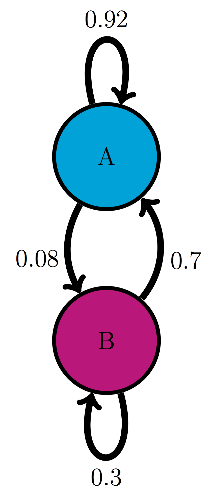
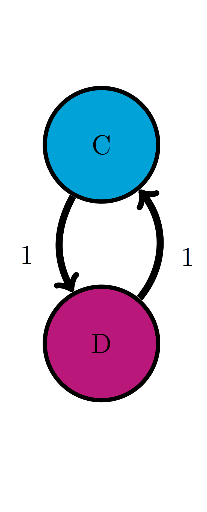
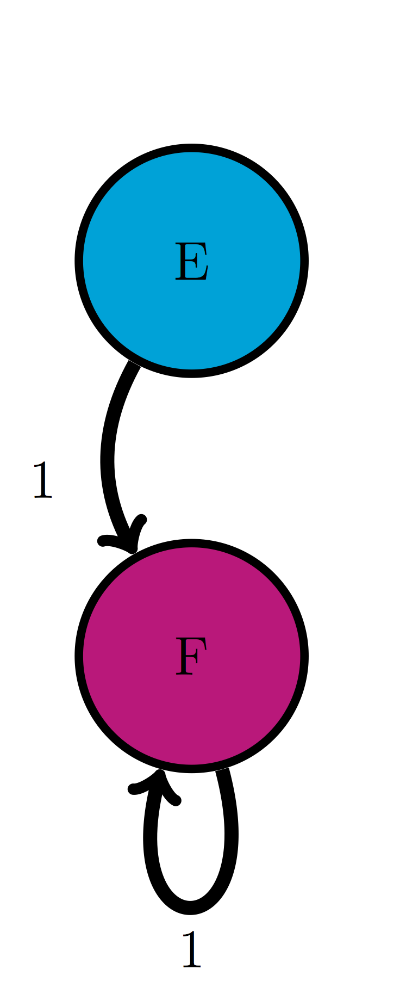
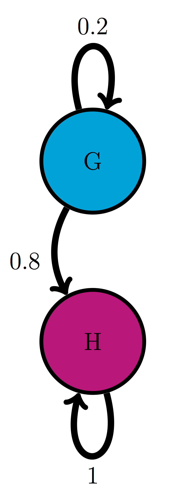
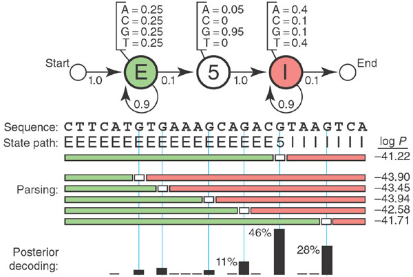

# Stationary distributions of Markov chains

> The tears of the world are a constant quantity. For each one who begins to weep somewhere else another stops. The same is true of the laugh.
-- Samuel Beckett, *Waiting for Godot*


In the last chapter we learned to compute the distributions of Markov models, bringing a measure of predictability to the randomness. Using repeated matrix multiplication we could compute the distribution for any given time, and observe how probability vectors evolve. You may have noticed that in the examples in the computational projects the probability vectors tended to approach some particular distribution and then essentially remain the same. It turns out that Markov chains have special stationary distributions at which the transitions are perfectly balanced so the probabilities of each state remain the same. In this chapter we will study the stationary distributions of Markov chains and learn to do the following:

* calculate the stationary distribution of a small Markov models on paper
* tell whether a Markov chain converges to a stationary distribution 
* run multiple simulations in R and observe convergence to a stationary distribution
* the concept of Hidden Markov Models

## History of Markov chains

The idea of chains of random variables that depend on each other was born of a feud. In the late 19th century probability theory had made great strides, both in theory and in ground-breaking applications to physics, like the work of Boltzmann in thermodynamics. Randomness and its mysteries become a fashionable topic of conversation outside of the confines of mathematics classrooms and conferences. Sociological studies were published that claimed to show that the behavior of a large number of people was predictable due to the law of large numbers.  The mathematician and self-styled philosopher P.A. Nekrasov published a paper in 1902 that made an  audacious leap of logic: he claimed that since human beings were subject to the law of large numbers, and the law of large numbers requires independence between constituent random variables, humans must have been endowed with free will, in agreement with his devout Russian Orthodox beliefs. The argument is questionable both mathematically and theologically, and it especially grated on another mathematician, A.A. Markov \citep{hayes_first_2012}.

Markov was a great mathematician as well as a malcontent. In contrast with Nekrasov, he was neither a monarchist nor a devout Orthodox believer, and even asked to be excommunicated from the church after it expelled the great writer Tolstoy for heresy. Markov already disdained Nekrasov both personally and professionally, and the paper inspired him to action. After several years of work, he published a paper entitled *An extension of the law of large numbers to quantities dependent on each other* \citep{markov_extension_1906}, which founded the concept of Markov chains. As the title states, it provided a counterexample to Nekrasov's claim that the predictability of the behavior of large number of random variables implied their independence. Markov showed that variables that depend on each other can also behave in a predictable manner in large numbers.


In addition to inventing the mathematical concepts, Markov was the first to use his chains of random variables to make a Markov model. In his 1913 paper \citep{markov_example_1913}, he proposed a model based on the classic Russian novel in verse *Eugene Onegin* by A.S. Pushkin. To make the task manageable, he divided the letters into two categories: consonants and vowels, discarding spaces, punctuation, and two Russian letters which make no sound. To calculate the transition probabilities between the two states, Markov took the first 20,000 letters of the poem and counted by hand the fraction of vowels that were followed by vowels, and the fraction of consonants that were followed by consonants, and built the first two-state text-based model, foreshadowing models of bioinformatics used now to analyze genome structure.

Figure \ref{fig:onegin_markov} shows two models based on 20,000 letters of *Eugene Onegin* in Russian and in English translation. The resulting transition probabilities are different than those computed by Markov in his paper: whereas in the English text the probability of a vowel following another vowel is 0.175, in the original Russian it is 0.128; in English the probability of a consonant following another consonant is 0.474, while in Russian it is 0.663. Clearly, Russian words contain more consonant clusters and fewer vowels next to each other. In both cases, the state of the previous letter affects the probability of the next letter being a vowel. Remarkably, the distribution of consonants and vowels is predictable in any sufficiently long piece of text: in English it is about 39% vowels and 61% consonants, and in Russian it is about 28% vowels and 72% consonants. This is an example of the main result of the first Markov chain paper: large numbers of interconnected random variables converge to a predictable distribution, called the stationary distribution.

## Stationary distributions

What happens when we extend our calculation of the probability distribution vectors of a Markov chain over a long time? Let us consider the cell cycle model with states Q and R. We have seen the state sequences of a single cell over time, so let us consider what happens to a population of cells. The basic question is: given that all the cells start out in a particular state (e.g. R), what fraction of cells is in state R after a certain number of time steps? Figure \ref{fig:math12_1} shows the result of propagating the QR model for 30 time steps, starting with two different initial distributions. You can try this at home yourself, starting with different initial distributions, and see that all of them converge over time to the same fraction of Q and R. This is called the *stationary distribution* of the Markov chain.

```{r stat-mark, echo=FALSE, fig.show='hold', out.width='50%', fig.asp=.75, fig.align='center', fig.cap = 'Probability distributions converge to the same distribution starting from two different initial distributions: a) P(0) =(0,1) ; b) P(0) =(1,0)'}
M <- matrix (c(0.95,0.05,0.1,0.9),nrow=2)
Nstep <- 30
P<- matrix (0,nrow=2,ncol=Nstep+1)
P[ ,1] <- c(0,1)
for (i in 1:Nstep) {
	P[,i+1] <- M%*%P[,i]
	}
barplot(P,xlab='time',names.arg=0:Nstep,ylab='probability',main='QR model with initial state Q',cex=1.5, cex.axis=1.5,cex.lab=1.5)
P<- matrix (0,nrow=2,ncol=Nstep+1)
P[ ,1] <- c(1,0)
for (i in 1:Nstep) {
	P[,i+1] <- M%*%P[,i]
	}
barplot(P,xlab='time',names.arg=0:Nstep,ylab='probability',main='QR model with initial state R',cex=1.5, cex.axis=1.5,cex.lab=1.5)
``` 

```{definition, def-mark-stat}
For a finite-state Markov model with transition matrix $M$, a *stationary (or equilibrium) distribution() is a vector $\vec P_s$ that has all nonnegative elements which add up to 1, and satisfies
$$ \vec P_s = M \times  \vec P_s$$
```

The definition says that a probability vector which is unchanged by multiplication by the transition matrix will remain stationary over time in a Markov chain. \citep{feller_introduction_????}

**Example.** The stationary distribution vector can be calculated analytically from the definition. Let us find the stationary vector $\vec P_s$ for the QR cell model with components $P_Q$ and $P_R$ (the fractions of quiescent and replicating cells in the stationary distribution):
$$  \left(\begin{array}{c} P_Q  \\ P_R \end{array} \right) =\left(\begin{array}{cc}0.95 & 0.1 \\0.05 & 0.9\end{array}\right)  \left(\begin{array}{c} P_Q  \\ P_R \end{array}\right) =  \left(\begin{array}{c}0.95P_Q + 0.1P_R \\0.05P_Q + 0.9P_R \end{array}\right) $$

This means there are two equations to solve for two variables. It turns out that they are equivalent:
$$ 0.95P_Q + 0.1P_R = P_Q \Rightarrow 0.1P_R = 0.05P_Q \Rightarrow P_R = 0.5P_Q$$
$$ 0.05P_Q + 0.9P_R  = P_R \Rightarrow 0.05P_Q  = 0.1P_R  \Rightarrow  0.5P_Q =  P_R  $$
Both equations say that in the stationary distribution there are twice as many quiescent cells as replicating. If we add the condition that $P_Q+P_R = 1$, then we can have the exact solution:
$$\vec P_s =  \left(\begin{array}{c} P_Q  \\ P_R \end{array} \right)  =  \left(\begin{array}{c} \frac{2}{3}  \\ \frac{1}{3} \end{array} \right) $$
This says that in a large population of cells in the cell cycle model, a population with 2/3 quiescent and 1/3 replicating is stationary. This does not mean that each individual cell remains in the same state! Each cell still randomly transitions between the two states, but the number of cells switching to the quiescent state is balanced by the number of cell switching out of the state, so the net distribution remains the same. We will observe this using simulations with multiple individual cells in section \ref{sec:comp12}.

### Exercises


{width = 25%}
{width = 25%}
{width = 25%}
{width = 25%}

For the following Markov models: a) write down the transition matrix $M$; b) find the stationary probability distribution on paper; c) use matrix multiplication in R to check that it satisfies the definition of stationary distribution.

1. Use the model in the transition diagram in figure \ref{fig:ch10_trans_diags} (Model 1).

2. Use the model in the transition diagram in figure \ref{fig:ch10_trans_diags} (Model 2).

3. Use the model in the transition diagram in figure \ref{fig:ch10_trans_diags} (Model 3).

4. Use the model in the transition diagram in figure \ref{fig:ch10_trans_diags} (Model 4).

5. An ion channel can be in either open or closed state. If it is open, then it has probability  0.1 of closing in 1 microsecond; if closed, it has probability 0.3 of opening in 1 microsecond.

6. An individual can be either susceptible or infected, the probability of infection for a susceptible person is 0.05 per day, and the probability an infected person becoming susceptible is 0.12 per day.

7. The genotype of an organism can be either normal (wild type) or mutant. Each generation, a wild type individual has probability 0.03 of having a mutant offspring, and a mutant has probability 0.005 of having a wild type offspring.

8. A gene is is either expressed (On) or not expressed (Off) by a stochastic mechanism. In the On state, it has probability 0.3 per minute of turning off, and in the Off state, it has probability 0.02 per minute of turning on.

9. The nAChR ion channel can be in one of three states: resting (R), closed with Ach bound (C), and open (O) with transition probabilities (per one microsecond): 0.04 (from R to C), 0.07 (from C to R), 0.12 (from C to O) and 0.02 (from O to C); the other transition probabilities are 0.

10. There are three kinds of vegetation in an ecosystem: grass, shrubs, and trees. Every year, 25% of grassland  plots are converted to shrubs, 20% of shrub plots are converted to trees, 8% of trees are converted to shrubs, and 1% of trees are converted to grass; the other transition probabilities are 0.

## Bioinformatics and Markov models
\label{sec:bio12}

In section \ref{sec:model12} we saw a simple Markov model for a string of characters, which was used to model a poetic text in Russian. While it did provide some information about the distribution of the vowels and consonants in the text: for instance, that it is substantially more likely that a vowel is followed by a consonant than by another vowel, the usefulness of the model is limited. However, analysis of strings of characters is a crucial component of modern biology which is awash in sequence data: DNA, RNA, and protein sequences from different organisms are pouring into various data bases. Markov models have become indispensable for making sense of sequence data.

One of the major problems in bioinformatics is identifying portions of the genome which code for proteins \citep{pevsner_bioinformatics_2009}. A nucleotide sequence consists of four letters, but their meaning and function depends on where they are and how they are used. Some parts of the genome (in humans, over 90%) are not part of a gene, and the DNA sequence is never translated into an amino acid sequence. Others are genes, which are continuous chunks of DNA sequence that are flanked by a promotor sequence and regulatory region which controls when a gene is expressed, followed by the gene proper which is transcribed into RNA and then translated into amino acids. Some parts used to be genes, but are no longer in use, those are called pseudogenes. These can be difficult to distinguish from actual, functional genes, because their sequences still have similar features, including the proximity of promoters, regulatory and coding regions. 

Within the borders of a gene there are other divisions. In eukaryotic genomes, after the gene sequence is transcribed into RNA, some portions called *introns* are cut out, then the remaining pieces called *exons* are spliced together and only then translated into protein sequences. The role of introns in biology is a topic of ongoing research, since it seems rather wasteful to transcribe portions of genes, which are sometimes considerably longer than the protein-coding exons, only to discard them later. The problem of identifying introns within a gene is important.

Markov models are used to determine the structure behind the sequence of letters. Based on known sequences of exons and introns, one can generate a *Hidden Markov Model* (HMM) that connects the DNA sequence with its underlying meaning: whether it is part of an exon or an intron. These models are more complex than the plain Markov models that we have studied: they involve two sets of states: the hidden ones, like introns and exons, which are not observable, and the observations, such as the four nucleotides (A,T,G,C). There are also two sets of transition probabilities: the transition probabilities between hidden states, and the emission probabilities, which are the probabilities that a hidden state produces a particular observation.

Figure \ref{fig:ch12_hmm_gene} shows an example of such a model for gene structure. The HMM has three hidden states: E (exon), 5 (the 5? boundary of an intron), and I (intron). Each of these states has its own probability distribution of nucleotides (letters in the sequence), with Exons containing equal proportions of all four letters, the 5? almost always being a G, and the Introns containing four times as many As and Ts as Gs and Cs.  The length of an intron is arbitrary, so the state has a probability of remaining in the same state. Each of the hidden states has its own probability of ``emitting'' a letter, so one can devise algorithms for finding the most probable string of hidden states based on an observed sequence of nucleotides. HMM enables intron-hunting to be done in a systematic manner, although, as with any random model, the results are never certain.


### Discussion questions

The following questions refer to the study [What is a hidden Markov model?](https://www.nature.com/articles/nbt1004-1315)

1. What does the Markov property mean for Hidden Markov Models presented in this paper? How reasonable is it for an actual genetic sequence?

2. Hidden Markov models can predict the *best state path* or the sequence of hidden states with the highest probability. Why is a single state path often not sufficient to answer the questions?

3. What additional assumptions does the HMM in figure \ref{fig:ch12_hmm_gene} make about the distribution of letters in an exon or intron? Comment on the biological implications.

4. What bioinformatics problems are HMMs best suited for? What are some of their drawbacks?
