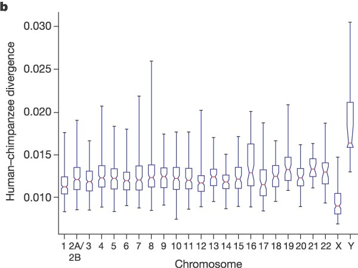

# Dynamics of Markov models

> No hour is ever eternity, but it has its right to weep.  
-- Zora Neale Hurston, *Their Eyes Were Watching God*

We have learned several approaches for analyzing the behavior of Markov models. We know that many Markov models converge to a single stationary distribution over time. For many biological questions, however, the stationary distribution itself is not very interesting, but what matters is how fast the probability distribution converges. In this chapter we will encounter more advanced tools for analyzing matrices which will enable us to answer that question. This approach will be illustrated in application to  determination of evolutionary distance based on sequence data. In this chapter you will learn to do the following:

* meaning of eigenvalues and eigenvectors
* calculate eigenvalues and eigenvectors of 2 by 2 matrices
* mixing times of Markov chains
* calculate the phylogenetic distance between two DNA sequences

## Phylogenetic trees

Over many generations, genomes of living creatures accumulate random mutations, as we previously discussed in chapters 3 and 6. Each individual genome in a population has its own polymorphisms, and thus some are more advantageous for survival in a particular environment than others. The process of natural selection is stochastic, and the notion of "survival of the fittest" is not a guarantee that the best-adapted always out-compete the rest - sometimes a more fit individual has a bad day and can't find any food or gets eaten by a predator. However, over time the allele that are advantageous have a better chance of survival and become more common in the population, while other alleles become rare or vanish \citep{futuyma_evolution_2009}. This process never stops, because the environmental conditions change, and new mutations arise, so at any point in time the individual genomes in a species have some variations, although the vast majority of their genomes are identical. 


One may describe the collection of genomes in a population or a species in terms of the most common alleles; this is roughly what we call the human genome, or the elephant genome, or the rice genome.  Once we have determined a consensus genome sequence for a species, it can be used to pose and answer questions about its heritage. If the genomes of two species are more similar to each other than to a third, it is likely that the similar pair diverged more recently than the third one. This information allows one to build *phylogenetic trees* that visually illustrate the evolutionary history of a collection of species, with each fork in the tree representing the splitting of lineages. Interpreting phylogenetic tress is fairly straightforward: species or clades (a collection of species that make an evolutionary unit) that are closely related are directly connected to a common ancestor, while the path between those that are more distantly related passes through multiple forks before reaching the common ancestor. Some trees also incorporate time information as branch lengths, with longer branches indicating that more time has passes from a divergence event.

Figure \ref{fig:ch13_phylotree} shows the phylogenetic tree for the lifeforms on Earth, divided into the three major kingdoms: Bacteria, Archea, ane Eukaryota, the latter includes all multicellular lifeforms, including plants, animals, and fungi. The nodes (end points) show the major groupings of life existing today, and the branches show the order of evolutionary divergence of lineages, starting with the hypothesized root of the tree at the bottom, known as LUCA (last universal common ancestor) \citep{futuyma_evolution_2009}. The order of splitting and the grouping of the nodes was determined by molecular sequence data (in particular ribosomal RNA) that has become available in the past 20 years.

In the past, biologists studied observable traits of different life forms, such as anatomy, physiology, or developmental features, and determined similarity from these data. However, the wealth of molecular sequence data has offered a great amount of evidence which is the primary material of evolution. Phylogeny, particularly that of unicellular organisms, has been revolutionized by these data; we now know that prokaryotes are divided into kingdoms of Archea and Bacteria which are evolutionarily more distant than humans are from fungi. Sequence data are quantitative and they require mathematical models to interpret them and to infer phylogenies. In the last section of this chapter we will introduce mathematical tools that connect related sequences to the evolutionary divergence from their common ancestor.

## Eigenvalues and eigenvectors

### basic linear algebra

In the past two chapters we have seen matrices and learned the definition of matrix multiplication, but now we are ready to go deeper into the branch of mathematics studying matrices and their generalizations, called linear algebra. It is fundamental to both pure and applied mathematics \citep{strang_linear_2005}, and its tools are used in countless applications and fields. Let us define two useful numbers that help describe the properties of a matrix:

```{definition, def-matrix-tr}
The *trace* $\tau$ of a matrix $A$ is the sum of the diagonal elements: $\tau = \sum_i A_{ii}$. 

The *determinant* $\Delta$ of a 2 by 2 matrix $A$ is given by the following: $\Delta = ad - bc$, where 
$$ A = \left(\begin{array}{cc}a & b \\c & d\end{array}\right) $$
```

For larger matrices, the determinant is defined recursively in terms of 2 by 2 submatrices of the larger matrix, but we will not give the full definition here. 


In this section we will learn to characterize square matrices by finding special numbers and vectors associated with them. At the core of this analysis lies the concept of a matrix as an operator that transforms vectors by multiplication. To be clear, in this section we take as default that the matrices $A$ are square, and that vectors $\vec v$ are column vectors, and thus will multiply the matrix on the right: $A \times  \vec v$.

A matrix multiplied by a vector produces another vector, provided the number of columns in the matrix is the same as the number of rows in the vector. This can be interpreted as the matrix transforming the vector $\vec v$ into another one: $A  \times  \vec v = \vec u$. The resultant vector $\vec u$ may or may not resemble $\vec v$, but there are special vectors for which the transformation is very simple. 

***Example.** Let us multiply the following matrix and vector:
$$ 
\left(\begin{array}{cc}2 & 1 \\ 2& 3\end{array}\right)\left(\begin{array}{c}1 \\ -1 \end{array}\right) = \left(\begin{array}{c}2 -1 \\ 2 - 3 \end{array}\right) =  \left(\begin{array}{c} 1 \\ -1 \end{array}\right) 
$$
We see that this particular vector is unchanged when multiplied by this matrix, or we can say that the matrix multiplication is equivalent to multiplication by 1. Here is another such vector for the same matrix:
$$ 
 \left(\begin{array}{cc}2 & 1 \\ 2& 3\end{array}\right)\left(\begin{array}{c}1 \\ 2 \end{array}\right) = \left(\begin{array}{c}2 +2 \\ 2 + 6 \end{array}\right) =  \left(\begin{array}{c} 4 \\ 8 \end{array}\right) 
$$
In this case, the vector is changed, but only by multiplication by a constant (4). Thus the geometric direction of the vector remained unchanged. 

Generally, a square matrix has an associated set of vectors for which multiplication by the matrix is equivalent to multiplication by a constant. This can be written down as a definition:

```{definition, def-eigen}
An *eigenvector* of a square matrix $A$ is a vector $\vec v$ for which matrix multiplication by $A$ is equivalent to multiplication by a constant. This constant $\lambda$ is called the *eigenvalue* of $A$ corresponding the the eigenvector $\vec v$. The relationship is summarized in the following equation:
$$
A  \times  \vec v = \lambda \vec v
$$
```

Note that this equation combines a matrix ($A$), a vector ($\vec v$) and a scalar $\lambda$, and that both sides of the equation are column vectors. This definition is illustrated in figure \ref{fig:ch13_eigenvector}, showing a vector ($v$) multiplied by a matrix $A$, and the resulting vector $\lambda v$, which is in the same direction as $v$, due to scalar multiplying all elements of a vector, thus either stretching it if $\lambda>1$ or compressing it if $\lambda < 1$. This assumes that $\lambda$ is a real number, which is not always the case, but we will leave that complication aside for the purposes of this chapter.


The definition does not specify how many such eigenvectors and eigenvalues can exist for a given matrix $A$. There are usually as many such vectors $\vec v$ and corresponding numbers $\lambda$ as the number of rows or columns of the square matrix $A$, so a 2 by 2 matrix has two eigenvectors and two eigenvalues, a 5x5 matrix  has 5 of each, etc. One ironclad rule is that there cannot be more distinct eigenvalues than the matrix dimension.  Some matrices possess  fewer eigenvalues than the matrix dimension, those are said to have a degenerate set of eigenvalues, and at least two of the eigenvectors share the same eigenvalue. 

The situation with eigenvectors is trickier. There are some matrices for which any vector is an eigenvector, and others which have a limited set of eigenvectors. What is difficult about counting eigenvectors is that an eigenvector is still an eigenvector when multiplied by a constant. You can show that for any matrix, multiplication by a constant is commutative: $cA = Ac$, where $A$ is a matrix and $c$ is a constant. This leads us to the important result that if $\vec v$ is an eigenvector with eigenvalue $\lambda$, then any scalar multiple $c \vec v$ is also an eigenvector with the same eigenvalue. The following demonstrates this algebraically:
$$ A  \times  (c \vec v) = c A  \times  \vec v = c \lambda \vec v =  \lambda (c \vec v) $$
This shows that when the vector $c \vec v$ is multiplied by the matrix $A$, it results in its being multiplied by the same number $\lambda$, so by definition it is an eigenvector.

Therefore, an eigenvector $\vec v$ is not unique, as any constant multiple $c \vec v$ is also an eigenvector. It is more useful to think not of a single eigenvector $\vec v$, but of a collection of vectors that can be interconverted by scalar multiplication that are all essentially the same eigenvector. Another way to represent this, if the eigenvector is real, is that an eigenvector as a **direction that remains unchanged by multiplication by the matrix**, such as direction of the vector $v$ in figure \ref{fig:ch13_eigenvector}. As mentioned above, this is true only for real eigenvalues and eigenvectors, since complex eigenvectors cannot be used to define a direction in a real space.
 
To summarize, eigenvalues and eigenvectors of a matrix are a set of numbers and a set of vectors (up to scalar multiple) that describe the action of the matrix as a multiplicative operator on vectors. "Well-behaved" square $n$ by $n$ matrices have $n$  distinct eigenvalues and $n$ eigenvectors pointing in distinct directions. In a deep sense, the collection of eigenvectors and eigenvalues defines a matrix $A$, which is why an older name for them is characteristic vectors and values. 

### calculation of eigenvalues on paper

Finding the eigenvalues and eigenvectors analytically, that is on paper, is quite laborious even for 3 by 3 or 4 by 4 matrices and for larger ones there is no analytical solution. In practice, the task is outsourced to a computer, and we will see how to do this using R in section \ref{sec:comp13}. Nevertheless, it is useful to go through the process in 2 dimensions in order to gain an understanding of what is involved. From the definition \ref{def:eigen} of eigenvalues and eigenvectors, the condition can be written in terms of the four elements of a 2 by 2 matrix:

$$  \left(\begin{array}{cc}a & b \\c & d\end{array}\right)\left(\begin{array}{c}v_1 \\ v_2 \end{array}\right) = \left(\begin{array}{c}av_1 +b v_2\\ cv_1+ dv_2 \end{array}\right) = \lambda \left(\begin{array}{c}v_1 \\ v_2 \end{array}\right)  $$
This is now a system of two linear algebraic equations, which we can solve by substitution. First, let us solve for $v_1$ in the first row, to get 
$$ v_1 = \frac{-bv_2}{a-\lambda}$$
Then we substitute this into the second equation and get:
$$\frac{-bcv_2}{a-\lambda} +(d-\lambda)v_2 = 0$$
Since $v_2$ multiplies both terms, and is not necessarily zero, we require that its multiplicative factor be zero. Doing a little algebra, we obtain the following, known as the *characteristic equation* of the matrix:
$$ -bc +(a-\lambda)(d-\lambda) = \lambda^2-(a+d)\lambda +ad-bc = 0$$
This equation can be simplified by using  two quantities we defined at the beginning of the section: the sum of the diagonal elements called the trace $\tau = a+d$, and the determinant $\Delta = ad-bc$. The quadratic equation has two solutions, dependent solely on $\tau$ and $\Delta$:
$$
\lambda = \frac{\tau \pm \sqrt{\tau^2-4\Delta}}{2}
$$

This is the general expression for a 2 by 2 matrix, showing there are two possible eigenvalues. Note that if $\tau^2-4\Delta>0$, the eigenvalues are real, if $\tau^2-4\Delta<0$, they are complex (have real and imaginary parts), and if $\tau^2-4\Delta=0$, there is only one eigenvalue. This situation is known as degenerate, because two eigenvectors share the same eigenvalue.

**Example.** Let us take the same matrix we looked at in the previous subsection:
$$ A = \left(\begin{array}{cc}2 & 1 \\ 2& 3\end{array}\right)$$
The trace of this matrix is $\tau = 2+3 =5$ and the determinant is $\Delta = 6 - 2 = 4$. Then by our formula, the eigenvalues are:
$$\lambda = \frac{5 \pm \sqrt{5^2-4 \times 4}}{2}  =  \frac{5 \pm 3}{2}  = 4, 1$$
These are the multiples we found in the example above, as expected.

### calculation of eigenvectors on paper

The surprising fact is that, as we saw in the last subsection, the eigenvalues of a matrix can be found without knowing its eigenvectors! However, the converse is not true: to find the eigenvectors, one first needs to know the eigenvalues. Given an eigenvalue $\lambda$, let us again write down the defining equation of the eigenvector for a generic 2 by 2 matrix:
$$  \left(\begin{array}{cc}a & b \\c & d\end{array}\right)\left(\begin{array}{c}v_1 \\ v_2 \end{array}\right) = \left(\begin{array}{c}av_1 +b v_2\\ cv_1+ dv_2 \end{array}\right) = \lambda \left(\begin{array}{c}v_1 \\ v_2 \end{array}\right)  $$
This vector equation is equivalent to two algebraic equations:
$$
av_1 + b v_2 = \lambda v_1
$$
$$
cv_1 + d v_2 = \lambda v_2 
$$
Since we have already found $\lambda$ by solving the characteristic equation, this is two linear equations with two unknowns ($v_1$ and $v_2$). You may remember from advanced algebra that such equations may either have a single solution for each unknown, but sometimes they may have none, or infinitely many solutions. Since there are unknowns on both sides of the equation, we can make both equations be equal to zero:
$$
(a-\lambda)v_1 + b v_2 = 0
$$
$$
cv_1 + (d-\lambda ) v_2 =0
$$
So the first equation yields the relationship $v_1 = -v_2 b/(a-\lambda) $ and the second equation is $v_1 = -v_2(d-\lambda)/c$, which we already obtained in the last subsection. We know that these two equations must be the same, since the ratio of $v_1$ and $v_2$ is what defines the eigenvector. So we can use either expression to find the eigenvector.

**Example.** Let us return to the same matrix we looked at in the previous subsection:
$$ 
A = \left(\begin{array}{cc}2 & 1 \\ 2& 3\end{array}\right)
$$
The eigenvalues of the matrix are 1 and 4. Using our expression above, where the element $a=2$ and $b=1$, let us find the eigenvector corresponding to the eigenvalue 1:
$$ 
v_1 = - v_2 \times  1/(2-1) = - v_2
$$
Therefore the eigenvector is characterized by the first and second elements being negatives of each other. We already saw in the example two subsections above that the vector $(1,-1)$ is such as eigenvector, but it is also true of the vectors $(-1,1)$, $(-\pi, \pi)$ and $(10^6, -10^6)$. This infinite collection of vectors, all along the same direction, can be described as the eigenvector (or eigendirection) corresponding to the eigenvalue 1.

Repeating this procedure for $\lambda = 4$, we obtain the linear relationship:
$$ v_1 = - v_2 \times  1/(2-4) = 0.5 v_2$$
Once again, the example vector we saw two subsections $(2,1)$ is in agreement with our calculation. Other vectors that satisfy this relationship include $(10,5)$, $(-20,-10)$, and $(-0.4,-0.2)$. This is again a collection of vectors that are all considered the same eigenvector with eigenvalue 4 which are all pointing in the same direction, with the only difference being their length.

### Exercises

{width = 25%}
{width = 25%}
{width = 25%}
{width = 25%}

For the following two-state Markov models a) calculate the eigenvalues of the transition matrix; b) calculate the corresponding eigenvectors and explain which one corresponds to the stationary distribution; c) use R to check that each of the eigenvectors obeys the definition \ref{def:eigen} with its corresponding eigenvalue.

1. Use the model in the transition diagram in figure \ref{fig:ch10_trans_diags} (Model 1).

2. Use the model in the transition diagram in figure \ref{fig:ch10_trans_diags} (Model 2).

3. Use the model in the transition diagram in figure \ref{fig:ch10_trans_diags} (Model 3).

4. Use the model in the transition diagram in figure \ref{fig:ch10_trans_diags} (Model 4).

5. An ion channel can be in either open or closed states. If it is open, then it has probability  0.1 of closing in 1 microsecond; if closed, it has probability 0.3 of opening in 1 microsecond.

6. An individual can be either susceptible or infected, the probability of infection for a susceptible person is 0.05 per day, and the probability an infected person becoming susceptible is 0.12 per day.

7. The genotype of an organism can be either normal (wild type) or mutant. Each generation, a wild type individual has probability 0.03 of having a mutant offspring, and a mutant has probability 0.005 of having a wild type offspring.


 
\subsection{rate of convergence}

Consider a two-state Markov model with the transition matrix $M$. As we know, the probability distribution vector at time $t+1$ is the matrix $M$ multiplied by the probability distribution vector at time $t$:
$$ P(t+1) = M \times P(t) $$
Using eigenvectors and eigenvalues, the matrix multiplication (which is difficult) can be turned into multiplication by scalar numbers (which is much simpler). Suppose that the initial probability vector $P(0)$ can be written as a weighted sum (linear combination) of the two eigenvectors of the matrix $M$, $v_1$ and $v_2$: $P(0) = c_1 \vec v_1 + c_2 \vec v_2 $. I will explain exactly how to find the constants $c_1$ and $c_2$ a few paragraphs later, but for now, let's go with this. Multiplying the matrix $M$ and this weighted sum (matrix multiplication can be distributed), we get:
$$ P(1) = M \times P(0) =  M \times (c_1 \vec v_1 + c_2 \vec v_2) = c_1 M \times \vec v_1 + c_2 M \times  \vec v_2  =  $$
$$ = c_1 \lambda_1\vec v_1 + c_2 \lambda_2 \vec v_2 $$
The last step is due to definition \ref{def:eigen} of eigenvectors and eigenvalues, which transformed matrix multiplication into multiplication by the corresponding eigenvalues. To see how useful this is, let us propagate the probability vector one more step:
$$ P(2) = M \times P(1) =  M \times ( c_1 \lambda_1\vec v_1 + c_2 \lambda_2 \vec v_2) =  c_1 \lambda_1^2\vec v_1 + c_2 \lambda_2^2 \vec v_2 $$
It should be clear that each matrix multiplication results in one additional multiplication of each eigenvector by its eigenvalue, so this allows us to write the general expression for the probability vector any number of time steps $t$ in the future, given the weights of the initial probability vector $c_1$ and $c_2$:
$$ P(t) =c_1 \lambda_1^t \vec v_1 +c_2 \lambda_2^t \vec v_2  $$
The constants $c_1, c_2$ are determined by the initial conditions, while the constants $\lambda_1, \lambda_2$ are the eigenvalues and the vectors $\vec v_1, \vec v_2$ are the eigenvectors of the matrix $M$. This expression is also true for Markov models of any number states, except that they have as many eigenvalues and eigenvectors as the dimensionality of the transition matrix. This is a hugely important development, because it allows us to predict how quickly the probability vectors converge to the stationary distribution. First, we need to use the following theorem:

```{theorem, theo-frob}
(Frobenius) A Markov transition matrix $M$, characterized by having all nonnegative elements between 0 and 1, and whose columns all sum up to 1, has eigenvalues that are no greater than 1 in absolute value, including at least one eigenvalue equal to 1.
```

This theorem has an immediate important consequence for the dynamics of the probability vector. According to our formula describing the time evolution of the probability vector, the eigenvalues are raised to the power $t$, which is the number of time steps. Therefore, for any eigenvalue which is less than 1, the number $\lambda^t$ grows smaller and approaches 0 as time goes on. Since the Frobenius theorem says that the eigenvalues cannot be greater than 1, the terms in the expression for the probability vector decay, except for the ones which are equal to 1 or to -1. The eigenvectors with eigenvalue 1 correspond to the stationary distribution that we introduced in the last chapter, and true to their name, they remain unchanged by time, since $1^t =1$ for all time. The ones with eigenvalue of -1 are a strange case, because they oscillate between positive and negative values, without decaying in absolute value. 

We now have the skills to answer the following question of practical importance: how quickly does the probability vector approach the stationary distribution? (There may be more than one stationary distribution vector, but that doesn't change the analysis.) This depends on how fast the contributions of other, non-stationary eigenvectors decay. If one of them has an eigenvalue of -1, then its contribution never decays - we saw an example of that in the cyclic 2-state matrix in chapter 12. If all of the eigenvalues other than the stationary one are less than 1 in absolute value, then all of them decay to zero, but at different rates. The one that decays slowest is the largest of the eigenvalues which are less than one - the  second-largest, sometimes called the subdominant eigenvalue. This is the eigenvalue which determines the rate of convergence to the stationary distribution because it is the "last person standing" of the non-stationary eigenvalues, after the others have all vanished into insignificance.

**Example.** Consider a Markov model with the following transition matrix $M$, with eigenvectors and eigenvalues already solved by a computational assistant: 
$$ M = \left(\begin{array}{ccc} 0.8 & 0.1  & 0.1  \\ 0.1 & 0.8 & 0.2 \\ 0.1 & 0.1 & 0.7 \end{array}\right)$$
$$ \lambda_1 = 1 \; \vec v_1= \left(\begin{array}{c} 1/3     \\  5/12  \\ 1/4 \end{array}\right) \; \lambda_2 = 0.7  \;  \vec v_2= \left(\begin{array}{c} -1   \\ 1  \\ 0 \end{array}\right) \; \lambda_3 = 0.6  \;  \vec v_3= \left(\begin{array}{c} 0  \\ -1  \\ 1 \end{array}\right)$$ 
Let us compute, using the tools of this section, how the probability distribution vector evolves starting with $P(0) = (7/12,5/12,0)$ (I chose this particular initial probability distribution because it makes the algebra simple, but you can start with any initial vector you want.)  The first step is to find what is called the decomposition of the initial probability vector into its three eigenvectors: 
$$P(0)= \left(\begin{array}{c} 7/12 \\ 5/12  \\ 0 \end{array}\right) =  c_1\left(\begin{array}{c} 1/3     \\  5/12  \\ 1/4 \end{array}\right) + c_2 \left(\begin{array}{c} -1   \\ 1  \\ 0 \end{array}\right) + c_3\left(\begin{array}{c} 0  \\ -1  \\ 1 \end{array}\right)$$

It turns out that the desired coefficients are $c_1 = 1$, $c_2 = -1/4$, and $c_3 = -1/4$ - you can check yourself that they add up to the initial vector we want. Therefore, after some number of time steps $t$, the probability distribution vector can be expressed like this:
$$ P(t) = \left(\begin{array}{c} 1/3     \\  5/12  \\ 1/4 \end{array}\right) -\frac{1}{4} 0.7^t \left(\begin{array}{c} -1   \\ 1  \\ 0 \end{array}\right)  -\frac{1}{4} 0.6^t \left(\begin{array}{c} 0  \\ -1  \\ 1 \end{array}\right)$$
All three eigenvectors, multiplied by their eigenvalues to the power $t$, are present in the expression, but the third eigenvalue (0.6) decays much faster than the second one (0.7). After 5 time steps, $0.7^5 = 0.168$, while $0.6^5 = 0.078$, so the contribution of the third eigenvector is about half that of the second; after 10 time steps, $0.7^{10} = 0.028$, while $0.6^{10} = 0.006$, so the contribution of the third eigenvector is about one-fifth that of the second; after 20 time steps,  $0.7^{20} \approx 8 \times 10^{-4}$, while $0.6^{20} \approx 4 \times 10^{-5}$, so the contribution of the third eigenvector is about one-twentieth that of the second. The trend is clear: although 0.6 and 0.7 are not that different, raising them to higher powers makes the ratio between them get smaller, until the contribution of the smaller of the two eigenvalues is negligible, however you'd like to define that term - less than 1%? less than 0.01%? - eventually the smaller eigenvalue will reach that level of insignificance. This is illustrates why the rate of convergence to the stationary distribution $(1/3,  5/12, 1/4)$ is determined by the eigenvalue 0.7, and the smaller eigenvalue can be neglected.

## Eigenvectors in R

R has a standard set of functions to handle linear algebra computations. One of the most important of those is the calculation of eigenvectors and eigenvalues, also known as  *diagonalization* of a matrix, for reasons you'll understand if you take a proper linear algebra course, as I strongly recommend for anyone who intends to be involved in quantitative biology. 

The function to calculate the special numbers and vectors is `eigen()`, and the name of the matrix goes between the parentheses. The function returns a data frame as its output, with `$values` and `$vectors` storing the eigenvalues and the eigenvectors, respectively. Here is a script to define the matrix we analyzed in the examples in section \ref{sec:math13} and then calculate and print out its eigenvalues and eigenvectors:
```{r, comp13-1}
test.matrix <- matrix(c(2,  2, 1, 3),nrow=2)
print(test.matrix)
result <- eigen(test.matrix)
print(result$values)
print(result$vectors)
```

The resulting eigenvalues and 4 and 1, just as we computed above. However, the situation with eigenvectors is trickier. In the R output they are presented as column vectors, and you may notice that they have the same ratio of elements as the calculated eigenvectors, but the numbers may appear strange. As we discussed, the eigenvector for a particular eigenvalue can be multiplied by any constant and still be a valid eigenvector. R (and other computational tools) thus has a choice about which eigenvector to output, and it typically prefers to *normalize* its eigenvectors by making sure their length (Euclidean norm) is equal to 1. You may observe that if you take square the two elements of one of  the eigenvectors in the output and add them up, the result will be 1. This is convenient for some purposes, but doesn't make for clean looking vectors in terms of the elements. But since we can multiply (or divide) the eigenvector by any constant, we can choose to make it look cleaner, for instance by making sure one of its elements is equal to 1. The next script illustrates how to make that happen by dividing each eigenvector by the value of its first element, which results in the same form of eigenvectors that we wrote down in the analytic solution:

```{r, comp13-2}
eigen1<-result$vectors[,1]/result$vectors[1,1]
print(eigen1)
eigen2<-result$vectors[,2]/result$vectors[1,2]
print(eigen2)
```

Let us now analyze a transition matrix, for example one that we investigated in the last subsection of section \ref{sec:math13}. This is how I obtained the eigenvalues and eigenvectors that were used to make predictions about the evolution of the probability vector. One important issue here is how best to normalize the eigenvectors. The eigenvector corresponding the eigenvalue 1 is (a multiple of) the stationary distribution vector, but in order to make it a probability distribution vector, its elements must add up to 1. The way to ensure this property is to divide the eigenvector by the sum of its elements. The two other eigenvector are not probability vectors, in fact they both contain negative elements, so it doesn't make sense to normalize them the same way. Any normalization of these vectors is arbitrary, so I choose to divide each by the value of one of its elements. Notice one more strange thing: the two non-stationary eigenvectors each contain a very small number on the order of $10^{-16}$. You may remember from section \ref{sec:comp1} that this is the limit of precision for storing numbers in R, so these values are not real, they are errors, and instead should be replaced with zeros.
```{r, comp13-3}
trans.matrix <- matrix(c(0.8,0.1,0.1,0.1,0.8,0.1,0.1,0.2,0.7),nrow=3)
print(trans.matrix)
result <- eigen(trans.matrix)
print(result$values)
print(result$vectors)
eigen1<-result$vectors[,1]/sum(result$vectors[,1])
print(eigen1)
eigen2<-result$vectors[,2]/result$vectors[1,2]
print(eigen2)
eigen3<- result$vectors[,3]/result$vectors[2,3]
print(eigen3)
```

We now have the tools to calculate the eigenvalues and eigenvectors of transition matrices, and we can use them to predict two things: 1) the stationary distribution, which is the properly normalized eigenvector with eigenvalue 1, and 2) how quickly probability vectors converge to the stationary distribution, which depends on the second-largest eigenvalue. The first task was already accomplished in the script above. 

The second question needs clarification: what does it mean to "converge", that is, how close does the probability distribution need to be to the stationary one, before we can say it converged? The answer is necessarily arbitrary, because a probability vector never actually reaches the stationary distribution unless the initial vector is stationary. Distances between vectors are typically measured using the standard Euclidean definition of distance (the square root of the sum of the squares of differences of the elements). The following R script propagates an initial probability vector for 30 time steps, and at each step calculates the distance of the probability vector to the stationary vector (which we calculated above).  
```{r, comp13-4}
nstep <- 30 # set number of time steps
stat.vec <- eigen1 # set the stationary distribution
prob.vec <- c(1,0,0) 
# set the initial probability vector
dist.vec <- rep(0,nstep) # initialize distance vector
dist.vec[1] <- sqrt(sum((prob.vec -stat.vec)^2))
for (i in 2:nstep) { 
  # propagate the probability vector
  prob.vec <- trans.matrix %*% prob.vec
  dist.vec[i] <- sqrt(sum((prob.vec -stat.vec)^2))
}
```
The distance to the stationary vector as a function of time is plotted in figure \ref{fig:mixing_time} along with the exponential decay of the second leading eigenvalue $0.7^t$ over the same number of time steps. While initially the two are not identical, over time the contribution of the smaller eigenvalue becomes insignificant and the second-leading eigenvalue describes the approach of the probability vector to the stationary distribution. The effect of choosing a different initial probability vector is not very large, with the exception of the case when the initial vector is exactly the stationary distribution (in which case the distance is zero initially and remains zero) or exactly the eigenvector with the smaller eigenvalue, in which case the smallest eigenvalue governs the convergence.

```{r comp13-5, fig.show='hold', out.width='50%', fig.asp=.75, fig.align='center', fig.cap = 'Decay of the distance from the stationary distribution (circles) and the exponential decay of the second-leading eigenvalue (red lines), plotted for two different initial probability distributions.'} 
plot(dist.vec,xlab='time step', ylab='distance from stationary distribution',cex=1.5, cex.axis=1.5,cex.lab=1.5)
steps<-1:nstep # vector of time steps 
# plot the exponential decay of the eigenvalue
lines(steps,0.7^steps,col='red',lwd=3) 
prob.vec <- c(0,1,0) # set the initial probability vector
dist.vec <- rep(0,nstep) # initialize distance vector
dist.vec[1] <- sqrt(sum((prob.vec -stat.vec)^2))
for (i in 2:nstep) { # propagate the probability vector
  prob.vec <- trans.matrix %*% prob.vec
  dist.vec[i] <- sqrt(sum((prob.vec -stat.vec)^2))
}
plot(dist.vec,xlab='time step', ylab='distance from stationary distribution', cex=1.5, cex.axis=1.5,cex.lab=1.5)
 # plot the exponential decay of the eigenvalue
lines(steps,0.7^steps,col='red',lwd=3)
```

## Molecular evolution 

Substitution mutations in DNA sequences can be modeled as a Markov process, where each base in the sequence mutates independently of others with a transition matrix $M$. Let the bases A, G, C, T correspond to states 1 through 4, respectively. A classic model for base substitution from one generation to the next is based on the assumption that all substitution mutations are equally likely, and that the fraction $a$ of the sequence will be substituted each generation. This was proposed by Jukes and Cantor \citep{jukes_evolution_1969} to calculate the rate of divergence of DNA (or protein) sequences from their common ancestor. The model is illustrated as a transition diagram in figure \ref{fig:ch13_jc_model}, with the four letters representing the states of a particular site in a DNA sequence, and all transition probabilities equal to $a$.


Then the probability of any particular transition, say from T to C is $a/3$, while the probability of not having a substitution is equal to $1-a$. This is known as the Jukes-Cantor model and it predicts that the fraction of letters in a sequence at generation $t+1$ depends on the distribution in generation $t$ as follows:
$$   \left(\begin{array}{c} P_A(t+1) \\ P_G(t+1) \\ P_C(t+1) \\ P_T(t+1) \end{array}\right) = \left(\begin{array}{cccc}1-a & a/3 & a/3 & a/3 \\a/3 & 1-a & a/3 & a/3 \\a/3 & a/3 & 1-a & a/3 \\a/3 & a/3 & a/3 & 1-a\end{array}\right) \left(\begin{array}{c} P_A(t) \\ P_G(t) \\ P_C(t) \\ P_T(t) \end{array}\right) $$
This model is very simple: it only considers substitutions, although other mutations are possible, e.g. insertions and deletions, although they are typically more disruptive and thus more rare, and it treats all substitutions as equally likely, which is not empirically true. The benefit is that  the number $a$ is the only parameter in this model, which represents the mutation rate at each site per generation. This makes is easy to compute the eigenvectors and eigenvalues of the model in general. It turns out that the four eigenvectors do not depend on the parameter $a$, only the eigenvalues do:
$$  \left(\begin{array}{c} 1/4 \\ 1/4 \\ 1/4 \\ 1/4 \end{array}\right) \; \lambda =1; \; \left(\begin{array}{c} 1/4 \\ -1/4 \\ 1/4 \\ -1/4 \end{array}\right) \lambda =1-\frac{4}{3}a $$
$$ \left(\begin{array}{c} 1/4 \\ -1/4 \\ -1/4 \\ 1/4 \end{array}\right) \; \lambda =1-\frac{4}{3}a;  \; \left(\begin{array}{c} 1/4 \\ -1/4 \\ 1/4 \\ -1/4 \end{array}\right) \; \lambda =1-\frac{4}{3}a$$
Notice two things: first, the first eigenvector is the equilibrium distribution and has the same frequencies for all four bases. Second, the three eigenvectors with eigenvalues smaller than 1 have negative entries, so they cannot be probability distributions themselves (although as linear combinations with the first one, they may be, depending on the coefficients.) 

Computationally, this allows us to predict the time evolution of a distribution of bases in a DNA sequence for any given initial distribution, by using repeated matrix multiplication as above. Figure \ref{fig:ch13_jc_prob_evol} shows the probability distribution of nucleotides based on the Jukes-Cantor model starting with the  nucleotide A for two different mutation rates, propagated for different lengths of time.  It is evident that for a faster substitution rate the approach to the equilibrium distribution is faster. This demonstrates how the second-largest eigenvalue of the transition matrix determines the speed of convergence to the equilibrium distribution, as we postulated in section \ref{sec:math13}.


```{r bio14-1, echo=FALSE, fig.width=4.5, fig.height=4.5, out.width='0.49\\linewidth',fig.show='hold', fig.cap= 'Evolution of probability vectors in the Jukes-Cantor model with bar graphs showing proportion of letters A, G, T, C (red, green, blue, magenta): a) 1000 generations with mutation rate a = 0.001; b) 200 generations with substitution rate a = 0.01.'}
 # code for propagating the Jukes-Cantor Markov model
a <- 0.001 # substitution mutation rate per generation
JC.matrix <- matrix(c(1-3*a,a,a,a,a,1-3*a,a,a,a,a,1-3*a,a,a,a,a,1-3*a),nrow=4,ncol=4)
ngen <- 1000 # set the number of generations
prob.vec <- matrix(0,nrow=4, ncol=ngen) # initialize the probability array
prob.vec[,1] = c(1, 0, 0, 0) # set the initial probability vector
for (i in 2:ngen) { # iteratively propagate the probability vector
  prob.vec[,i] <- JC.matrix %*% prob.vec[,i-1]
}
ndisp <- 40 # number of timepoints to display
# select exactly ndisp timepoints to display within dstep times
tpoints <- ngen%/%ndisp*0:(ndisp-1)
# plot the probability distribution at ndisp time points
color.vec <- c('red','green','blue','magenta')
barplot(prob.vec[,tpoints+1],axes=TRUE,names.arg=tpoints,xlab="time (generations)",col=color.vec, ylab="fraction of each nucleotide",cex=1.5, cex.axis=1.5,cex.lab=1.5)
# title(paste('Jukes-Cantor model with a=',a))

a <- 0.01 # substitution mutation rate per generation
JC.matrix <- matrix(c(1-3*a,a,a,a,a,1-3*a,a,a,a,a,1-3*a,a,a,a,a,1-3*a),nrow=4,ncol=4)
ngen <- 200 # set the number of generations
prob.vec <- matrix(0,nrow=4, ncol=ngen) # initialize the probability array
prob.vec[,1] = c(1, 0, 0, 0) # set the initial probability vector
for (i in 2:ngen) { # iteratively propagate the probability vector
  prob.vec[,i] <- JC.matrix %*% prob.vec[,i-1]
}
ndisp <- 40 # number of timepoints to display
# select exactly ndisp timepoints to display within dstep times
tpoints <- ngen%/%ndisp*0:(ndisp-1)
# plot the probability distribution at ndisp time points
barplot(prob.vec[,tpoints+1],axes=TRUE,names.arg=tpoints,xlab="time (generations)",col=color.vec, ylab="fraction of each nucleotide",cex=1.5, cex.axis=1.5,cex.lab=1.5)
# title(paste('Jukes-Cantor model with a=',a))
```


Thus, the Jukes-Cantor model provides a prediction of the time-dependent evolution of the probability distribution of each letter, starting with an initial distribution. In reality, we would like to answer the following question: given two DNA sequences in the present (e.g. from different species), what is the length of time they spent evolving from a common ancestor? 

### time since divergence
To do this, we need to some preliminary work. The first step is to compute the probability that a letter at a particular site remain unchanged after $t$ generations. Because all the nucleotides are equivalent in the Jukes-Cantor model, it's the same as finding the probability that a nucleotide in state A remains in A after $t$ generations. As we saw in section \ref{sec:math13}, we can calculate the frequency distribution after $t$ time steps by using the decomposition of the initial probability vector $\vec P(0)$ into a weighted sum of the eigenvectors. We take $\vec P_0 = (1,0,0,0)$ (the initial state is A) and this can be written as a sum of the four eigenvectors of the matrix $M$:
$$ \left(\begin{array}{c} 1 \\ 0 \\ 0 \\ 0 \end{array}\right) = \left(\begin{array}{c} 1/4 \\ 1/4 \\ 1/4 \\ 1/4 \end{array}\right) + \left(\begin{array}{c} 1/4 \\ -1/4 \\ 1/4 \\ -1/4 \end{array}\right) +  \left(\begin{array}{c} 1/4 \\ -1/4 \\ -1/4 \\ 1/4 \end{array}\right) + \left(\begin{array}{c} 1/4 \\ -1/4 \\ 1/4 \\ -1/4 \end{array}\right) $$

Therefore, the transition matrix $M$ can be applied to each eigenvector separately, and each matrix multiplication is a multiplication by the appropriate eigenvalue. Thus, 
$$ P(t) = M^t P(0) =  $$
$$ = 1^t \left(\begin{array}{c} 1/4 \\ 1/4 \\ 1/4 \\ 1/4 \end{array}\right) + (1-\frac{4}{3}a)^t\left( \left(\begin{array}{c} 1/4 \\ -1/4 \\ 1/4 \\ -1/4 \end{array}\right) +  \left(\begin{array}{c} 1/4 \\ -1/4 \\ -1/4 \\ 1/4 \end{array}\right) + \left(\begin{array}{c} 1/4 \\ -1/4 \\ 1/4 \\ -1/4 \end{array}\right) \right)$$
The first element of $P(t)$ is the probability of a nucleotide remaining $A$ after $t$ generation, and it is: $ P_A (t) = 1/4 +3/4(1-\frac{4}{3}a)^t $. For $t=0$, the probability is 1, as it should be, and as $t \rightarrow \infty $, $P_A (t) \rightarrow 1/4$, since this is the equilibrium probability distribution. Note that the expression is the same for all the other letters, so we have found the expression for any nucleotide remaining the same after $t$ generations.

Now let us get to the question of calculating the time that two sequences have evolved from each other. Denote by $m$ the fraction of sites in two aligned sequences with different letters, and $q$ is the probability of a nucleotide remaining the same, which is the given by the expression for $P_A(t)$. Thus $m = 1 - q = 3/4 - 3/4(1-\frac{4}{3}a)^t$. This can be solved for $t$:
$$ t = \frac{\log (1 -  \frac{4}{3} m)}{\log (1 -  \frac{4}{3} a)}$$

###  phylogenetic distance
However, if we do not know the mutation rate $a$, and until recently it was rarely known with any precision, this formula is of limited practical use. Jukes and Cantor neatly finessed the problem by calculating the *phylogenetic distance* between the two sequences, which is defined as $d  = a t$, or the mean number of substitutions that occurred per nucleotide during $t$ generations, with mutation rate $a$ (substitutions per nucleotide per generation). Note that this distance is not directly measurable from the fraction of different nucleotides in the two sequences, because it counts all substitutions, including those which reverse an earlier mutation, and cause the sequence to revert to its initial letter.

Now, let us assume $a$ is small, as is usually the case; as you recall from section \ref{sec:bio3}, for humans the rate of substitutions per generation per nucleotide is about $10^{-8}$. By Taylor expansion of the logarithm around 1, $\log (1 - \frac{4}{3} a) \approx - \frac{4}{3}a$. Using the formula for $t$ from above with this approximation, we find the Jukes-Cantor phylogenetic distance to be:
$$ d_{JC} = \frac{\log (1 -  \frac{4}{3} m)}{ - \frac{4}{3}a} a =  -\frac{3}{4}\log (1 -  \frac{4}{3} m)$$
This formula has the correct behavior in the two limits: when $m = 0$, $d_{JC} = 0$ (identical sequences have zero distance), and when $m \rightarrow 3/4$, $d_{JC}  \rightarrow \infty$, since 3/4 is the maximum possible fraction of differences under the Jukes-Cantor model. Thus, we have obtained an analytic formula for the phylogenetic distance based on the fraction of differences between two homologous sequences. 

A useful discussion of the details of connecting the Jukes-Cantor distance to phylogenetic distances can be found on the treethinkers blog \citep{thomson_jukes_2013}, describing several possible adjustments that can be made to the formula. It can then be used to calculate a *distance matrix* that contains distances between all pairs from collection of sequences. There are algorithms that can generate phylogenetic trees based on a distance matrix, which minimize the total phylogenetic distance of all the branches. This is one approach that biologists use to infer evolutionary relationships from molecular sequence data, but there are many others, including maximum likelihood and parsimony models.

### Kimura model
One can devise more sophisticated models of base substitution. There are two classes of nucleotide bases: purines (A,G) and pyrimidines (C,T). One may consider the difference in rates of *transitions* (substitutions within the classes) and *transversions* (substitutions of purines by pyrimidines and vice versa). This is known as the Kimura model and can be written as follows as Markov chain:
$$   \left(\begin{array}{c} P_A \\ P_G \\ P_C \\ P_T \end{array}\right)_{t+1}  = \left(\begin{array}{cccc}1-\beta-\gamma & \beta & \gamma/2 &  \gamma/2 \\ \beta  & 1-\beta-\gamma & \gamma/2 & \gamma/2 \\ \gamma/2 & \gamma/2 & 1-\beta-\gamma& \beta  \\ \gamma/2 &\gamma/2 & \beta  & 1-\beta-\gamma \end{array}\right) \left(\begin{array}{c} P_A \\ P_G \\ P_C \\ P_T \end{array}\right)_t $$
where $\beta$ is the rate of transitions and $\gamma$ is the rate of transversions per generation. This model has two different parameters, and as those two rates are empirically different (transitions occur more frequently, since the bases are more chemically similar) the model is more realistic. Whether or not it is worth the additional complexity depends on the question at hand.

### divergence of human and chimp genomes

The  human genome sequence was reported in 2001 and the genome \index{genome!chimpanzee}of our closest living inter-species relative, the chimpanzee, was published in 2005 \citep{consortium_initial_2005}. Comparison \index{evolution!genome divergence}between the two genomes has allowed us to peer into the evolutionary history of the two lineages. Although our genomes are quite similar, several large genome changes separate us and chimps. One particularly big difference is the number of chromosomes: human genome is organized into 23 chromosomes while chimps have 24. This suggests two options: either the common ancestor had 23 chromosomes and one of them split in the chimpanzee lineage, or the common ancestor has 24 and an two of them merged in the human lineage. Determining the complete sequences  has answered that questions decisively: the human chromosome 2 is a result of a fusion of two ancestral chromosomes. This is supported by multiple observations, in particular that the two halves of human chromosome 2 can be matched to contiguous sequences in two separate chimp chromosomes, as well as the presence of telomere sequences, which form caps on the ends of chromosomes, in the middle of human chromosome 2. The entire story of great ape chromosomal is still in the process of being investigated, here is one recent study that examines the history of gorilla and orangutan chromosomal modification as well \citep{ventura_evolution_2012}.

Besides the large-scale changes, many point mutations have accumulated since the split of the two lineages. Large portions of the two genomes can be directly aligned, and the the differences measured as fractions of letters that do not match in a particular region. In the original report on the chimp genome \citep{consortium_initial_2005}, the authors calculated the divergence (mean fraction of different letters in an aligned sequence) to be 1.23%. The distribution of these divergences is shown in figure \ref{fig:ch13_human_chimp}. This information allows us to calculate the likely time since the split of the two lineages to be about 6-7 million years. The model used to make that calculation is more sophisticated than the simple Jukes-Cantor substitution model, and uses a maximum-likelihood approach.




### Discussion questions


The following questions refer to the study [Initial sequence of the chimpanzee genome and comparison with the human genome](https://www.nature.com/articles/nature04072)  

1. Name some possible challenges in comparing genomes between two different species.

2. Speculate on the biological reasons for the disparities in the substitution rates in different chromosomes and in the distal parts (closer to the end) compared to the proximal (closer to the center).

3. What are the differences in the  transposable elements (SINES and LINES) between the two genomes? Are there any explanations offered for this observation?

4. Explain the meaning of the $K_A/K_S$ ratio for studying the effect of natural selection.

